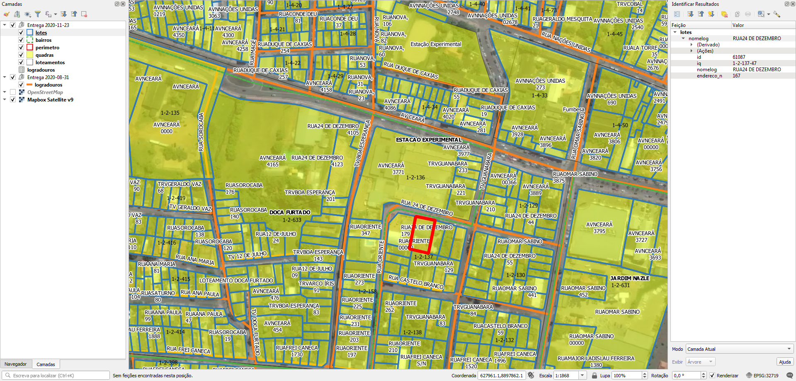

<aside>
<table align="right" style="padding: 1em">
<tr><td>Pacote <a target="_git" title="link canônico para o git deste pacote" href="http://git.digital-guard.org/preserv-BR/blob/main/data/AC/RioBranco/_pk0042.01"><big><b>pk0042.01</b></big></a> de <small><a target="_osmcodes" title="Jurisdição" href="https://osm.codes/BR-AC-RioBranco">BR-AC-RioBranco</a></small>
</td></tr>
<tr><td>
Doador: <a rel="external" target="_doador" href="http://www.riobranco.ac.gov.br/">Prefeitura Municipal de Rio Branco</a>
 &nbsp; <small>CNPJ 04.034.583/0001-22</small> • Wikidata <a rel="external" target="_doador" title="link descritor Wikidata do doador" href="https://www.wikidata.org/wiki/Q56450051">Q56450051</a></small> 

Obtido via <i>email</i> em <b>2020-09-10</b> por:
 &nbsp; Avaliação técnica: <a rel="external" target="_gitPerson" title="usuário Git" href="https://github.com/IgorEliezer">IgorEliezer</a>
 &nbsp; Representação institucional: <a rel="external" target="_gitPerson" title="usuário Git" href="https://github.com/ThierryAJean">ThierryAJean</a> 
</td></tr>
<tr><td>Camadas:     </td></tr>
<tr><td>Dados publicados em <a href="http://git.digital-guard.org/preservCutGeo-BR2021/tree/main/data/AC/RioBranco/_pk0042.01">preservCutGeo-BR2021</a> <a href="#reprodutibilidade">Reprodutíveis</a></td></tr>
<tr><td>Visualização: </td></tr>
</table>
</aside>

<section>

Este repositório de metadados descreve um pacote de arquivos doado para o domínio público. Ele está sendo preservado pela Digital Guard: para maiores detalhes consulte a [documentação sobre o processo de registro e preservação](https://wiki.addressforall.org/doc/Documentação_Digital-guard).

Nota. O presente documento README foi gerado por software a partir das informações contidas no arquivo [`make_conf.yaml`](make_conf.yaml) deste pacote, e informações adicionais dos catálogos de [doadores](https://git.digital-guard.org/preserv-BR/blob/main/data/donor.csv) e de [pacotes](https://git.digital-guard.org/preserv-BR/blob/main/data/donatedPack.csv).

# Camadas de dados

Os arquivos contêm "camadas de dados" temáticas. Os metadados também descrevem como cada camada foi avaliada e seus dados filtrados de forma padronizada.

##  block

Nome do arquivo: `rb_20201111/quadras`. *Download* e integridade: [73d02ba0ae4b0a994a629f7d06f0a027259f5c1d97e53f9b771fecd345c2a02b.zip](http://dl.digital-guard.org/73d02ba0ae4b0a994a629f7d06f0a027259f5c1d97e53f9b771fecd345c2a02b.zip) Descrição: Bairros Tamanho do arquivo: 4527739 bytes (4.32 <abbr title="mebibyte">MiB</abbr>) Formato: shp SRID: 32719

#### Dados relevantes
* `iq` (ref): número de setor e quadra.

#### Dados publicados
[http://git.digital-guard.org/preservCutGeo-BR2021/tree/main/data/AC/RioBranco/_pk0042.01/block](http://git.digital-guard.org/preservCutGeo-BR2021/tree/main/data/AC/RioBranco/_pk0042.01/block) 6690558 bytes (6.38 <abbr title="mebibyte">MiB</abbr>) 4789 polígonos com 69.84 <abbr title="quilômetros quadrados">km²</abbr> densidade média: 0.23 polígonos/km²

#### Visualização
[https://viz.addressforall.org/BR-AC-RioBranco/_pk0042.01/block](https://viz.addressforall.org/BR-AC-RioBranco/_pk0042.01/block)
##  nsvia

Nome do arquivo: `rb_20201111/bairros`. *Download* e integridade: [73d02ba0ae4b0a994a629f7d06f0a027259f5c1d97e53f9b771fecd345c2a02b.zip](http://dl.digital-guard.org/73d02ba0ae4b0a994a629f7d06f0a027259f5c1d97e53f9b771fecd345c2a02b.zip) Descrição: Bairros Tamanho do arquivo: 4527739 bytes (4.32 <abbr title="mebibyte">MiB</abbr>) Formato: shp SRID: 32719

#### Dados relevantes
* `name` (nsvia): nome do bairro em caixa alta, com acentuação.

#### Dados publicados
[http://git.digital-guard.org/preservCutGeo-BR2021/tree/main/data/AC/RioBranco/_pk0042.01/nsvia](http://git.digital-guard.org/preservCutGeo-BR2021/tree/main/data/AC/RioBranco/_pk0042.01/nsvia) 537156 bytes (0.51 <abbr title="mebibyte">MiB</abbr>) 127 polígonos com 149.84 <abbr title="quilômetros quadrados">km²</abbr> densidade média: 0.02 polígonos/km²

#### Visualização
[https://viz.addressforall.org/BR-AC-RioBranco/_pk0042.01/nsvia](https://viz.addressforall.org/BR-AC-RioBranco/_pk0042.01/nsvia)
##  parcel

Nome do arquivo: `rb_20201116/lotes`. *Download* e integridade: [d96f47270e22336cf4660f742ae4dba5694f15c6833363167c91d9fc9929871b.zip](http://dl.digital-guard.org/d96f47270e22336cf4660f742ae4dba5694f15c6833363167c91d9fc9929871b.zip) Descrição: Lotes Tamanho do arquivo: 12086731 bytes (11.53 <abbr title="mebibyte">MiB</abbr>) Formato: shp SRID: 32719

#### Dados relevantes
* `nomelog` (via): tipo e nome do logradouro em caixa alta, com acentuação.

* `endereco_n` (hnum): número predial. Sem número pode ser representado como &quot;S/N&quot;, &quot;s/n&quot;, &quot;SN&quot; etc.

#### Dados publicados
[http://git.digital-guard.org/preservCutGeo-BR2021/tree/main/data/AC/RioBranco/_pk0042.01/parcel](http://git.digital-guard.org/preservCutGeo-BR2021/tree/main/data/AC/RioBranco/_pk0042.01/parcel) 23348544 bytes (22.27 <abbr title="mebibyte">MiB</abbr>) 96883 polígonos com 64.18 <abbr title="quilômetros quadrados">km²</abbr> densidade média: 0.5 polígonos/km²

#### Visualização
[https://viz.addressforall.org/BR-AC-RioBranco/_pk0042.01/parcel](https://viz.addressforall.org/BR-AC-RioBranco/_pk0042.01/parcel)
##  via

Nome do arquivo: `logradouros`. *Download* e integridade: [29d68e5ce006079b06b710cc2df3aa08d6cb6934f32bc0b29fc46d3e8272ff77.rar](http://dl.digital-guard.org/29d68e5ce006079b06b710cc2df3aa08d6cb6934f32bc0b29fc46d3e8272ff77.rar) Descrição: Eixos Tamanho do arquivo: 316372 bytes (0.3 <abbr title="mebibyte">MiB</abbr>) Formato: shp SRID: 32719

#### Dados relevantes
* `tipo ||' '|| Nome` (via): tipo e nome do logradouro em caixa alta, com acentuação.

#### Comentários
Os eixos de ruas possui, em algumas áreas, desalinhamentos com o restante do material e com a imagem área, mesmo com a projeção indicada no arquivo PRJ. Há lugares em que o eixo da rua atravessa lotes e quadras.

#### Dados publicados
[http://git.digital-guard.org/preservCutGeo-BR2021/tree/main/data/AC/RioBranco/_pk0042.01/via](http://git.digital-guard.org/preservCutGeo-BR2021/tree/main/data/AC/RioBranco/_pk0042.01/via) 618898 bytes (0.59 <abbr title="mebibyte">MiB</abbr>) 3172 segmentos com 1030.79 <abbr title="quilômetros">km</abbr> densidade média: 0.15 segmentos/km²

#### Visualização
[https://viz.addressforall.org/BR-AC-RioBranco/_pk0042.01/via](https://viz.addressforall.org/BR-AC-RioBranco/_pk0042.01/via)

# Evidências de teste

# Tarefas
* Corrigir a string dos nomes de logradouro nos lotes. Os lotes possuem erros de nome de logradouros, nestes casos: 1. na maioria está faltando um espaço entre o tipo de via e o nome (ex.\: &quot;RUACECÍLIA MEIRELES&quot;). 2. em alguns há dois espaços entre o tipo de via e o nome (ex.\: &quot;ALA  MATRINCHÃ&quot;). 3. e em alguns há uma vírgula ou ponto no final do nome (ex.\: &quot;VIAVERDE.&quot;).
* Gerar ponto de endereço na testada do lote com script desenvolvido pelo A4A.
</section>
<section>

# Reprodutibilidade

Ver detalhes em [reproducibility.sh](reproducibility.sh).

</section>

# Anexo

Foi recebido via email 3 arquivos, os quais foram renomeados para facilitar:
* rb_20201111 (1) (2).zip -> rb_20201111.zip.
* rb_20201116 (2).zip -> rb_20201116.zip.
* E-SIC 13131.0000372020-46 - SEFIN RESPOSTA.rar -> E-SIC_SEFIN.rar

Abreviaturas raras usadas em eixos:
* RO, RD = Rodovia (equivalente de VIA para os lotes)
* RM = Ramal (equivalente de RM para os lotes)
* ES, EST = Estrada
* BR = Rodovia BR. Se for "BR VIA VERDE", é o equivalente de VIA VERDE dos lotes.
* BC = Beco
* ALA, ALAM = Alameda

