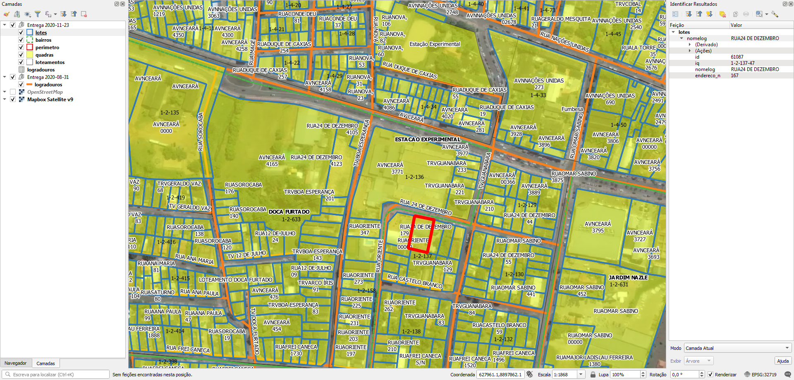

# Geral

Foi recebido via email 3 arquivos, os quais foram renomeados para facilitar:
* rb_20201111 (1) (2).zip -> rb_20201111.zip.
* rb_20201116 (2).zip -> rb_20201116.zip.
* E-SIC 13131.0000372020-46 - SEFIN RESPOSTA.rar -> E-SIC_SEFIN.rar

# Tarefas

## 1. Corrigir a string dos nomes de logradouro nos lotes
Os lotes (ver Extração: Lotes) possuem erros de nome de logradouros, nestes casos:
* na maioria está faltando um espaço entre o tipo de via e o nome (ex.: "RUACECÍLIA MEIRELES").
* em alguns há dois espaços entre o tipo de via e o nome (ex.: "ALA  MATRINCHÃ").
* e em alguns há uma vírgula ou ponto no final do nome (ex.: "VIAVERDE.").

## 2. Gerar ponto de endereço na testada do lote
Procedimento usando PostGIS com script desenvolvido pelo A4A.

Cada ponto terá os dados:
* Nome do logradouro
* Número predial

# Extração
Abaixo os passos para extração por tipo de dado relevante.

## Lotes
SRID: 32719 (INDICADO)
1. Abrir `rb_20201116.zip`.
2. Abrir diretório `rb_20201116`.
3. Selecionar arquivos `lotes.*`.
4. Copiar arquivos selecionados para diretório alvo.

### Dados relevantes
Colunas da camada `lotes`:
* `nomelog` (string): tipo e nome do logradouro em caixa alta, com acentuação.
* `endereco_n` (string): número predial. Sem número pode ser representado como "S/N", "s/n", "SN" etc.

## Bairros
SRID: 32719 (INDICADO)
1. Abrir `rb_20201111.zip`.
2. Abrir diretório `rb_20201111`.
3. Selecionar arquivos shapefile `bairros.*`.
4. Copiar arquivos selecionados para diretório alvo.

### Dados relevantes
Colunas da camada `bairros`:
* `name` (string): nome do bairro em caixa alta, com acentuação.

## Eixos
SRID: 32719
1. Abrir `E-SIC_SEFIN.rar`.
2. Selecionar arquivos `logradouros.*`.
3. Copiar arquivos selecionados para diretório alvo.

**N.B.:** Os eixos de ruas possui, em algumas áreas, desalinhamentos com o restante do material e com a imagem área, mesmo com a projeção indicada no arquivo PRJ. Há lugares em que o eixo da rua atravessa lotes e quadras.

### Dados relevantes
Colunas da camada `logradouros`:
* `Nome` (string): nome do logradouro em caixa alta sem tipo de via, com acentuação.
* `Tipo` (string): tipo de logradouro em caixa alta.

### Abreviaturas raras
RO, RD = Rodovia (equivalente de VIA para os lotes)
RM = Ramal (equivalente de RM para os lotes)
ES, EST = Estrada
BR = Rodovia BR. Se for "BR VIA VERDE", é o equivalente de VIA VERDE dos lotes.
BC = Beco
ALA, ALAM = Alameda

### Expressões
Para construir o nome do logradouro, usar:
`Nome + ' ' + Tipo`

## Eixos - planilha
Arquivo CSV
Codificação: UTF-8
1. Abrir `rb_20201111.zip`.
2. Abrir diretório `rb_20201111`.
3. Selecionar arquivos `logradouros.csv`.
4. Copiar arquivos selecionados para diretório alvo.

### Dados relevantes
Colunas, pela ordem:
* `id`: ID.
* `nome`: tipo de via abreviado e nome do logradouro em caixa alta. Há inconsistências: pontos finais soltos, aspas etc. 

## Quadras
SRID: 32719 (INDICADO)
1. Abrir `rb_20201111.zip`.
2. Abrir diretório `rb_20201111`.
3. Selecionar arquivos shapefile `quadras.*`.
4. Copiar arquivos selecionados para diretório alvo.

### Dados relevantes
Colunas da camada `quadras`:
* `iq` (string): número de setor e quadra.

## Loteamentos
SRID: 32719 (INDICADO)
1. Abrir `rb_20201111.zip`.
2. Abrir diretório `rb_20201111`.
3. Selecionar arquivos shapefile `loteamentos.*`.
4. Copiar arquivos selecionados para diretório alvo.

### Dados relevantes
Colunas da camada `loteamentos`:
* `name` (string): nome do loteamento em formatos diverso, incluindo caixa alta, acentuação e abreviação. Funciona como bairro.

# Outros
Outros dados:
* Perímetro urbano.

(!!! Havendo outros projetos, esta seção será detalhada !!!)

# Evidências de teste
Teste no QGIS:

