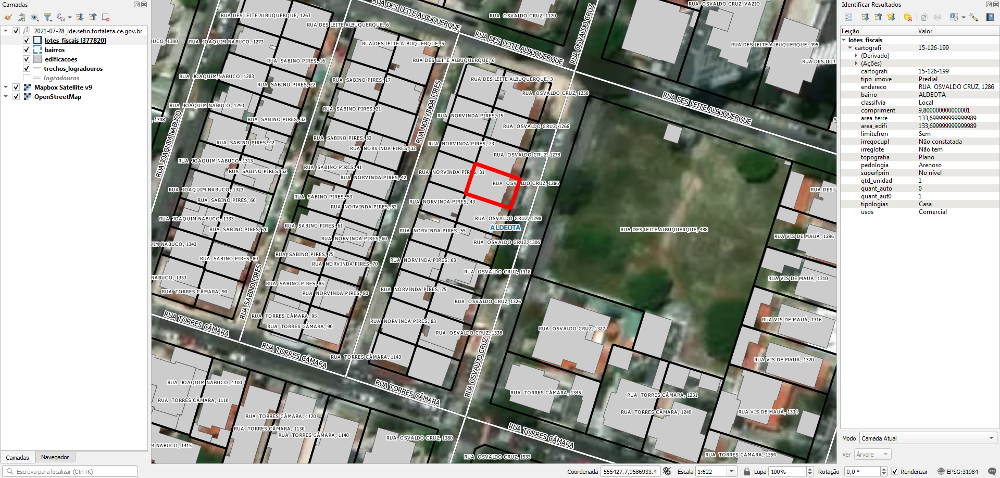

<aside>
<table align="right" style="padding: 1em">
<tr><td>Pacote <big><b>pk0097.01</b></big> de <small><a target="_afacodes" title="Jurisdição" href="https://afa.codes/BR-CE-Fortaleza">BR-CE-Fortaleza</a></small>
</td></tr>
<tr><td>
Doador: <a rel="external" target="_doador" href="https://www.fortaleza.ce.gov.br/">Prefeitura Municipal de Fortaleza</a>
 &nbsp; <small>CNPJ 07.954.605/0001-60</small> • Wikidata <a rel="external" target="_doador" title="link descritor Wikidata do doador" href="https://www.wikidata.org/wiki/Q43463">Q43463</a></small> 
Licença <a rel="external" target="_doador" href="https://creativecommons.org/publicdomain/zero/1.0/"><b>CC0-1.0</b></a> (cc0 <a title="SHA256 87c78d7d7d33acbc18296a537842e6229369a747bb087e5c0b2a6aec7ebbfe2b.eml" href="http://dl.digital-guard.org/87c78d7d7d33acbc18296a537842e6229369a747bb087e5c0b2a6aec7ebbfe2b.eml"><code>87c78d7...eml</code></a>) 
Obtido via <i>website</i> em <b>12/09/2022</b> por:
 &nbsp; Avaliação técnica: <a rel="external" target="_gitPerson" title="usuário Git" href="https://github.com/luisfelipebr">luisfelipebr</a>
 &nbsp; Representação institucional: <a rel="external" target="_gitPerson" title="usuário Git" href="https://github.com/ThierryAJean">ThierryAJean</a> 
</td></tr>
<tr><td>Camadas:      </td></tr>
<tr><td>Dados publicados em <a href="https://git.digital-guard.org/preservCutGeo-BR2021/tree/main/data/CE/Fortaleza/_pk0097.01">preservCutGeo-BR2021</a> <a href="#reprodutibilidade">Reprodutíveis</a></td></tr>
<tr><td>Visualização:      </td></tr>
</table>
</aside>

<section>

Este repositório de metadados descreve um pacote de arquivos doado para o domínio público. Ele está sendo preservado pela Digital Guard: para maiores detalhes consulte a [documentação sobre o processo de registro e preservação](https://wiki.addressforall.org/doc/Documentação_Digital-guard).

Nota. O presente documento README foi gerado por software a partir das informações contidas no arquivo [`make_conf.yaml`](https://git.digital-guard.org/preserv-BR/blob/main/data/CE/Fortaleza/_pk0097.01/make_conf.yaml) deste pacote, e informações adicionais dos catálogos de [doadores](https://git.digital-guard.org/preserv-BR/blob/main/data/donor.csv) e de [pacotes](https://git.digital-guard.org/preserv-BR/blob/main/data/donatedPack.csv).

# Camadas de dados

Os arquivos contêm "camadas de dados" temáticas. Os metadados também descrevem como cada camada foi avaliada e seus dados filtrados de forma padronizada.

##  block

Nome do arquivo: `quadras` *Download* e integridade: [82edaae1d8a79f5167d88cb89a09a21f7e2f89bae88d16d39ebbe971a28976d5.zip](http://dl.digital-guard.org/82edaae1d8a79f5167d88cb89a09a21f7e2f89bae88d16d39ebbe971a28976d5.zip) Descrição: Quadras Tamanho do arquivo: 8398313 bytes (8.01 <abbr title="mebibyte">MiB</abbr>) Formato: shp SRID: 31984

#### Resultados da filtragem e sua publicação
15357290 bytes (14.65 <abbr title="mebibyte">MiB</abbr>) 18222 polígonos com 237.32 <abbr title="quilômetros quadrados">km²</abbr> densidade média: 0.74 polígonos/km² GeoJSONs publicados em [https://git.digital-guard.org/preservCutGeo-BR2021/tree/main/data/CE/Fortaleza/_pk0097.01/block](https://git.digital-guard.org/preservCutGeo-BR2021/tree/main/data/CE/Fortaleza/_pk0097.01/block)

#### Visualização
[https://viz.addressforall.org/BR-CE-Fortaleza/_pk0097.01/block](https://viz.addressforall.org/BR-CE-Fortaleza/_pk0097.01/block)
##  building

Nome do arquivo: `edificacoes` *Download* e integridade: [8a07c88d17167f65182a6c1a86fb89842d2e0bfe4ca5f7fc2dba4d41d9f682f9.zip](http://dl.digital-guard.org/8a07c88d17167f65182a6c1a86fb89842d2e0bfe4ca5f7fc2dba4d41d9f682f9.zip) Descrição: Edificações Tamanho do arquivo: 129751437 bytes (123.74 <abbr title="mebibyte">MiB</abbr>) Formato: shp SRID: 31984

#### Resultados da filtragem e sua publicação
248783984 bytes (237.26 <abbr title="mebibyte">MiB</abbr>) 922127 polígonos com 77.89 <abbr title="quilômetros quadrados">km²</abbr> densidade média: 0.33 polígonos/km² GeoJSONs publicados em [https://git.digital-guard.org/preservCutGeo-BR2021/tree/main/data/CE/Fortaleza/_pk0097.01/building](https://git.digital-guard.org/preservCutGeo-BR2021/tree/main/data/CE/Fortaleza/_pk0097.01/building)

#### Visualização
[https://viz.addressforall.org/BR-CE-Fortaleza/_pk0097.01/building](https://viz.addressforall.org/BR-CE-Fortaleza/_pk0097.01/building)
##  nsvia

Nome do arquivo: `bairros` *Download* e integridade: [4c97d93a39cce2190b436b1adf1d56321627fef452dbbf18ede812731e2a035b.zip](http://dl.digital-guard.org/4c97d93a39cce2190b436b1adf1d56321627fef452dbbf18ede812731e2a035b.zip) Descrição: Bairros Tamanho do arquivo: 342881 bytes (0.33 <abbr title="mebibyte">MiB</abbr>) Formato: shp SRID: 31984

#### Dados relevantes
* `nome_bairr` (nsvia)

#### Resultados da filtragem e sua publicação
633562 bytes (0.6 <abbr title="mebibyte">MiB</abbr>) 121 polígonos com 312.42 <abbr title="quilômetros quadrados">km²</abbr> densidade média: 0.96 polígonos/km² GeoJSONs publicados em [https://git.digital-guard.org/preservCutGeo-BR2021/tree/main/data/CE/Fortaleza/_pk0097.01/nsvia](https://git.digital-guard.org/preservCutGeo-BR2021/tree/main/data/CE/Fortaleza/_pk0097.01/nsvia)

#### Visualização
[https://viz.addressforall.org/BR-CE-Fortaleza/_pk0097.01/nsvia](https://viz.addressforall.org/BR-CE-Fortaleza/_pk0097.01/nsvia)
##  parcel

Nome do arquivo: `lotes_fiscais` *Download* e integridade: [d6bfda4f6ec70796d753b570ff04afc040ba6a2c438f116b301a977db3788b5e.zip](http://dl.digital-guard.org/d6bfda4f6ec70796d753b570ff04afc040ba6a2c438f116b301a977db3788b5e.zip) Descrição: Lotes Tamanho do arquivo: 57886654 bytes (55.21 <abbr title="mebibyte">MiB</abbr>) Formato: shp SRID: 31984

#### Dados relevantes
* `split_part(endereco,',',1)` (hnum)

* `split_part(endereco,',',2)` (via)

#### Resultados da filtragem e sua publicação
90396502 bytes (86.21 <abbr title="mebibyte">MiB</abbr>) 374580 polígonos com 194.51 <abbr title="quilômetros quadrados">km²</abbr> densidade média: 0.65 polígonos/km² GeoJSONs publicados em [https://git.digital-guard.org/preservCutGeo-BR2021/tree/main/data/CE/Fortaleza/_pk0097.01/parcel](https://git.digital-guard.org/preservCutGeo-BR2021/tree/main/data/CE/Fortaleza/_pk0097.01/parcel)

#### Visualização
[https://viz.addressforall.org/BR-CE-Fortaleza/_pk0097.01/parcel](https://viz.addressforall.org/BR-CE-Fortaleza/_pk0097.01/parcel)
##  via

Nome do arquivo: `logradouros` *Download* e integridade: [86c7283d4dc0351e397e72934f96141f55b92dc09112462cad3769649c0f8fec.zip](http://dl.digital-guard.org/86c7283d4dc0351e397e72934f96141f55b92dc09112462cad3769649c0f8fec.zip) Descrição: Logradouros Tamanho do arquivo: 2292206 bytes (2.19 <abbr title="mebibyte">MiB</abbr>) Formato: shp SRID: 31984

#### Dados relevantes
* `nome_compl` (via)

#### Resultados da filtragem e sua publicação
3455551 bytes (3.3 <abbr title="mebibyte">MiB</abbr>) 10608 segmentos com 4496.6 <abbr title="quilômetros">km</abbr> densidade média: 13.06 segmentos/km² GeoJSONs publicados em [https://git.digital-guard.org/preservCutGeo-BR2021/tree/main/data/CE/Fortaleza/_pk0097.01/via](https://git.digital-guard.org/preservCutGeo-BR2021/tree/main/data/CE/Fortaleza/_pk0097.01/via)

#### Visualização
[https://viz.addressforall.org/BR-CE-Fortaleza/_pk0097.01/via](https://viz.addressforall.org/BR-CE-Fortaleza/_pk0097.01/via)

# Evidências de teste

</section>
<section>

# Reprodutibilidade

O processo de transformação dos *dados orginais* (arquivos doados) em *dados filtrados* pode ser reproduzido por qualquer pessoa fazendo uso das mesmas ferramentas de software utilizadas pelo projeto. A seguir a sequência de comandos *bash* que garantem a [reprodutibilidade](https://en.wikipedia.org/wiki/Reproducibility) do processo a cada *layer*. Qualquer pessoa, munida dos [ferramentas de software utilizadas pelo projeto](https://git.AddressForAll.org/suporte/blob/master/docs/pt/infra.md#ambientes-e-ferramentas-de-uso-geral), vai gerar os mesmos resultados.

Pode-se reproduzir de dois modos:
* artesanal: com os comandos em [reproducibility.sh](https://git.digital-guard.org/preserv-BR/blob/main/data/CE/Fortaleza/_pk0097.01/reproducibility.sh), depois de seguir a sequência de preparo da base de dados no esquema *ingest*.
* automático: usando o comando `make` conforme descrito na documentação do projeto.

</section>

