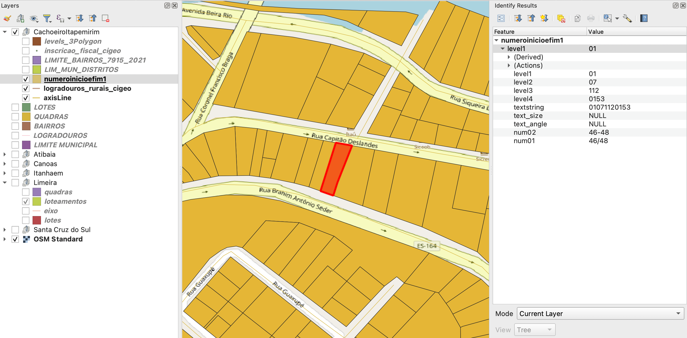

<aside>
<table align="right">
<tr><th>BR-ES-CachoeiroItapemirim</th></tr>
<tr><td>
Pacote: <a target="_git" href="http://git.digital-guard.org/preserv-BR/blob/main/data/ES/CachoeiroItapemirim/_pk0091.01"><small>_pk0091.01</small></a>
</td></tr>
<tr><td>
Doador: <a rel="external" target="_doador" href="https://www.cachoeiro.es.gov.br/">Municipio De Cachoeiro De Itapemirim</a><br/>
<small>cnpj:27.165.588/0001-90</small> • <a rel="external" target="_doador" href="https://www.wikidata.org/wiki/Q1439193">Q1439193</a></small><br/>
Obtido via <i>site e email</i> em <b>2022-04-05</b><br/>
Avaliação técnica: luis<br/>
Representação institucional: Thierry<br/>
Licença: <b>CC0</b>
</td></tr>
<tr><td>Camadas: <a title="via" href="#-via"></a> <a title="block" href="#-block"></a> <a title="nsvia" href="#-nsvia"></a> <a title="parcel" href="#-parcel"></a> <a title="geoaddress" href="#-geoaddress"></a> </td></tr>
<tr><td><a href="http://git.digital-guard.org/preservCutGeo-BR2021/tree/main/data/ES/CachoeiroItapemirim/_pk0091.01">Dados publicados</a></td></tr>
</table>
</aside>

<section>

# Camadas de dados
##  block

Nome do arquivo: `levels_3Polygon`.<br/>Download: [8d0400b02d594228c5a43df5e5bcdbbb620bce1175fac22fb2f196768159d53f.zip](http://dl.digital-guard.org/8d0400b02d594228c5a43df5e5bcdbbb620bce1175fac22fb2f196768159d53f.zip)<br/>Descrição: Quadras<br/>Tamanho do arquivo: 984417 bytes (0.94 <abbr title="mebibyte">MiB</abbr>)<br/>Formato: shp<br/>SRID: +proj=longlat +datum=WGS84 +no_defs

#### Dados publicados
[http://git.digital-guard.org/preservCutGeo-BR2021/tree/main/data/ES/CachoeiroItapemirim/_pk0091.01/block](http://git.digital-guard.org/preservCutGeo-BR2021/tree/main/data/ES/CachoeiroItapemirim/_pk0091.01/block)<br/>1799230 bytes (1.72 <abbr title="mebibyte">MiB</abbr>)<br/>2289 polígonos com 67.42 <abbr title="quilômetros quadrados">km²</abbr><br/>densidade média: 0.07 polígonos/km²
##  geoaddress

Nome do arquivo: `inscricao_fiscal_cigeo`.<br/>Download: [4b8f5c5264e567014e98d3314a49ba2a1c71f8da5cba66572671fe674b7788f1.zip](http://dl.digital-guard.org/4b8f5c5264e567014e98d3314a49ba2a1c71f8da5cba66572671fe674b7788f1.zip)<br/>Descrição: Geoenderecos<br/>Tamanho do arquivo: 1872639 bytes (1.79 <abbr title="mebibyte">MiB</abbr>)<br/>Formato: shp<br/>SRID: +proj=longlat +datum=WGS84 +no_defs

#### Outros dados relevantes
* `inscricao`: IPTU

#### Dados publicados
[http://git.digital-guard.org/preservCutGeo-BR2021/tree/main/data/ES/CachoeiroItapemirim/_pk0091.01/geoaddress](http://git.digital-guard.org/preservCutGeo-BR2021/tree/main/data/ES/CachoeiroItapemirim/_pk0091.01/geoaddress)<br/>3294648 bytes (3.14 <abbr title="mebibyte">MiB</abbr>)<br/>61263 pontos<br/>densidade média de 2106.78 pontos/km²
##  nsvia

Nome do arquivo: `Camadas_Shap_base_Cachoeiro de Itpemirim/LIMITE_BAIRROS_7915_2021`.<br/>Download: [5662a73fff9eeb6c1c3753b4d204b5c1074e9a17454c68fabcf17bd87c2c77b4.rar](http://dl.digital-guard.org/5662a73fff9eeb6c1c3753b4d204b5c1074e9a17454c68fabcf17bd87c2c77b4.rar)<br/>Descrição: Bairros<br/>Tamanho do arquivo: 6289596 bytes (6 <abbr title="mebibyte">MiB</abbr>)<br/>Formato: shp<br/>SRID: 31984

#### Dados relevantes
* `NOME` (nsvia)

#### Dados publicados
[http://git.digital-guard.org/preservCutGeo-BR2021/tree/main/data/ES/CachoeiroItapemirim/_pk0091.01/nsvia](http://git.digital-guard.org/preservCutGeo-BR2021/tree/main/data/ES/CachoeiroItapemirim/_pk0091.01/nsvia)<br/>356930 bytes (0.34 <abbr title="mebibyte">MiB</abbr>)<br/>76 polígonos com 34.29 <abbr title="quilômetros quadrados">km²</abbr><br/>densidade média: 0.04 polígonos/km²
##  parcel

Nome do arquivo: `numeroinicioefim1`.<br/>Download: [81db1f1d79472aa7e664a00e012628ee113c887e952e73af28e6e86ad10a7dab.zip](http://dl.digital-guard.org/81db1f1d79472aa7e664a00e012628ee113c887e952e73af28e6e86ad10a7dab.zip)<br/>Descrição: Lotes<br/>Tamanho do arquivo: 4617404 bytes (4.4 <abbr title="mebibyte">MiB</abbr>)<br/>Formato: shp<br/>SRID: +proj=longlat +datum=WGS84 +no_defs

#### Outros dados relevantes
* `num01`: Não consegui checar a veracidade dos números iniciais e finais.

#### Dados publicados
[http://git.digital-guard.org/preservCutGeo-BR2021/tree/main/data/ES/CachoeiroItapemirim/_pk0091.01/parcel](http://git.digital-guard.org/preservCutGeo-BR2021/tree/main/data/ES/CachoeiroItapemirim/_pk0091.01/parcel)<br/>10052688 bytes (9.59 <abbr title="mebibyte">MiB</abbr>)<br/>51234 polígonos com 64.53 <abbr title="quilômetros quadrados">km²</abbr><br/>densidade média: 0.48 polígonos/km²
##  via

Nome do arquivo: `axisLine`.<br/>Download: [3a300c9f9836c3ea1af53bfdff81e4d663c413f688fdd9c9f583105c19f3ec39.zip](http://dl.digital-guard.org/3a300c9f9836c3ea1af53bfdff81e4d663c413f688fdd9c9f583105c19f3ec39.zip)<br/>Descrição: Logradouros urbanos<br/>Tamanho do arquivo: 500230 bytes (0.48 <abbr title="mebibyte">MiB</abbr>)<br/>Formato: shp<br/>SRID: +proj=longlat +datum=WGS84 +no_defs

#### Dados relevantes
* `tip_logr || ' ' || textstring` (via)

#### Dados publicados
[http://git.digital-guard.org/preservCutGeo-BR2021/tree/main/data/ES/CachoeiroItapemirim/_pk0091.01/via](http://git.digital-guard.org/preservCutGeo-BR2021/tree/main/data/ES/CachoeiroItapemirim/_pk0091.01/via)<br/>825874 bytes (0.79 <abbr title="mebibyte">MiB</abbr>)<br/>2937 segmentos com 680.82 <abbr title="quilômetros">km</abbr><br/>densidade média: 0.76 segmentos/km²

# Evidências de teste


# Comentários gerais
Além dos arquivos preservados, existe base de logradouros rurais, faces de quadras, iptu (como linhas), metadados do street view, pontos de interesse e outros.

</section>
<section>

# Reprodutibilidade

```bash

block:
rm -rf /tmp/sandbox/_pkBR911_001 || true
mkdir -m 777 -p /tmp/sandbox
mkdir -m 777 -p /tmp/sandbox/_pkBR911_001
mkdir -p /tmp/pg_io
wget -P /var/www/preserv.addressforall.org/download http://dl.digital-guard.org/8d0400b02d594228c5a43df5e5bcdbbb620bce1175fac22fb2f196768159d53f.zip
sudo chown postgres:www-data /var/www/preserv.addressforall.org/download/8d0400b02d594228c5a43df5e5bcdbbb620bce1175fac22fb2f196768159d53f.zip && sudo chmod 664 /var/www/preserv.addressforall.org/download/8d0400b02d594228c5a43df5e5bcdbbb620bce1175fac22fb2f196768159d53f.zip
psql $(pg_uri_db) -c "DROP  TABLE IF EXISTS pk7600009101101_p1_block CASCADE"
cd /tmp/sandbox/_pkBR911_001; 7z  x -y /var/www/preserv.addressforall.org/download/8d0400b02d594228c5a43df5e5bcdbbb620bce1175fac22fb2f196768159d53f.zip "*levels_3Polygon*" ; chmod -R a+rwx . > /dev/null
psql postgres://postgres@localhost/ingest1 -c "INSERT INTO spatial_ref_sys (srid, auth_name, auth_srid, proj4text, srtext) VALUES (952096,'carlos',952096,'+proj=longlat +datum=WGS84 +no_defs',null);"
psql postgres://postgres@localhost/ingest1 -c "SELECT srid, proj4text FROM spatial_ref_sys where srid=952096"
cd /tmp/sandbox/_pkBR911_001; shp2pgsql -D   -s 952096 "levels_3Polygon.shp" pk7600009101101_p1_block | psql -q postgres://postgres@localhost/ingest1 2> /dev/null

psql postgres://postgres@localhost/ingest1 -c "SELECT ingest.any_load('shp2sql','/tmp/sandbox/_pkBR911_001/levels_3Polygon.shp','block_full','pk7600009101101_p1_block','7600009101101','8d0400b02d594228c5a43df5e5bcdbbb620bce1175fac22fb2f196768159d53f.zip',array['gid', 'geom'],5,1)"
@echo "Confira os resultados nas tabelas ingest.donated_packcomponent e ingest.feature_asis".
@echo "Delete SRID 952096 configurado via PROJ.4 string:"
@echo "+proj=longlat +datum=WGS84 +no_defs"
psql postgres://postgres@localhost/ingest1 -c "DELETE FROM spatial_ref_sys WHERE srid=952096;"
rm -f "/tmp/sandbox/_pkBR911_001/*levels_3Polygon.*" || true
psql $(pg_uri_db) -c "DROP TABLE IF EXISTS pk7600009101101_p1_block CASCADE"
mkdir -m777 -p /var/gits/_dg/preservCutGeo-BR2021/data/ES/CachoeiroItapemirim/_pk0091.01/block
rm -rf /var/gits/_dg/preservCutGeo-BR2021/data/ES/CachoeiroItapemirim/_pk0091.01/block/*.geojson
psql $(pg_uri_db) -c "SELECT ingest.publicating_geojsons('block','BR-ES-CachoeiroItapemirim','/var/gits/_dg/preservCutGeo-BR2021/data/ES/CachoeiroItapemirim/_pk0091.01/block','1',9,3);"
cd /var/gits/_dg/preserv/src; sudo bash fixaPermissoes.sh /var/gits/_dg/preservCutGeo-BR2021/data/ES/CachoeiroItapemirim/_pk0091.01/block

geoaddress:
rm -rf /tmp/sandbox/_pkBR911_001 || true
mkdir -m 777 -p /tmp/sandbox
mkdir -m 777 -p /tmp/sandbox/_pkBR911_001
mkdir -p /tmp/pg_io
wget -P /var/www/preserv.addressforall.org/download http://dl.digital-guard.org/4b8f5c5264e567014e98d3314a49ba2a1c71f8da5cba66572671fe674b7788f1.zip
sudo chown postgres:www-data /var/www/preserv.addressforall.org/download/4b8f5c5264e567014e98d3314a49ba2a1c71f8da5cba66572671fe674b7788f1.zip && sudo chmod 664 /var/www/preserv.addressforall.org/download/4b8f5c5264e567014e98d3314a49ba2a1c71f8da5cba66572671fe674b7788f1.zip
psql $(pg_uri_db) -c "DROP  TABLE IF EXISTS pk7600009101201_p2_geoaddress CASCADE"
cd /tmp/sandbox/_pkBR911_001; 7z  x -y /var/www/preserv.addressforall.org/download/4b8f5c5264e567014e98d3314a49ba2a1c71f8da5cba66572671fe674b7788f1.zip "*inscricao_fiscal_cigeo*" ; chmod -R a+rwx . > /dev/null
psql postgres://postgres@localhost/ingest1 -c "INSERT INTO spatial_ref_sys (srid, auth_name, auth_srid, proj4text, srtext) VALUES (952096,'carlos',952096,'+proj=longlat +datum=WGS84 +no_defs',null);"
psql postgres://postgres@localhost/ingest1 -c "SELECT srid, proj4text FROM spatial_ref_sys where srid=952096"
cd /tmp/sandbox/_pkBR911_001; shp2pgsql -D   -s 952096 "inscricao_fiscal_cigeo.shp" pk7600009101201_p2_geoaddress | psql -q postgres://postgres@localhost/ingest1 2> /dev/null

psql postgres://postgres@localhost/ingest1 -c "SELECT ingest.any_load('shp2sql','/tmp/sandbox/_pkBR911_001/inscricao_fiscal_cigeo.shp','geoaddress_none','pk7600009101201_p2_geoaddress','7600009101201','4b8f5c5264e567014e98d3314a49ba2a1c71f8da5cba66572671fe674b7788f1.zip',array['gid', 'inscricao', 'geom'],1,1)"
@echo "Confira os resultados nas tabelas ingest.donated_packcomponent e ingest.feature_asis".
@echo "Delete SRID 952096 configurado via PROJ.4 string:"
@echo "+proj=longlat +datum=WGS84 +no_defs"
psql postgres://postgres@localhost/ingest1 -c "DELETE FROM spatial_ref_sys WHERE srid=952096;"
rm -f "/tmp/sandbox/_pkBR911_001/*inscricao_fiscal_cigeo.*" || true
psql $(pg_uri_db) -c "DROP TABLE IF EXISTS pk7600009101201_p2_geoaddress CASCADE"
mkdir -m777 -p /var/gits/_dg/preservCutGeo-BR2021/data/ES/CachoeiroItapemirim/_pk0091.01/geoaddress
rm -rf /var/gits/_dg/preservCutGeo-BR2021/data/ES/CachoeiroItapemirim/_pk0091.01/geoaddress/*.geojson
psql $(pg_uri_db) -c "SELECT ingest.publicating_geojsons('geoaddress','BR-ES-CachoeiroItapemirim','/var/gits/_dg/preservCutGeo-BR2021/data/ES/CachoeiroItapemirim/_pk0091.01/geoaddress','1',9,3);"
cd /var/gits/_dg/preserv/src; sudo bash fixaPermissoes.sh /var/gits/_dg/preservCutGeo-BR2021/data/ES/CachoeiroItapemirim/_pk0091.01/geoaddress

nsvia:
rm -rf /tmp/sandbox/_pkBR911_001 || true
mkdir -m 777 -p /tmp/sandbox
mkdir -m 777 -p /tmp/sandbox/_pkBR911_001
mkdir -p /tmp/pg_io
wget -P /var/www/preserv.addressforall.org/download http://dl.digital-guard.org/5662a73fff9eeb6c1c3753b4d204b5c1074e9a17454c68fabcf17bd87c2c77b4.rar
sudo chown postgres:www-data /var/www/preserv.addressforall.org/download/5662a73fff9eeb6c1c3753b4d204b5c1074e9a17454c68fabcf17bd87c2c77b4.rar && sudo chmod 664 /var/www/preserv.addressforall.org/download/5662a73fff9eeb6c1c3753b4d204b5c1074e9a17454c68fabcf17bd87c2c77b4.rar
psql $(pg_uri_db) -c "DROP  TABLE IF EXISTS pk7600009101301_p3_nsvia CASCADE"
cd /tmp/sandbox/_pkBR911_001; 7z  x -y /var/www/preserv.addressforall.org/download/5662a73fff9eeb6c1c3753b4d204b5c1074e9a17454c68fabcf17bd87c2c77b4.rar "*Camadas_Shap_base_Cachoeiro de Itpemirim/LIMITE_BAIRROS_7915_2021*" ; chmod -R a+rwx . > /dev/null
psql postgres://postgres@localhost/ingest1 -c "SELECT srid, proj4text FROM spatial_ref_sys where srid=31984"
cd /tmp/sandbox/_pkBR911_001; shp2pgsql -D   -s 31984 "Camadas_Shap_base_Cachoeiro de Itpemirim/LIMITE_BAIRROS_7915_2021.shp" pk7600009101301_p3_nsvia | psql -q postgres://postgres@localhost/ingest1 2> /dev/null

psql postgres://postgres@localhost/ingest1 -c "SELECT ingest.any_load('shp2sql','/tmp/sandbox/_pkBR911_001/Camadas_Shap_base_Cachoeiro de Itpemirim/LIMITE_BAIRROS_7915_2021.shp','nsvia_full','pk7600009101301_p3_nsvia','7600009101301','5662a73fff9eeb6c1c3753b4d204b5c1074e9a17454c68fabcf17bd87c2c77b4.rar',array['gid', 'NOME as nsvia', 'geom'],5,1)"
@echo "Confira os resultados nas tabelas ingest.donated_packcomponent e ingest.feature_asis".
@echo "Delete SRID 31984 configurado via PROJ.4 string:"
@echo "+proj=longlat +datum=WGS84 +no_defs"
psql postgres://postgres@localhost/ingest1 -c "DELETE FROM spatial_ref_sys WHERE srid=31984;"
rm -f "/tmp/sandbox/_pkBR911_001/*Camadas_Shap_base_Cachoeiro de Itpemirim/LIMITE_BAIRROS_7915_2021.*" || true
psql $(pg_uri_db) -c "DROP TABLE IF EXISTS pk7600009101301_p3_nsvia CASCADE"
mkdir -m777 -p /var/gits/_dg/preservCutGeo-BR2021/data/ES/CachoeiroItapemirim/_pk0091.01/nsvia
rm -rf /var/gits/_dg/preservCutGeo-BR2021/data/ES/CachoeiroItapemirim/_pk0091.01/nsvia/*.geojson
psql $(pg_uri_db) -c "SELECT ingest.publicating_geojsons('nsvia','BR-ES-CachoeiroItapemirim','/var/gits/_dg/preservCutGeo-BR2021/data/ES/CachoeiroItapemirim/_pk0091.01/nsvia','1',9,3);"
cd /var/gits/_dg/preserv/src; sudo bash fixaPermissoes.sh /var/gits/_dg/preservCutGeo-BR2021/data/ES/CachoeiroItapemirim/_pk0091.01/nsvia

parcel:
rm -rf /tmp/sandbox/_pkBR911_001 || true
mkdir -m 777 -p /tmp/sandbox
mkdir -m 777 -p /tmp/sandbox/_pkBR911_001
mkdir -p /tmp/pg_io
wget -P /var/www/preserv.addressforall.org/download http://dl.digital-guard.org/81db1f1d79472aa7e664a00e012628ee113c887e952e73af28e6e86ad10a7dab.zip
sudo chown postgres:www-data /var/www/preserv.addressforall.org/download/81db1f1d79472aa7e664a00e012628ee113c887e952e73af28e6e86ad10a7dab.zip && sudo chmod 664 /var/www/preserv.addressforall.org/download/81db1f1d79472aa7e664a00e012628ee113c887e952e73af28e6e86ad10a7dab.zip
psql $(pg_uri_db) -c "DROP  TABLE IF EXISTS pk7600009101401_p4_parcel CASCADE"
cd /tmp/sandbox/_pkBR911_001; 7z  x -y /var/www/preserv.addressforall.org/download/81db1f1d79472aa7e664a00e012628ee113c887e952e73af28e6e86ad10a7dab.zip "*numeroinicioefim1*" ; chmod -R a+rwx . > /dev/null
psql postgres://postgres@localhost/ingest1 -c "INSERT INTO spatial_ref_sys (srid, auth_name, auth_srid, proj4text, srtext) VALUES (952096,'carlos',952096,'+proj=longlat +datum=WGS84 +no_defs',null);"
psql postgres://postgres@localhost/ingest1 -c "SELECT srid, proj4text FROM spatial_ref_sys where srid=952096"
cd /tmp/sandbox/_pkBR911_001; shp2pgsql -D   -s 952096 "numeroinicioefim1.shp" pk7600009101401_p4_parcel | psql -q postgres://postgres@localhost/ingest1 2> /dev/null

psql postgres://postgres@localhost/ingest1 -c "SELECT ingest.any_load('shp2sql','/tmp/sandbox/_pkBR911_001/numeroinicioefim1.shp','parcel_none','pk7600009101401_p4_parcel','7600009101401','81db1f1d79472aa7e664a00e012628ee113c887e952e73af28e6e86ad10a7dab.zip',array['gid', 'num01', 'geom'],5,1)"
@echo "Confira os resultados nas tabelas ingest.donated_packcomponent e ingest.feature_asis".
@echo "Delete SRID 952096 configurado via PROJ.4 string:"
@echo "+proj=longlat +datum=WGS84 +no_defs"
psql postgres://postgres@localhost/ingest1 -c "DELETE FROM spatial_ref_sys WHERE srid=952096;"
rm -f "/tmp/sandbox/_pkBR911_001/*numeroinicioefim1.*" || true
psql $(pg_uri_db) -c "DROP TABLE IF EXISTS pk7600009101401_p4_parcel CASCADE"
mkdir -m777 -p /var/gits/_dg/preservCutGeo-BR2021/data/ES/CachoeiroItapemirim/_pk0091.01/parcel
rm -rf /var/gits/_dg/preservCutGeo-BR2021/data/ES/CachoeiroItapemirim/_pk0091.01/parcel/*.geojson
psql $(pg_uri_db) -c "SELECT ingest.publicating_geojsons('parcel','BR-ES-CachoeiroItapemirim','/var/gits/_dg/preservCutGeo-BR2021/data/ES/CachoeiroItapemirim/_pk0091.01/parcel','1',9,3);"
cd /var/gits/_dg/preserv/src; sudo bash fixaPermissoes.sh /var/gits/_dg/preservCutGeo-BR2021/data/ES/CachoeiroItapemirim/_pk0091.01/parcel

via:
rm -rf /tmp/sandbox/_pkBR911_001 || true
mkdir -m 777 -p /tmp/sandbox
mkdir -m 777 -p /tmp/sandbox/_pkBR911_001
mkdir -p /tmp/pg_io
wget -P /var/www/preserv.addressforall.org/download http://dl.digital-guard.org/3a300c9f9836c3ea1af53bfdff81e4d663c413f688fdd9c9f583105c19f3ec39.zip
sudo chown postgres:www-data /var/www/preserv.addressforall.org/download/3a300c9f9836c3ea1af53bfdff81e4d663c413f688fdd9c9f583105c19f3ec39.zip && sudo chmod 664 /var/www/preserv.addressforall.org/download/3a300c9f9836c3ea1af53bfdff81e4d663c413f688fdd9c9f583105c19f3ec39.zip
psql $(pg_uri_db) -c "DROP  TABLE IF EXISTS pk7600009101601_p6_via CASCADE"
cd /tmp/sandbox/_pkBR911_001; 7z  x -y /var/www/preserv.addressforall.org/download/3a300c9f9836c3ea1af53bfdff81e4d663c413f688fdd9c9f583105c19f3ec39.zip "*axisLine*" ; chmod -R a+rwx . > /dev/null
psql postgres://postgres@localhost/ingest1 -c "INSERT INTO spatial_ref_sys (srid, auth_name, auth_srid, proj4text, srtext) VALUES (952096,'carlos',952096,'+proj=longlat +datum=WGS84 +no_defs',null);"
psql postgres://postgres@localhost/ingest1 -c "SELECT srid, proj4text FROM spatial_ref_sys where srid=952096"
cd /tmp/sandbox/_pkBR911_001; shp2pgsql -D -W ISO-8859-1  -s 952096 "axisLine.shp" pk7600009101601_p6_via | psql -q postgres://postgres@localhost/ingest1 2> /dev/null

psql postgres://postgres@localhost/ingest1 -c "CREATE VIEW vw6_pk7600009101601_p6_via AS SELECT gid, tip_logr || ' ' || textstring AS via, geom FROM $(tabname)"
psql postgres://postgres@localhost/ingest1 -c "SELECT ingest.any_load('shp2sql','/tmp/sandbox/_pkBR911_001/axisLine.shp','via_full','vw6_pk7600009101601_p6_via','7600009101601','3a300c9f9836c3ea1af53bfdff81e4d663c413f688fdd9c9f583105c19f3ec39.zip',array[]::text[],5,1)"
psql postgres://postgres@localhost/ingest1 -c "DROP VIEW vw6_pk7600009101601_p6_via"
@echo "Confira os resultados nas tabelas ingest.donated_packcomponent e ingest.feature_asis".
@echo "Delete SRID 952096 configurado via PROJ.4 string:"
@echo "+proj=longlat +datum=WGS84 +no_defs"
psql postgres://postgres@localhost/ingest1 -c "DELETE FROM spatial_ref_sys WHERE srid=952096;"
rm -f "/tmp/sandbox/_pkBR911_001/*axisLine.*" || true
psql $(pg_uri_db) -c "DROP TABLE IF EXISTS pk7600009101601_p6_via CASCADE"
mkdir -m777 -p /var/gits/_dg/preservCutGeo-BR2021/data/ES/CachoeiroItapemirim/_pk0091.01/via
rm -rf /var/gits/_dg/preservCutGeo-BR2021/data/ES/CachoeiroItapemirim/_pk0091.01/via/*.geojson
psql $(pg_uri_db) -c "SELECT ingest.publicating_geojsons('via','BR-ES-CachoeiroItapemirim','/var/gits/_dg/preservCutGeo-BR2021/data/ES/CachoeiroItapemirim/_pk0091.01/via','1',9,3);"
cd /var/gits/_dg/preserv/src; sudo bash fixaPermissoes.sh /var/gits/_dg/preservCutGeo-BR2021/data/ES/CachoeiroItapemirim/_pk0091.01/via

```
</section>

