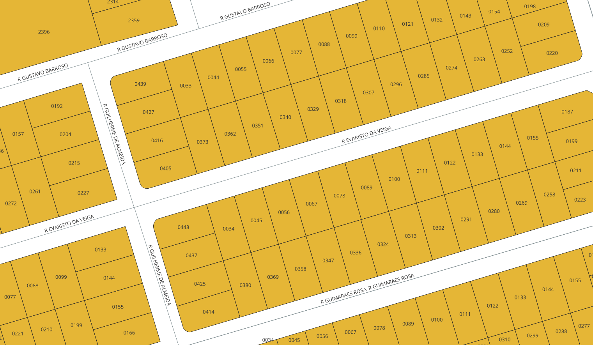

<aside>
<table align="right" style="padding: 1em">
<tr><td>Pacote <big><b>pk0005.01</b></big> de <small><a target="_afacodes" title="Jurisdição" href="https://afa.codes/BR-ES-Serra">BR-ES-Serra</a></small>
</td></tr>
<tr><td>
Doador: <a rel="external" target="_doador" href="http://www.serra.es.gov.br/">Prefeitura Municipal de Serra</a>
 &nbsp; <small>CNPJ 27.174.093/0001-27</small> • Wikidata <a rel="external" target="_doador" title="link descritor Wikidata do doador" href="https://www.wikidata.org/wiki/Q56450024">Q56450024</a></small> 
Licença <a rel="external" target="_doador" href="https://creativecommons.org/publicdomain/zero/1.0/"><b>CC0-1.0</b></a> (cc0) 
Obtido via <i>email</i> em <b>14/05/2020</b> por:
 &nbsp; Avaliação técnica: <a rel="external" target="_gitPerson" title="usuário Git" href="https://github.com/IgorEliezer">IgorEliezer</a>
 &nbsp; Representação institucional: <a rel="external" target="_gitPerson" title="usuário Git" href="https://github.com/ThierryAJean">ThierryAJean</a> 
</td></tr>
<tr><td>Camadas:     </td></tr>
<tr><td>Dados publicados em <a href="https://git.digital-guard.org/preservCutGeo-BR2021/tree/main/data/ES/Serra/_pk0005.01">preservCutGeo-BR2021</a> <a href="#reprodutibilidade">Reprodutíveis</a></td></tr>
<tr><td>Visualização:     </td></tr>
</table>
</aside>

<section>

Este repositório de metadados descreve um pacote de arquivos doado para o domínio público. Ele está sendo preservado pela Digital Guard: para maiores detalhes consulte a [documentação sobre o processo de registro e preservação](https://wiki.addressforall.org/doc/Documentação_Digital-guard).

Nota. O presente documento README foi gerado por software a partir das informações contidas no arquivo [`make_conf.yaml`](https://git.digital-guard.org/preserv-BR/blob/main/data/ES/Serra/_pk0005.01/make_conf.yaml) deste pacote, e informações adicionais dos catálogos de [doadores](https://git.digital-guard.org/preserv-BR/blob/main/data/donor.csv) e de [pacotes](https://git.digital-guard.org/preserv-BR/blob/main/data/donatedPack.csv).

# Camadas de dados

Os arquivos contêm "camadas de dados" temáticas. Os metadados também descrevem como cada camada foi avaliada e seus dados filtrados de forma padronizada.

##  block

Nome do arquivo: `2018-01-05.gdb` *Download* e integridade: [b18fc8ebe8bccc2cfdbbbd5f4896d5f6573033ebfa80061d1d86550c5ae8521d.zip](https://dl.digital-guard.org/b18fc8ebe8bccc2cfdbbbd5f4896d5f6573033ebfa80061d1d86550c5ae8521d.zip) Descrição: GDB Geodatabase Tamanho do arquivo: 24218623 bytes (23.1 <abbr title="mebibyte">MiB</abbr>) Formato: gdb SRID: 31984

#### Resultados da filtragem e sua publicação
6596474 bytes (6.29 <abbr title="mebibyte">MiB</abbr>) 7733 polígonos com 92.17 <abbr title="quilômetros quadrados">km²</abbr> densidade média: 0.29 polígonos/km² GeoJSONs publicados em [https://git.digital-guard.org/preservCutGeo-BR2021/tree/main/data/ES/Serra/_pk0005.01/block](https://git.digital-guard.org/preservCutGeo-BR2021/tree/main/data/ES/Serra/_pk0005.01/block)

#### Visualização
[https://viz.addressforall.org/BR-ES-Serra/_pk0005.01/block](https://viz.addressforall.org/BR-ES-Serra/_pk0005.01/block)
##  nsvia

Nome do arquivo: `2018-01-05.gdb` *Download* e integridade: [b18fc8ebe8bccc2cfdbbbd5f4896d5f6573033ebfa80061d1d86550c5ae8521d.zip](https://dl.digital-guard.org/b18fc8ebe8bccc2cfdbbbd5f4896d5f6573033ebfa80061d1d86550c5ae8521d.zip) Descrição: GDB Geodatabase Tamanho do arquivo: 24218623 bytes (23.1 <abbr title="mebibyte">MiB</abbr>) Formato: gdb SRID: 31984

#### Dados relevantes
* `TX_BAIRRO` (nsvia)

#### Resultados da filtragem e sua publicação
675891 bytes (0.64 <abbr title="mebibyte">MiB</abbr>) 129 polígonos com 173.78 <abbr title="quilômetros quadrados">km²</abbr> densidade média: 0.31 polígonos/km² GeoJSONs publicados em [https://git.digital-guard.org/preservCutGeo-BR2021/tree/main/data/ES/Serra/_pk0005.01/nsvia](https://git.digital-guard.org/preservCutGeo-BR2021/tree/main/data/ES/Serra/_pk0005.01/nsvia)

#### Visualização
[https://viz.addressforall.org/BR-ES-Serra/_pk0005.01/nsvia](https://viz.addressforall.org/BR-ES-Serra/_pk0005.01/nsvia)
##  parcel

Nome do arquivo: `2018-01-05.gdb` *Download* e integridade: [b18fc8ebe8bccc2cfdbbbd5f4896d5f6573033ebfa80061d1d86550c5ae8521d.zip](https://dl.digital-guard.org/b18fc8ebe8bccc2cfdbbbd5f4896d5f6573033ebfa80061d1d86550c5ae8521d.zip) Descrição: GDB Geodatabase Tamanho do arquivo: 24218623 bytes (23.1 <abbr title="mebibyte">MiB</abbr>) Formato: gdb SRID: 31984

#### Resultados da filtragem e sua publicação
30747693 bytes (29.32 <abbr title="mebibyte">MiB</abbr>) 135587 polígonos com 93.91 <abbr title="quilômetros quadrados">km²</abbr> densidade média: 0.37 polígonos/km² GeoJSONs publicados em [https://git.digital-guard.org/preservCutGeo-BR2021/tree/main/data/ES/Serra/_pk0005.01/parcel](https://git.digital-guard.org/preservCutGeo-BR2021/tree/main/data/ES/Serra/_pk0005.01/parcel)

#### Visualização
[https://viz.addressforall.org/BR-ES-Serra/_pk0005.01/parcel](https://viz.addressforall.org/BR-ES-Serra/_pk0005.01/parcel)
##  via

Nome do arquivo: `2018-01-05.gdb` *Download* e integridade: [b18fc8ebe8bccc2cfdbbbd5f4896d5f6573033ebfa80061d1d86550c5ae8521d.zip](https://dl.digital-guard.org/b18fc8ebe8bccc2cfdbbbd5f4896d5f6573033ebfa80061d1d86550c5ae8521d.zip) Descrição: GDB Geodatabase Tamanho do arquivo: 24218623 bytes (23.1 <abbr title="mebibyte">MiB</abbr>) Formato: gdb SRID: 31984

#### Dados relevantes
* `TX_TOPONIMIA_EXTENSO` (via)

#### Resultados da filtragem e sua publicação
2079791 bytes (1.98 <abbr title="mebibyte">MiB</abbr>) 9995 segmentos com 1790.17 <abbr title="quilômetros">km</abbr> densidade média: 3.19 segmentos/km² GeoJSONs publicados em [https://git.digital-guard.org/preservCutGeo-BR2021/tree/main/data/ES/Serra/_pk0005.01/via](https://git.digital-guard.org/preservCutGeo-BR2021/tree/main/data/ES/Serra/_pk0005.01/via)

#### Visualização
[https://viz.addressforall.org/BR-ES-Serra/_pk0005.01/via](https://viz.addressforall.org/BR-ES-Serra/_pk0005.01/via)

# Evidências de teste

</section>
<section>

# Reprodutibilidade

O processo de transformação dos *dados orginais* (arquivos doados) em *dados filtrados* pode ser reproduzido por qualquer pessoa fazendo uso das mesmas ferramentas de software utilizadas pelo projeto. A seguir a sequência de comandos *bash* que garantem a [reprodutibilidade](https://en.wikipedia.org/wiki/Reproducibility) do processo a cada *layer*. Qualquer pessoa, munida dos [ferramentas de software utilizadas pelo projeto](https://git.AddressForAll.org/suporte/blob/master/docs/pt/infra.md#ambientes-e-ferramentas-de-uso-geral), vai gerar os mesmos resultados.

Pode-se reproduzir de dois modos:
* artesanal: com os comandos em [reproducibility.sh](https://git.digital-guard.org/preserv-BR/blob/main/data/ES/Serra/_pk0005.01/reproducibility.sh), depois de seguir a sequência de preparo da base de dados no esquema *ingest*.
* automático: usando o comando `make` conforme descrito na documentação do projeto.

</section>

