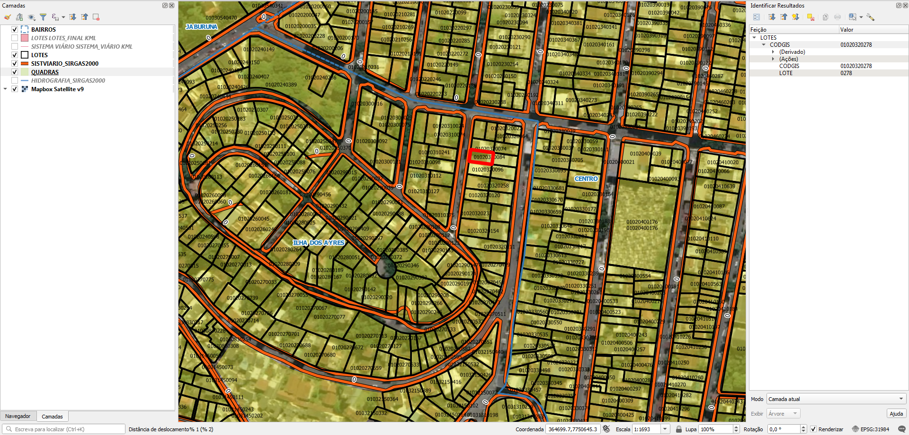

<aside>
<table align="right" style="padding: 1em">
<tr><td>Pacote <a target="_git" title="link canônico para o git deste pacote" href="https://git.digital-guard.org/preserv-BR/blob/main/data/ES/VilaVelha/_pk0007.01"><big><b>pk0007.01</b></big></a> de <small><a target="_osmcodes" title="Jurisdição" href="https://osm.codes/BR-ES-VilaVelha">BR-ES-VilaVelha</a></small>
</td></tr>
<tr><td>
Doador: <a rel="external" target="_doador" href="https://www.vilavelha.es.gov.br/">Prefeitura Municipal de Vila Velha</a>
 &nbsp; <small>CNPJ 27.165.554/0001-03</small> • Wikidata <a rel="external" target="_doador" title="link descritor Wikidata do doador" href="https://www.wikidata.org/wiki/Q56450026">Q56450026</a></small> 
Licença <a rel="external" target="_doador" href="https://creativecommons.org/publicdomain/zero/1.0/"><b>CC0-1.0</b></a> (cc0) 
Obtido via <i>site</i> em <b>14/05/2020</b> por:
 &nbsp; Avaliação técnica: <a rel="external" target="_gitPerson" title="usuário Git" href="https://github.com/IgorEliezer">IgorEliezer</a>
 &nbsp; Representação institucional: <a rel="external" target="_gitPerson" title="usuário Git" href="https://github.com/ThierryAJean">ThierryAJean</a> 
</td></tr>
<tr><td>Camadas:    </td></tr>
<tr><td>Dados publicados em <a href="https://git.digital-guard.org/preservCutGeo-BR2021/tree/main/data/ES/VilaVelha/_pk0007.01">preservCutGeo-BR2021</a> <a href="#reprodutibilidade">Reprodutíveis</a></td></tr>
<tr><td>Visualização:    </td></tr>
</table>
</aside>

<section>

Este repositório de metadados descreve um pacote de arquivos doado para o domínio público. Ele está sendo preservado pela Digital Guard: para maiores detalhes consulte a [documentação sobre o processo de registro e preservação](https://wiki.addressforall.org/doc/Documentação_Digital-guard).

Nota. O presente documento README foi gerado por software a partir das informações contidas no arquivo [`make_conf.yaml`](https://git.digital-guard.org/preserv-BR/blob/main/data/ES/VilaVelha/_pk0007.01/make_conf.yaml) deste pacote, e informações adicionais dos catálogos de [doadores](https://git.digital-guard.org/preserv-BR/blob/main/data/donor.csv) e de [pacotes](https://git.digital-guard.org/preserv-BR/blob/main/data/donatedPack.csv).

# Camadas de dados

Os arquivos contêm "camadas de dados" temáticas. Os metadados também descrevem como cada camada foi avaliada e seus dados filtrados de forma padronizada.

##  block

Nome do arquivo: `QUADRAS/QUADRAS` *Download* e integridade: [3984d1a48b63d858fdfbe7829e493d1c35650546eb84039a59f9008de9bc4871.zip](http://dl.digital-guard.org/3984d1a48b63d858fdfbe7829e493d1c35650546eb84039a59f9008de9bc4871.zip) Descrição: Quadras Tamanho do arquivo: 2327148 bytes (2.22 <abbr title="mebibyte">MiB</abbr>) Formato: shp SRID: 31984

#### Resultados da filtragem e sua publicação
2813635 bytes (2.68 <abbr title="mebibyte">MiB</abbr>) 4523 polígonos com 54.44 <abbr title="quilômetros quadrados">km²</abbr> densidade média: 0.25 polígonos/km² GeoJSONs publicados em [https://git.digital-guard.org/preservCutGeo-BR2021/tree/main/data/ES/VilaVelha/_pk0007.01/block](https://git.digital-guard.org/preservCutGeo-BR2021/tree/main/data/ES/VilaVelha/_pk0007.01/block)

#### Visualização
[https://viz.addressforall.org/BR-ES-VilaVelha/_pk0007.01/block](https://viz.addressforall.org/BR-ES-VilaVelha/_pk0007.01/block)
##  nsvia

Nome do arquivo: `BAIRROS/BAIRROS` *Download* e integridade: [c0cd7b2a4cc67b5d49a4d296f41b564b23464364ab746adc6d2206d5dd9249af.zip](http://dl.digital-guard.org/c0cd7b2a4cc67b5d49a4d296f41b564b23464364ab746adc6d2206d5dd9249af.zip) Descrição: Bairros Tamanho do arquivo: 68069 bytes (0.06 <abbr title="mebibyte">MiB</abbr>) Formato: shp SRID: 31984

#### Dados relevantes
* `BAIRRO` (nsvia): nome do bairro em caixa alta, por extenso e com acentuação

#### Resultados da filtragem e sua publicação
148475 bytes (0.14 <abbr title="mebibyte">MiB</abbr>) 92 polígonos com 67.68 <abbr title="quilômetros quadrados">km²</abbr> densidade média: 0.31 polígonos/km² GeoJSONs publicados em [https://git.digital-guard.org/preservCutGeo-BR2021/tree/main/data/ES/VilaVelha/_pk0007.01/nsvia](https://git.digital-guard.org/preservCutGeo-BR2021/tree/main/data/ES/VilaVelha/_pk0007.01/nsvia)

#### Visualização
[https://viz.addressforall.org/BR-ES-VilaVelha/_pk0007.01/nsvia](https://viz.addressforall.org/BR-ES-VilaVelha/_pk0007.01/nsvia)
##  parcel

Nome do arquivo: `LOTES/LOTES` *Download* e integridade: [5c7131c32a7411cf7a27022b8ac2989e88f86254ed74b6b3b2e5cf94b44e3acb.zip](http://dl.digital-guard.org/5c7131c32a7411cf7a27022b8ac2989e88f86254ed74b6b3b2e5cf94b44e3acb.zip) Descrição: Lotes Tamanho do arquivo: 6282461 bytes (5.99 <abbr title="mebibyte">MiB</abbr>) Formato: shp SRID: 31984

#### Resultados da filtragem e sua publicação
15341314 bytes (14.63 <abbr title="mebibyte">MiB</abbr>) 86886 polígonos com 43.76 <abbr title="quilômetros quadrados">km²</abbr> densidade média: 0.44 polígonos/km² GeoJSONs publicados em [https://git.digital-guard.org/preservCutGeo-BR2021/tree/main/data/ES/VilaVelha/_pk0007.01/parcel](https://git.digital-guard.org/preservCutGeo-BR2021/tree/main/data/ES/VilaVelha/_pk0007.01/parcel)

#### Visualização
[https://viz.addressforall.org/BR-ES-VilaVelha/_pk0007.01/parcel](https://viz.addressforall.org/BR-ES-VilaVelha/_pk0007.01/parcel)

# Evidências de teste

</section>
<section>

# Reprodutibilidade

O processo de transformação dos *dados orginais* (arquivos doados) em *dados filtrados* pode ser reproduzido por qualquer pessoa fazendo uso das mesmas ferramentas de software utilizadas pelo projeto. A seguir a sequência de comandos *bash* que garantem a [reprodutibilidade](https://en.wikipedia.org/wiki/Reproducibility) do processo a cada *layer*. Qualquer pessoa, munida dos [ferramentas de software utilizadas pelo projeto](https://git.AddressForAll.org/suporte/blob/master/docs/pt/infra.md#ambientes-e-ferramentas-de-uso-geral), vai gerar os mesmos resultados.

Pode-se reproduzir de dois modos:
* artesanal: com os comandos em [reproducibility.sh](https://git.digital-guard.org/preserv-BR/blob/main/data/ES/VilaVelha/_pk0007.01/reproducibility.sh), depois de seguir a sequência de preparo da base de dados no esquema *ingest*.
* automático: usando o comando `make` conforme descrito na documentação do projeto.

</section>

