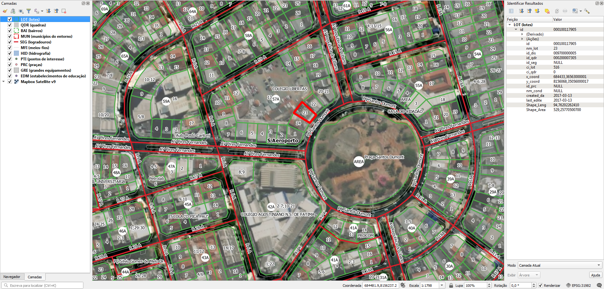

<aside>
<table align="right" style="padding: 1em">
<tr><td>Pacote <a target="_git" title="link canônico para o git deste pacote" href="https://git.digital-guard.org/preserv-BR/blob/main/data/GO/Goiania/_pk0054.01"><big><b>pk0054.01</b></big></a> de <small><a target="_afacodes" title="Jurisdição" href="https://afa.codes/BR-GO-Goiania">BR-GO-Goiania</a></small>
</td></tr>
<tr><td>
Doador: <a rel="external" target="_doador" href="https://www.goiania.go.gov.br/">Prefeitura de Goiânia</a>
 &nbsp; <small>CNPJ 14.185.071/0001-10</small> • Wikidata <a rel="external" target="_doador" title="link descritor Wikidata do doador" href="https://www.wikidata.org/wiki/Q53930914">Q53930914</a></small> 

Obtido via <i>site</i> em <b>01/12/2020</b> por:
 &nbsp; Avaliação técnica: <a rel="external" target="_gitPerson" title="usuário Git" href="https://github.com/IgorEliezer">IgorEliezer</a>
 &nbsp; Representação institucional: <a rel="external" target="_gitPerson" title="usuário Git" href="https://github.com/ThierryAJean">ThierryAJean</a> 
</td></tr>
<tr><td>Camadas:     </td></tr>
<tr><td>Dados publicados em <a href="https://git.digital-guard.org/preservCutGeo-BR2021/tree/main/data/GO/Goiania/_pk0054.01">preservCutGeo-BR2021</a> <a href="#reprodutibilidade">Reprodutíveis</a></td></tr>
<tr><td>Visualização:     </td></tr>
</table>
</aside>

<section>

Este repositório de metadados descreve um pacote de arquivos doado para o domínio público. Ele está sendo preservado pela Digital Guard: para maiores detalhes consulte a [documentação sobre o processo de registro e preservação](https://wiki.addressforall.org/doc/Documentação_Digital-guard).

Nota. O presente documento README foi gerado por software a partir das informações contidas no arquivo [`make_conf.yaml`](https://git.digital-guard.org/preserv-BR/blob/main/data/GO/Goiania/_pk0054.01/make_conf.yaml) deste pacote, e informações adicionais dos catálogos de [doadores](https://git.digital-guard.org/preserv-BR/blob/main/data/donor.csv) e de [pacotes](https://git.digital-guard.org/preserv-BR/blob/main/data/donatedPack.csv).

# Camadas de dados

Os arquivos contêm "camadas de dados" temáticas. Os metadados também descrevem como cada camada foi avaliada e seus dados filtrados de forma padronizada.

##  block

Nome do arquivo: `QDR` *Download* e integridade: [1fd83fa52b1a8b9179f8e38703b1a33a30256f68994794404acde1ad786dac7e.zip](http://dl.digital-guard.org/1fd83fa52b1a8b9179f8e38703b1a33a30256f68994794404acde1ad786dac7e.zip) Descrição: Lotes Tamanho do arquivo: 8757528 bytes (8.35 <abbr title="mebibyte">MiB</abbr>) Formato: shp SRID: 31982

#### Resultados da filtragem e sua publicação
15136347 bytes (14.44 <abbr title="mebibyte">MiB</abbr>) 24543 polígonos com 313.75 <abbr title="quilômetros quadrados">km²</abbr> densidade média: 0.58 polígonos/km² GeoJSONs publicados em [https://git.digital-guard.org/preservCutGeo-BR2021/tree/main/data/GO/Goiania/_pk0054.01/block](https://git.digital-guard.org/preservCutGeo-BR2021/tree/main/data/GO/Goiania/_pk0054.01/block)

#### Visualização
[https://viz.addressforall.org/BR-GO-Goiania/_pk0054.01/block](https://viz.addressforall.org/BR-GO-Goiania/_pk0054.01/block)
##  nsvia

Nome do arquivo: `BAI` *Download* e integridade: [981d55ac26d0131ff4040aeca1444ad2310e20b89ceeac70c9d4ca12caf5151b.zip](http://dl.digital-guard.org/981d55ac26d0131ff4040aeca1444ad2310e20b89ceeac70c9d4ca12caf5151b.zip) Descrição: Bairros Tamanho do arquivo: 1260874 bytes (1.2 <abbr title="mebibyte">MiB</abbr>) Formato: shp SRID: 31982

#### Dados relevantes
* `nm` (nsvia)

#### Resultados da filtragem e sua publicação
2591981 bytes (2.47 <abbr title="mebibyte">MiB</abbr>) 1154 polígonos com 419.35 <abbr title="quilômetros quadrados">km²</abbr> densidade média: 0.56 polígonos/km² GeoJSONs publicados em [https://git.digital-guard.org/preservCutGeo-BR2021/tree/main/data/GO/Goiania/_pk0054.01/nsvia](https://git.digital-guard.org/preservCutGeo-BR2021/tree/main/data/GO/Goiania/_pk0054.01/nsvia)

#### Visualização
[https://viz.addressforall.org/BR-GO-Goiania/_pk0054.01/nsvia](https://viz.addressforall.org/BR-GO-Goiania/_pk0054.01/nsvia)
##  parcel

Nome do arquivo: `LOT` *Download* e integridade: [db2d3b64a2494ff53212d276645986490890025d2b5d1fc5a1b90af7e7bbdf39.zip](http://dl.digital-guard.org/db2d3b64a2494ff53212d276645986490890025d2b5d1fc5a1b90af7e7bbdf39.zip) Descrição: Lotes Tamanho do arquivo: 53017065 bytes (50.56 <abbr title="mebibyte">MiB</abbr>) Formato: shp SRID: 31982

#### Resultados da filtragem e sua publicação
73501329 bytes (70.1 <abbr title="mebibyte">MiB</abbr>) 388832 polígonos com 312.07 <abbr title="quilômetros quadrados">km²</abbr> densidade média: 0.64 polígonos/km² GeoJSONs publicados em [https://git.digital-guard.org/preservCutGeo-BR2021/tree/main/data/GO/Goiania/_pk0054.01/parcel](https://git.digital-guard.org/preservCutGeo-BR2021/tree/main/data/GO/Goiania/_pk0054.01/parcel)

#### Visualização
[https://viz.addressforall.org/BR-GO-Goiania/_pk0054.01/parcel](https://viz.addressforall.org/BR-GO-Goiania/_pk0054.01/parcel)
##  via

Nome do arquivo: `SEG` *Download* e integridade: [926566fc01aa45a22ede663e66e371ce9e70e730e7f4e28b10b3bdf19d67fd38.zip](http://dl.digital-guard.org/926566fc01aa45a22ede663e66e371ce9e70e730e7f4e28b10b3bdf19d67fd38.zip) Descrição: Eixos Tamanho do arquivo: 6634769 bytes (6.33 <abbr title="mebibyte">MiB</abbr>) Formato: shp SRID: 31982

#### Dados relevantes
* `tp_log || ' ' || nm_log` (via)

#### Resultados da filtragem e sua publicação
7980622 bytes (7.61 <abbr title="mebibyte">MiB</abbr>) 65436 segmentos com 6554.87 <abbr title="quilômetros">km</abbr> densidade média: 12.71 segmentos/km² GeoJSONs publicados em [https://git.digital-guard.org/preservCutGeo-BR2021/tree/main/data/GO/Goiania/_pk0054.01/via](https://git.digital-guard.org/preservCutGeo-BR2021/tree/main/data/GO/Goiania/_pk0054.01/via)

#### Visualização
[https://viz.addressforall.org/BR-GO-Goiania/_pk0054.01/via](https://viz.addressforall.org/BR-GO-Goiania/_pk0054.01/via)

# Evidências de teste

</section>
<section>

# Reprodutibilidade

O processo de transformação dos *dados orginais* (arquivos doados) em *dados filtrados* pode ser reproduzido por qualquer pessoa fazendo uso das mesmas ferramentas de software utilizadas pelo projeto. A seguir a sequência de comandos *bash* que garantem a [reprodutibilidade](https://en.wikipedia.org/wiki/Reproducibility) do processo a cada *layer*. Qualquer pessoa, munida dos [ferramentas de software utilizadas pelo projeto](https://git.AddressForAll.org/suporte/blob/master/docs/pt/infra.md#ambientes-e-ferramentas-de-uso-geral), vai gerar os mesmos resultados.

Pode-se reproduzir de dois modos:
* artesanal: com os comandos em [reproducibility.sh](https://git.digital-guard.org/preserv-BR/blob/main/data/GO/Goiania/_pk0054.01/reproducibility.sh), depois de seguir a sequência de preparo da base de dados no esquema *ingest*.
* automático: usando o comando `make` conforme descrito na documentação do projeto.

</section>

