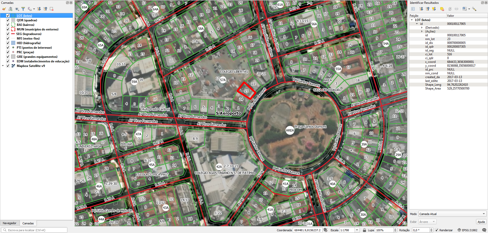

# Sobre
## Sistema de endereçamento
Goiânia possui um sistema que usa logradouro, quadra e lote. Exemplo: Avenida 10, Quadra 10, Lote 18.

A Prefeitura não entregou nenhuma planilha DE-PARA.

# Tarefas
## 1. Atribuir número de quadra nos lotes contidos
Lotes somente possuem número de lote. Precisa atribuir o número de quadra.

Ver [Extração](#Extração) para dados.

## 2. Atribuir nome de logradouro nos lotes
Atribuir o nome do eixo de logradouro mais próximo aos lotes.

Ver [Extração](#Extração) para dados.

## 3. Gerar ponto de endereço na testada do lote
Procedimento usando PostGIS com script desenvolvido pelo A4A.

Cada ponto terá os dados:
* Nome do logradouro
* Número de lote
* Número de quadra

# Extração
Abaixo os passos para extração por tipo de dado relevante.

## Lotes
SRID: 31982
1. Abrir `lot.zip`.
2. Selecionar todos os arquivos shapefile.
3. Copiar arquivos selecionados para diretório alvo.

### Dados relevantes
Colunas da camada `LOT`:
* `id` (string): identificador, no caso de haver planilha DE-PARA.
* `nm_lot` (string): número de lote.

N.B.1: a coluna `id_seg` supostamente seria o ID do segmento do logradouro, mas está com valor NULL ou 0 em toda a cidade.

N.B.2: Alguns lotes são originados de englobamento (fusão) de lotes. Estes terão como numeração "1;2" (fusão dos lotes 1 e 2) ou "1-3" (fusão dos lotes 1, 2 e 3).

## Quadra
SRID: 31982
1. Abrir `qdr.zip`.
2. Selecionar todos os arquivos shapefile.
3. Copiar arquivos selecionados para diretório alvo.

### Dados relevantes
Colunas da camada `QDR`:
* `nm_qdr` (string): número de lote.

## Bairros
SRID: 31982
1. Abrir `bai.zip`.
2. Selecionar todos os arquivos shapefile.
3. Copiar arquivos selecionados para diretório alvo.

### Dados relevantes
Colunas da camada `BAI`:
* `tp_bai` (string): tipo de bairro abreviado (Prq, Bro, Jd, etc).
* `nm_bai` (string): nome de bairro.
* `nm` (string): tipo de bairro abreviado e nome de bairro.

## Eixos
SRID: 31982
1. Abrir `seg.zip`.
2. Selecionar todos os arquivos shapefile.
3. Copiar arquivos selecionados para diretório alvo.

### Dados relevantes
Colunas da camada `logradouros`:
* `tp_log` (string): tipo de logradouro caixa alta e abreviado (R, AV, PÇ, etc).
* `nm_log` (string): nome de logradouro sem tipo.

### Expressões
Para contruir o nome do logradouro, usar:

`tp_log  +  ' '  + nm_log`

## Outros
Para outros projetos, há também dados sobre:
* Divisas de municípios do entorno: em `mun.zip`;
* Meios-fios: em `mfi.zip`;
* Hidrografia: em `hdi.zip`;
* Pontos de interesse: em `pti.zip`;
* Pontos de praças: em `prc.zip`;
* Grandes equipamentos: em `gre.zip`;
* Pontos de estabelecimentos de educação: em `edm.zip`.

(!!! Havendo outros projetos, esta seção será detalhada !!!)

# Evidências de teste
Teste no QGIS:

