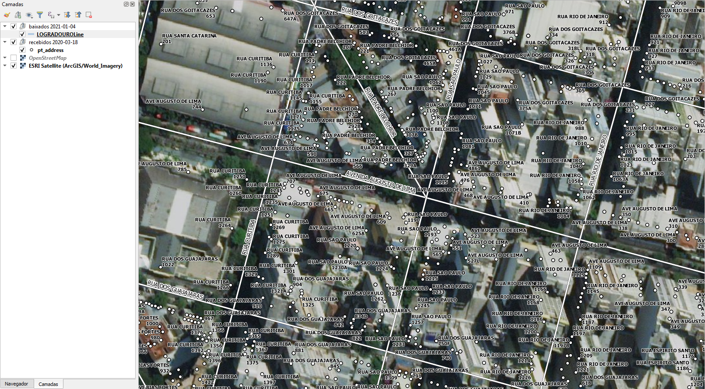

<aside>
<table align="right" style="padding: 1em">
<tr><td>Pacote <a target="_git" title="link canônico para o git deste pacote" href="http://git.digital-guard.org/preserv-BR/blob/main/data/MG/BeloHorizonte/_pk0008.01"><big><b>pk0008.01</b></big></a> de <small><a target="_osmcodes" title="Jurisdição" href="https://osm.codes/BR-MG-BeloHorizonte">BR-MG-BeloHorizonte</a></small>
</td></tr>
<tr><td>
Doador: <a rel="external" target="_doador" href="https://prefeitura.pbh.gov.br/">Prefeitura de Belo Horizonte</a><br/>
<small>cnpj:18.715.383/0001-40</small> • Wikidata <a rel="external" target="_doador" title="link descritor Wikidata do doador" href="https://www.wikidata.org/wiki/Q30263897">Q30263897</a></small><br/>
Licença <a rel="external" target="_doador" href="https://creativecommons.org/publicdomain/zero/1.0/"><b>CC0-1.0</b></a> (cc0 <a title="SHA256 c60a5c4b52d62db992ac18d1647fa7aa0e42926c430d621961ed44c08e3fac5e.zip" href="http://dl.digital-guard.org/c60a5c4b52d62db992ac18d1647fa7aa0e42926c430d621961ed44c08e3fac5e.zip"><code>c60a5c4...zip</code></a><a title="SHA256 https://web.archive.org/web/20220523213131/https://dados.pbh.gov.br/about" href="https://web.archive.org/web/20220523213131/https://dados.pbh.gov.br/about"><code>webarchive</code></a>)
Obtido via <i>email;site</i> em <b>2020-03-19</b> por:<br/>
 Avaliação técnica: <a rel="external" target="_gitPerson" title="usuário Git" href="https://github.com/IgorEliezer">IgorEliezer</a><br/>
 Representação institucional: <a rel="external" target="_gitPerson" title="usuário Git" href="https://github.com/ThierryAJean">ThierryAJean</a><br/>
</td></tr>
<tr><td>Camadas: <a title="via" href="#-via"></a> <a title="geoaddress" href="#-geoaddress"></a> </td></tr>
<tr><td><a href="http://git.digital-guard.org/preservCutGeo-BR2021/tree/main/data/MG/BeloHorizonte/_pk0008.01">Dados publicados</a></td></tr>
</table>
</aside>

<section>

Este repositório de metadados descreve um pacote de arquivos doado para o domínio público. Ele está sendo preservado pela Digital Guard: para maiores detalhes consulte a [documentação sobre o processo de registro e preservação](https://git.digital-guard.org/preserv/tree/main/docs).

Nota. O presente documento README foi gerado por software a partir das informações contidas no arquivo [`make_conf.yaml`](make_conf.yaml) deste pacote, e informações adicionais dos catálogos de [doadores](https://git.digital-guard.org/preserv-BR/blob/main/data/donor.csv) e de [pacotes](https://git.digital-guard.org/preserv-BR/blob/main/data/donatedPack.csv).

# Camadas de dados

Os arquivos contém "camadas de dados" temáticas. Os metadados também descrevem como cada camada foi avaliada e seus dados filtrados de forma padronizada.

##  geoaddress

Nome do arquivo: `ENDERECO`.<br/>*Download* e integridade: [1ce29a555565be5f540ab0c6f93ac55797c368293e0a6bfb479a645a5a23f542.zip](http://dl.digital-guard.org/1ce29a555565be5f540ab0c6f93ac55797c368293e0a6bfb479a645a5a23f542.zip)<br/>Descrição: Pontos de Endereço<br/>Tamanho do arquivo: 42826370 bytes (40.84 <abbr title="mebibyte">MiB</abbr>)<br/>Formato: csv<br/>SRID: 31983

#### Dados publicados
[http://git.digital-guard.org/preservCutGeo-BR2021/tree/main/data/MG/BeloHorizonte/_pk0008.01/geoaddress](http://git.digital-guard.org/preservCutGeo-BR2021/tree/main/data/MG/BeloHorizonte/_pk0008.01/geoaddress)<br/>37140899 bytes (35.42 <abbr title="mebibyte">MiB</abbr>)<br/>690656 pontos<br/>densidade média de 3135.37 pontos/km²
##  via

Nome do arquivo: `LOGRADOUROLine`.<br/>*Download* e integridade: [7d7d0661683a8eebd95d544c47dd0e254fc75e3d916fe9900a3bd9fb7b2cc378.zip](http://dl.digital-guard.org/7d7d0661683a8eebd95d544c47dd0e254fc75e3d916fe9900a3bd9fb7b2cc378.zip)<br/>Descrição: Vias<br/>Tamanho do arquivo: 2637788 bytes (2.52 <abbr title="mebibyte">MiB</abbr>)<br/>Formato: shp<br/>SRID: 31983

#### Dados publicados
[http://git.digital-guard.org/preservCutGeo-BR2021/tree/main/data/MG/BeloHorizonte/_pk0008.01/via](http://git.digital-guard.org/preservCutGeo-BR2021/tree/main/data/MG/BeloHorizonte/_pk0008.01/via)<br/>3955525 bytes (3.77 <abbr title="mebibyte">MiB</abbr>)<br/>16075 segmentos com 4629.73 <abbr title="quilômetros">km</abbr><br/>densidade média: 13.44 segmentos/km²

# Evidências de teste


</section>
<section>

# Reprodutibilidade

```bash

geoaddress:
rm -rf /tmp/sandbox/_pk7600000801_001 || true
mkdir -m 777 -p /tmp/sandbox
mkdir -m 777 -p /tmp/sandbox/_pk7600000801_001
mkdir -p /tmp/pg_io
wget -P /var/www/preserv.addressforall.org/download http://dl.digital-guard.org/1ce29a555565be5f540ab0c6f93ac55797c368293e0a6bfb479a645a5a23f542.zip
sudo chown postgres:www-data /var/www/preserv.addressforall.org/download/1ce29a555565be5f540ab0c6f93ac55797c368293e0a6bfb479a645a5a23f542.zip && sudo chmod 664 /var/www/preserv.addressforall.org/download/1ce29a555565be5f540ab0c6f93ac55797c368293e0a6bfb479a645a5a23f542.zip
psql $(pg_uri_db) -c "DROP FOREIGN TABLE IF EXISTS pk7600000801101_p1_geoaddress CASCADE"
cd /tmp/sandbox/_pk7600000801_001; 7z  x -y /var/www/preserv.addressforall.org/download/1ce29a555565be5f540ab0c6f93ac55797c368293e0a6bfb479a645a5a23f542.zip "*ENDERECO*" ; chmod -R a+rwx . > /dev/null
psql postgres://postgres@localhost/ingest1 -c "SELECT srid, proj4text FROM spatial_ref_sys where srid=31983"
psql postgres://postgres@localhost/ingest1 -c "SELECT ingest.fdw_generate_direct_csv( '/tmp/sandbox/_pk7600000801_001/ENDERECO.csv', 'pk7600000801101_p1_geoaddress' )"

psql postgres://postgres@localhost/ingest1 -c "CREATE VIEW vw1_pk7600000801101_p1_geoaddress AS SELECT row_number() OVER () as gid, \"SIGLA_TIPO_LOGRADOURO\" \
     || CASE WHEN \"SIGLA_TIPO_LOGRADOURO\" IN ('RUA','VIA') THEN ' ' ELSE '. ' END \
     || \"NOME_LOGRADOURO\" AS via,\
     \"NUMERO_IMOVEL\" || COALESCE(\"LETRA_IMOVEL\",'') AS hnum,\
     \"LETRA_IMOVEL\">'' AS is_complemento_provavel,\
     ST_GeomFromText(\"GEOMETRIA\",$(srid)) as geom \
FROM $(tabname)"
psql $(pg_uri_db) -c "SELECT ingest.any_load('csv2sql','$(sandbox)/ENDERECO.csv','geoaddress_full','vw1_pk7600000801101_p1_geoaddress','7600000801101','1ce29a555565be5f540ab0c6f93ac55797c368293e0a6bfb479a645a5a23f542.zip',array[]::text[],1,2)"
psql postgres://postgres@localhost/ingest1 -c "DROP VIEW vw1_pk7600000801101_p1_geoaddress"
@echo "Confira os resultados nas tabelas ingest.donated_packcomponent e ingest.feature_asis".
psql postgres://postgres@localhost/ingest1 -c "DROP FOREIGN TABLE IF EXISTS pk7600000801101_p1_geoaddress"
rm -f "/tmp/sandbox/_pk7600000801_001/*ENDERECO.*" || true
psql $(pg_uri_db) -c "DROP TABLE IF EXISTS pk7600000801101_p1_geoaddress CASCADE"
mkdir -m777 -p /var/gits/_dg/preservCutGeo-BR2021/data/MG/BeloHorizonte/_pk0008.01/geoaddress
rm -rf /var/gits/_dg/preservCutGeo-BR2021/data/MG/BeloHorizonte/_pk0008.01/geoaddress/*.geojson
psql $(pg_uri_db) -c "SELECT ingest.publicating_geojsons('geoaddress','BR-MG-BeloHorizonte','/var/gits/_dg/preservCutGeo-BR2021/data/MG/BeloHorizonte/_pk0008.01/geoaddress','2',9,3);"
cd /var/gits/_dg/preserv/src; sudo bash fixaPermissoes.sh /var/gits/_dg/preservCutGeo-BR2021/data/MG/BeloHorizonte/_pk0008.01/geoaddress

via:
rm -rf /tmp/sandbox/_pk7600000801_001 || true
mkdir -m 777 -p /tmp/sandbox
mkdir -m 777 -p /tmp/sandbox/_pk7600000801_001
mkdir -p /tmp/pg_io
wget -P /var/www/preserv.addressforall.org/download http://dl.digital-guard.org/7d7d0661683a8eebd95d544c47dd0e254fc75e3d916fe9900a3bd9fb7b2cc378.zip
sudo chown postgres:www-data /var/www/preserv.addressforall.org/download/7d7d0661683a8eebd95d544c47dd0e254fc75e3d916fe9900a3bd9fb7b2cc378.zip && sudo chmod 664 /var/www/preserv.addressforall.org/download/7d7d0661683a8eebd95d544c47dd0e254fc75e3d916fe9900a3bd9fb7b2cc378.zip
psql $(pg_uri_db) -c "DROP  TABLE IF EXISTS pk7600000801201_p2_via CASCADE"
cd /tmp/sandbox/_pk7600000801_001; 7z  x -y /var/www/preserv.addressforall.org/download/7d7d0661683a8eebd95d544c47dd0e254fc75e3d916fe9900a3bd9fb7b2cc378.zip "*LOGRADOUROLine*" ; chmod -R a+rwx . > /dev/null
psql postgres://postgres@localhost/ingest1 -c "SELECT srid, proj4text FROM spatial_ref_sys where srid=31983"
cd /tmp/sandbox/_pk7600000801_001; shp2pgsql -D -W ISO-8859-1  -s 31983 "LOGRADOUROLine.shp" pk7600000801201_p2_via | psql -q postgres://postgres@localhost/ingest1 2> /dev/null

psql postgres://postgres@localhost/ingest1 -c "CREATE VIEW vw2_pk7600000801201_p2_via AS SELECT gid, TIPO_LOGRA || ' ' || NOME_LOGRA AS via, geom FROM $(tabname)"
psql $(pg_uri_db) -c "SELECT ingest.any_load('shp2sql','$(sandbox)/LOGRADOUROLine.shp','via_full','vw2_pk7600000801201_p2_via','7600000801201','7d7d0661683a8eebd95d544c47dd0e254fc75e3d916fe9900a3bd9fb7b2cc378.zip',array[]::text[],5,1)"
psql postgres://postgres@localhost/ingest1 -c "DROP VIEW vw2_pk7600000801201_p2_via"
@echo "Confira os resultados nas tabelas ingest.donated_packcomponent e ingest.feature_asis".
rm -f "/tmp/sandbox/_pk7600000801_001/*LOGRADOUROLine.*" || true
psql $(pg_uri_db) -c "DROP TABLE IF EXISTS pk7600000801201_p2_via CASCADE"
mkdir -m777 -p /var/gits/_dg/preservCutGeo-BR2021/data/MG/BeloHorizonte/_pk0008.01/via
rm -rf /var/gits/_dg/preservCutGeo-BR2021/data/MG/BeloHorizonte/_pk0008.01/via/*.geojson
psql $(pg_uri_db) -c "SELECT ingest.publicating_geojsons('via','BR-MG-BeloHorizonte','/var/gits/_dg/preservCutGeo-BR2021/data/MG/BeloHorizonte/_pk0008.01/via','1',9,3);"
cd /var/gits/_dg/preserv/src; sudo bash fixaPermissoes.sh /var/gits/_dg/preservCutGeo-BR2021/data/MG/BeloHorizonte/_pk0008.01/via

```
</section>

