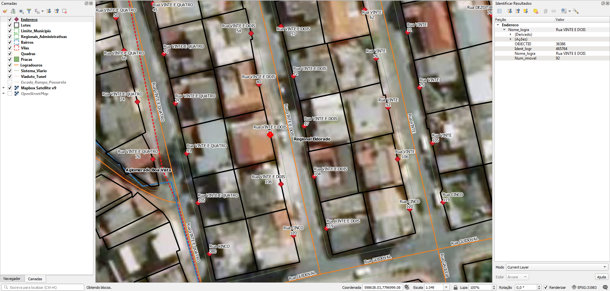

<aside>
<table align="right" style="padding: 1em">
<tr><td>Pacote <a target="_git" title="link canônico para o git deste pacote" href="https://git.digital-guard.org/preserv-BR/blob/main/data/MG/Contagem/_pk0009.01"><big><b>pk0009.01</b></big></a> de <small><a target="_afacodes" title="Jurisdição" href="https://afa.codes/BR-MG-Contagem">BR-MG-Contagem</a></small>
</td></tr>
<tr><td>
Doador: <a rel="external" target="_doador" href="http://www.contagem.mg.gov.br">Prefeitura Municipal de Contagem</a>
 &nbsp; <small>CNPJ 18.715.508/0001-31</small> • Wikidata <a rel="external" target="_doador" title="link descritor Wikidata do doador" href="https://www.wikidata.org/wiki/Q56450007">Q56450007</a></small> 
Licença <a rel="external" target="_doador" href="https://creativecommons.org/publicdomain/zero/1.0/"><b>CC0-1.0</b></a> (cc0 <a title="SHA256 4982630073e571b5d4f0e347819bf1b8848aec4a9867766b90d75309966dc6fe.zip" href="http://dl.digital-guard.org/4982630073e571b5d4f0e347819bf1b8848aec4a9867766b90d75309966dc6fe.zip"><code>4982630...zip</code></a><a title="SHA256 d575c707490b0867f7d0a38662ac2788c7b787fe5f130673b2ee7bd89f8a7c13.eml" href="d575c707490b0867f7d0a38662ac2788c7b787fe5f130673b2ee7bd89f8a7c13.eml"><code>webarchive</code></a>) 
Obtido via <i>email</i> em <b>22/07/2020</b> por:
 &nbsp; Avaliação técnica: <a rel="external" target="_gitPerson" title="usuário Git" href="https://github.com/IgorEliezer">IgorEliezer</a>
 &nbsp; Representação institucional: <a rel="external" target="_gitPerson" title="usuário Git" href="https://github.com/ThierryAJean">ThierryAJean</a> 
</td></tr>
<tr><td>Camadas:      </td></tr>
<tr><td>Dados publicados em <a href="https://git.digital-guard.org/preservCutGeo-BR2021/tree/main/data/MG/Contagem/_pk0009.01">preservCutGeo-BR2021</a> <a href="#reprodutibilidade">Reprodutíveis</a></td></tr>
<tr><td>Visualização:      </td></tr>
</table>
</aside>

<section>

Este repositório de metadados descreve um pacote de arquivos doado para o domínio público. Ele está sendo preservado pela Digital Guard: para maiores detalhes consulte a [documentação sobre o processo de registro e preservação](https://wiki.addressforall.org/doc/Documentação_Digital-guard).

Nota. O presente documento README foi gerado por software a partir das informações contidas no arquivo [`make_conf.yaml`](https://git.digital-guard.org/preserv-BR/blob/main/data/MG/Contagem/_pk0009.01/make_conf.yaml) deste pacote, e informações adicionais dos catálogos de [doadores](https://git.digital-guard.org/preserv-BR/blob/main/data/donor.csv) e de [pacotes](https://git.digital-guard.org/preserv-BR/blob/main/data/donatedPack.csv).

# Camadas de dados

Os arquivos contêm "camadas de dados" temáticas. Os metadados também descrevem como cada camada foi avaliada e seus dados filtrados de forma padronizada.

##  block

Nome do arquivo: `OpenStreetMap.gdb` *Download* e integridade: [058a6022054e8b3f9ba81f25f7511b58cbd4ad616b0510033b917f3f7f9f23d5.rar](http://dl.digital-guard.org/058a6022054e8b3f9ba81f25f7511b58cbd4ad616b0510033b917f3f7f9f23d5.rar) Descrição: GDB Geodatabase Tamanho do arquivo: 24477090 bytes (23.34 <abbr title="mebibyte">MiB</abbr>) Formato: gdb SRID: 31983

#### Dados relevantes
* `QUADRA` (ref)

#### Resultados da filtragem e sua publicação
11340374 bytes (10.82 <abbr title="mebibyte">MiB</abbr>) 5953 polígonos com 91.52 <abbr title="quilômetros quadrados">km²</abbr> densidade média: 0.59 polígonos/km² GeoJSONs publicados em [https://git.digital-guard.org/preservCutGeo-BR2021/tree/main/data/MG/Contagem/_pk0009.01/block](https://git.digital-guard.org/preservCutGeo-BR2021/tree/main/data/MG/Contagem/_pk0009.01/block)

#### Visualização
[https://viz.addressforall.org/BR-MG-Contagem/_pk0009.01/block](https://viz.addressforall.org/BR-MG-Contagem/_pk0009.01/block)
##  geoaddress

Nome do arquivo: `OpenStreetMap.gdb` *Download* e integridade: [058a6022054e8b3f9ba81f25f7511b58cbd4ad616b0510033b917f3f7f9f23d5.rar](http://dl.digital-guard.org/058a6022054e8b3f9ba81f25f7511b58cbd4ad616b0510033b917f3f7f9f23d5.rar) Descrição: GDB Geodatabase Tamanho do arquivo: 24477090 bytes (23.34 <abbr title="mebibyte">MiB</abbr>) Formato: gdb SRID: 31983

#### Dados relevantes
* `Nome_logra` (via)

* `Num_imovel` (hnum)

#### Resultados da filtragem e sua publicação
5085443 bytes (4.85 <abbr title="mebibyte">MiB</abbr>) 94572 pontos densidade média: 695.12 pontos/km² GeoJSONs publicados em [https://git.digital-guard.org/preservCutGeo-BR2021/tree/main/data/MG/Contagem/_pk0009.01/geoaddress](https://git.digital-guard.org/preservCutGeo-BR2021/tree/main/data/MG/Contagem/_pk0009.01/geoaddress)

#### Visualização
[https://viz.addressforall.org/BR-MG-Contagem/_pk0009.01/geoaddress](https://viz.addressforall.org/BR-MG-Contagem/_pk0009.01/geoaddress)
##  nsvia

Nome do arquivo: `OpenStreetMap.gdb` *Download* e integridade: [058a6022054e8b3f9ba81f25f7511b58cbd4ad616b0510033b917f3f7f9f23d5.rar](http://dl.digital-guard.org/058a6022054e8b3f9ba81f25f7511b58cbd4ad616b0510033b917f3f7f9f23d5.rar) Descrição: GDB Geodatabase Tamanho do arquivo: 24477090 bytes (23.34 <abbr title="mebibyte">MiB</abbr>) Formato: gdb SRID: 3857

#### Dados relevantes
* `Teste2_P_1` (nsvia)

#### Visualização
[https://viz.addressforall.org/BR-MG-Contagem/_pk0009.01/nsvia](https://viz.addressforall.org/BR-MG-Contagem/_pk0009.01/nsvia)
##  parcel

Nome do arquivo: `OpenStreetMap.gdb` *Download* e integridade: [058a6022054e8b3f9ba81f25f7511b58cbd4ad616b0510033b917f3f7f9f23d5.rar](http://dl.digital-guard.org/058a6022054e8b3f9ba81f25f7511b58cbd4ad616b0510033b917f3f7f9f23d5.rar) Descrição: GDB Geodatabase Tamanho do arquivo: 24477090 bytes (23.34 <abbr title="mebibyte">MiB</abbr>) Formato: gdb SRID: 31983

#### Dados relevantes
* `BAIRRO` (nsvia)

#### Resultados da filtragem e sua publicação
48776559 bytes (46.52 <abbr title="mebibyte">MiB</abbr>) 115541 polígonos com 91.26 <abbr title="quilômetros quadrados">km²</abbr> densidade média: 0.66 polígonos/km² GeoJSONs publicados em [https://git.digital-guard.org/preservCutGeo-BR2021/tree/main/data/MG/Contagem/_pk0009.01/parcel](https://git.digital-guard.org/preservCutGeo-BR2021/tree/main/data/MG/Contagem/_pk0009.01/parcel)

#### Visualização
[https://viz.addressforall.org/BR-MG-Contagem/_pk0009.01/parcel](https://viz.addressforall.org/BR-MG-Contagem/_pk0009.01/parcel)
##  via

Nome do arquivo: `OpenStreetMap.gdb` *Download* e integridade: [058a6022054e8b3f9ba81f25f7511b58cbd4ad616b0510033b917f3f7f9f23d5.rar](http://dl.digital-guard.org/058a6022054e8b3f9ba81f25f7511b58cbd4ad616b0510033b917f3f7f9f23d5.rar) Descrição: GDB Geodatabase Tamanho do arquivo: 24477090 bytes (23.34 <abbr title="mebibyte">MiB</abbr>) Formato: gdb SRID: 31983

#### Dados relevantes
* `TIPO_LOGRA || ' ' || NOME_LOGRA` (via)

#### Resultados da filtragem e sua publicação
2602162 bytes (2.48 <abbr title="mebibyte">MiB</abbr>) 16020 segmentos com 1816.09 <abbr title="quilômetros">km</abbr> densidade média: 8.9 segmentos/km² GeoJSONs publicados em [https://git.digital-guard.org/preservCutGeo-BR2021/tree/main/data/MG/Contagem/_pk0009.01/via](https://git.digital-guard.org/preservCutGeo-BR2021/tree/main/data/MG/Contagem/_pk0009.01/via)

#### Visualização
[https://viz.addressforall.org/BR-MG-Contagem/_pk0009.01/via](https://viz.addressforall.org/BR-MG-Contagem/_pk0009.01/via)

# Evidências de teste

# Comentários gerais
Tambem possui pracas.

</section>
<section>

# Reprodutibilidade

O processo de transformação dos *dados orginais* (arquivos doados) em *dados filtrados* pode ser reproduzido por qualquer pessoa fazendo uso das mesmas ferramentas de software utilizadas pelo projeto. A seguir a sequência de comandos *bash* que garantem a [reprodutibilidade](https://en.wikipedia.org/wiki/Reproducibility) do processo a cada *layer*. Qualquer pessoa, munida dos [ferramentas de software utilizadas pelo projeto](https://git.AddressForAll.org/suporte/blob/master/docs/pt/infra.md#ambientes-e-ferramentas-de-uso-geral), vai gerar os mesmos resultados.

Pode-se reproduzir de dois modos:
* artesanal: com os comandos em [reproducibility.sh](https://git.digital-guard.org/preserv-BR/blob/main/data/MG/Contagem/_pk0009.01/reproducibility.sh), depois de seguir a sequência de preparo da base de dados no esquema *ingest*.
* automático: usando o comando `make` conforme descrito na documentação do projeto.

</section>

