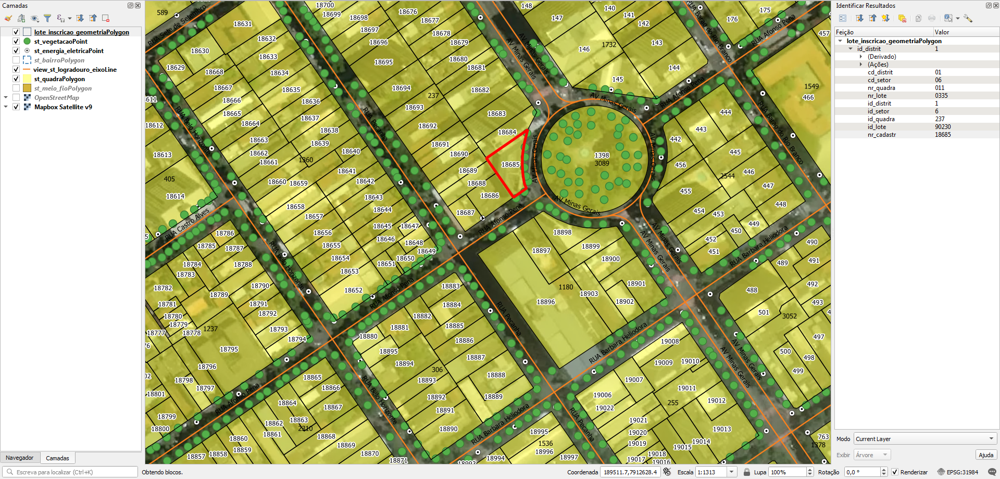

<aside>
<table align="right" style="padding: 1em">
<tr><td>Pacote <big><b>pk0039.01</b></big> de <small><a target="_afacodes" title="Jurisdição" href="https://afa.codes/BR-MG-GovernadorValadares">BR-MG-GovernadorValadares</a></small>
</td></tr>
<tr><td>
Doador: <a rel="external" target="_doador" href="https://www.valadares.mg.gov.br/">Prefeitura Municipal de Governador Valadares</a>
 &nbsp; <small>CNPJ 20.622.890/0001-80</small> • Wikidata <a rel="external" target="_doador" title="link descritor Wikidata do doador" href="https://www.wikidata.org/wiki/Q56450091">Q56450091</a></small> 
Licença <a rel="external" target="_doador" href="https://git.digital-guard.org/licenses/blob/master/reports/implied-govWorks_geo-BR_municipal-v1.md"><b>Implied govWorks_geo-BR_municipal-1.0</b></a> (cc0) 
Obtido via <i>email</i> em <b>24/08/2020</b> por:
 &nbsp; Avaliação técnica: <a rel="external" target="_gitPerson" title="usuário Git" href="https://github.com/IgorEliezer">IgorEliezer</a>
 &nbsp; Representação institucional: <a rel="external" target="_gitPerson" title="usuário Git" href="https://github.com/ThierryAJean">ThierryAJean</a> 
</td></tr>
<tr><td>Camadas:      </td></tr>
<tr><td>Dados publicados em <a href="https://git.digital-guard.org/preservCutGeo-BR2021/tree/main/data/MG/GovernadorValadares/_pk0039.01">preservCutGeo-BR2021</a> <a href="#reprodutibilidade">Reprodutíveis</a></td></tr>
<tr><td>Visualização:     </td></tr>
</table>
</aside>

<section>

Este repositório de metadados descreve um pacote de arquivos doado para o domínio público. Ele está sendo preservado pela Digital Guard: para maiores detalhes consulte a [documentação sobre o processo de registro e preservação](https://wiki.addressforall.org/doc/Documentação_Digital-guard).

Nota. O presente documento README foi gerado por software a partir das informações contidas no arquivo [`make_conf.yaml`](https://git.digital-guard.org/preserv-BR/blob/main/data/MG/GovernadorValadares/_pk0039.01/make_conf.yaml) deste pacote, e informações adicionais dos catálogos de [doadores](https://git.digital-guard.org/preserv-BR/blob/main/data/donor.csv) e de [pacotes](https://git.digital-guard.org/preserv-BR/blob/main/data/donatedPack.csv).

# Camadas de dados

Os arquivos contêm "camadas de dados" temáticas. Os metadados também descrevem como cada camada foi avaliada e seus dados filtrados de forma padronizada.

##  block

Nome do arquivo: `st_quadraPolygon` *Download* e integridade: [2bcdbd6a2ddf4fd810147a106616f404c69a9c38bc02531fe3fa9f27acab25a6.zip](https://dl.digital-guard.org/2bcdbd6a2ddf4fd810147a106616f404c69a9c38bc02531fe3fa9f27acab25a6.zip) Descrição: Quadras Tamanho do arquivo: 1673189 bytes (1.6 <abbr title="mebibyte">MiB</abbr>) Formato: shp SRID: 31984

#### Resultados da filtragem e sua publicação
2292784 bytes (2.19 <abbr title="mebibyte">MiB</abbr>) 2723 polígonos com 26.73 <abbr title="quilômetros quadrados">km²</abbr> densidade média: 0.01 polígonos/km² GeoJSONs publicados em [https://git.digital-guard.org/preservCutGeo-BR2021/tree/main/data/MG/GovernadorValadares/_pk0039.01/block](https://git.digital-guard.org/preservCutGeo-BR2021/tree/main/data/MG/GovernadorValadares/_pk0039.01/block)

#### Visualização
[https://viz.addressforall.org/BR-MG-GovernadorValadares/_pk0039.01/block](https://viz.addressforall.org/BR-MG-GovernadorValadares/_pk0039.01/block)
##  nsvia

Nome do arquivo: `st_bairroPolygon` *Download* e integridade: [0cc1b05163361968a5681e971c8ab1395fcca1ba4b48150a7522a90b836727e3.zip](https://dl.digital-guard.org/0cc1b05163361968a5681e971c8ab1395fcca1ba4b48150a7522a90b836727e3.zip) Descrição: Bairros Tamanho do arquivo: 359552 bytes (0.34 <abbr title="mebibyte">MiB</abbr>) Formato: shp SRID: 31984

#### Resultados da filtragem e sua publicação
618659 bytes (0.59 <abbr title="mebibyte">MiB</abbr>) 147 polígonos com 46.69 <abbr title="quilômetros quadrados">km²</abbr> densidade média: 0.02 polígonos/km² GeoJSONs publicados em [https://git.digital-guard.org/preservCutGeo-BR2021/tree/main/data/MG/GovernadorValadares/_pk0039.01/nsvia](https://git.digital-guard.org/preservCutGeo-BR2021/tree/main/data/MG/GovernadorValadares/_pk0039.01/nsvia)

#### Visualização
[https://viz.addressforall.org/BR-MG-GovernadorValadares/_pk0039.01/nsvia](https://viz.addressforall.org/BR-MG-GovernadorValadares/_pk0039.01/nsvia)
##  parcel

Nome do arquivo: `lote_inscricao_geometria/lote_inscricao_geometriaPolygon` *Download* e integridade: [98248f643e60829689b398b2852981cfd12b11799a640d93b27223dfc4346948.rar](https://dl.digital-guard.org/98248f643e60829689b398b2852981cfd12b11799a640d93b27223dfc4346948.rar) Descrição: Lotes Tamanho do arquivo: 4147631 bytes (3.96 <abbr title="mebibyte">MiB</abbr>) Formato: shp SRID: 31984

#### Dados relevantes
* `cd_distrit || cd_setor || nr_quadra || nr_lote` (ref)

 Complementado por [cadparcel](#-cadparcel) por meio de `ref` e `ref`

#### Resultados da filtragem e sua publicação
11400668 bytes (10.87 <abbr title="mebibyte">MiB</abbr>) 63544 polígonos com 32.44 <abbr title="quilômetros quadrados">km²</abbr> densidade média: 0.22 polígonos/km² GeoJSONs publicados em [https://git.digital-guard.org/preservCutGeo-BR2021/tree/main/data/MG/GovernadorValadares/_pk0039.01/parcel](https://git.digital-guard.org/preservCutGeo-BR2021/tree/main/data/MG/GovernadorValadares/_pk0039.01/parcel)

#### Visualização
[https://viz.addressforall.org/BR-MG-GovernadorValadares/_pk0039.01/parcel](https://viz.addressforall.org/BR-MG-GovernadorValadares/_pk0039.01/parcel)
##  via

Nome do arquivo: `view_st_logradouro_eixoLine` *Download* e integridade: [437a5012420b1bdc748ea571eabfa0aee6154c41196fe898c383d76e61a5c5db.zip](https://dl.digital-guard.org/437a5012420b1bdc748ea571eabfa0aee6154c41196fe898c383d76e61a5c5db.zip) Descrição: Eixos Tamanho do arquivo: 1597448 bytes (1.52 <abbr title="mebibyte">MiB</abbr>) Formato: shp SRID: 31984

#### Dados relevantes
* `descricao` (via)

#### Resultados da filtragem e sua publicação
2248998 bytes (2.14 <abbr title="mebibyte">MiB</abbr>) 10015 segmentos com 919.61 <abbr title="quilômetros">km</abbr> densidade média: 0.45 segmentos/km² GeoJSONs publicados em [https://git.digital-guard.org/preservCutGeo-BR2021/tree/main/data/MG/GovernadorValadares/_pk0039.01/via](https://git.digital-guard.org/preservCutGeo-BR2021/tree/main/data/MG/GovernadorValadares/_pk0039.01/via)

#### Visualização
[https://viz.addressforall.org/BR-MG-GovernadorValadares/_pk0039.01/via](https://viz.addressforall.org/BR-MG-GovernadorValadares/_pk0039.01/via)
##  cadparcel

Nome do arquivo: `Logradouros - Gov. Valadares` *Download* e integridade: [2e79fdf013a8de68e071c2f2a9911bc98196254bc9b9f39482cb0941a146b485.zip](https://dl.digital-guard.org/2e79fdf013a8de68e071c2f2a9911bc98196254bc9b9f39482cb0941a146b485.zip) Descrição: Planilha de Endereços Tamanho do arquivo: 2097698 bytes (2 <abbr title="mebibyte">MiB</abbr>) Formato: xlsx SRID: 31984

#### Dados relevantes
* `Logradouro` (via)

* `Número` (hnum)

* `Distrito || Setor || Quadra || Lote` (ref)

Complementa [parcel](#-parcel) por meio de `ref` e `ref`

# Evidências de teste

# Tarefas
* &lt;p dir=&quot;auto&quot;&gt;A planilha &lt;code&gt;Logradouros - Gov. Valadares.xlsx&lt;/code&gt; relaciona o número de setor, quadra e lote ao nome de logradouro e número predial.&lt;/p&gt;
&lt;p dir=&quot;auto&quot;&gt;Precisa atribuir os endereços da planilha ao mapa de lote do shapefile &lt;code&gt;lote_inscricao_geometriaPolygon&lt;/code&gt;. Os lotes possuem número de setor, quadra e lote para fazer o vínculo.&lt;/p&gt;
&lt;p dir=&quot;auto&quot;&gt;Correspondência entre as colunas da planilha e colunas do shapefile:&lt;/p&gt;
&lt;ul dir=&quot;auto&quot;&gt;
&lt;li&gt;&lt;code&gt;Setor&lt;/code&gt; -&amp;gt; &lt;code&gt;cd_setor&lt;/code&gt;&lt;/li&gt;
&lt;li&gt;&lt;code&gt;Quadra&lt;/code&gt; -&amp;gt; &lt;code&gt;nr_quadra&lt;/code&gt;&lt;/li&gt;
&lt;li&gt;&lt;code&gt;Lote&lt;/code&gt; -&amp;gt;  &lt;code&gt;nr_lote&lt;/code&gt;&lt;/li&gt;
&lt;/ul&gt;
&lt;a href=&quot;qgis-plan.png&quot;&gt;

</section>
<section>

# Reprodutibilidade

O processo de transformação dos *dados orginais* (arquivos doados) em *dados filtrados* pode ser reproduzido por qualquer pessoa fazendo uso das mesmas ferramentas de software utilizadas pelo projeto. A seguir a sequência de comandos *bash* que garantem a [reprodutibilidade](https://en.wikipedia.org/wiki/Reproducibility) do processo a cada *layer*. Qualquer pessoa, munida dos [ferramentas de software utilizadas pelo projeto](https://git.AddressForAll.org/suporte/blob/master/docs/pt/infra.md#ambientes-e-ferramentas-de-uso-geral), vai gerar os mesmos resultados.

Pode-se reproduzir de dois modos:
* artesanal: com os comandos em [reproducibility.sh](https://git.digital-guard.org/preserv-BR/blob/main/data/MG/GovernadorValadares/_pk0039.01/reproducibility.sh), depois de seguir a sequência de preparo da base de dados no esquema *ingest*.
* automático: usando o comando `make` conforme descrito na documentação do projeto.

</section>

