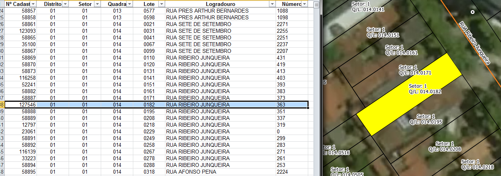

# Tarefas
## 1. Atribuir endereço nos lotes
A planilha `Logradouros - Gov. Valadares.xlsx` relaciona o número de setor, quadra e lote ao nome de logradouro e número predial.

Precisa atribuir os endereços da planilha ao mapa de lote do shapefile `lote_inscricao_geometriaPolygon`. Os lotes possuem número de setor, quadra e lote para fazer o vínculo.

Correspondência entre as colunas da planilha e colunas do shapefile:
* `Setor` -> `cd_setor`
* `Quadra` -> `nr_quadra`
* `Lote` ->  `nr_lote`

Ver [Extração](#Extração) para detalhes.

## 2. Gerar ponto de endereço na testada do lote
Procedimento usando PostGIS com script desenvolvido pelo A4A.

Cada ponto terá os dados:
* Nome do logradouro
* Número predial

# Extração
Abaixo os passos para extração por tipo de dado relevante.

## Planilha relacionando setor, quadra e lote aos endereços
Arquivo MSExcel
1. Abrir `Logradouros_-_Gov._Valadares.xlsx.zip`.
2. Selecionar arquivo `Logradouros - Gov. Valadares.xlsx`.
3. Copiar arquivos selecionados para diretório alvo.

### Dados relevantes
Colunas [número da coluna]:
* `Setor` [2]: número de setor.
* `Quadra`[3]: número de quadra.
* `Lote` [4]: número de lote.
* `Logradouro` [5]: nome do logradouro em caixa alta.
* `Número` [6]: número predial.

Notas:
1. Ignore a coluna `Nº Cadastro`, pois ela não tem correspondência com o mapa de Lotes.
2. Ignore a coluna `Distrito`, uma vez que ela é igual para o município inteiro.
3. A coluna `Número` possui alguns casos especiais:
* Numeração com "frente" ou "fundo", exemplo: "RUA SERRA DA MANTIQUEIRA","317 frente".
* Numeração com letra, exemplo: "RUA ZILIM GONCALVES","1390 A".
* Mais de um endereço no mesmo lote, exemplo: "AV RIO BAHIA","805/797/801", é um lote abrigando três endereços (streetview: https://goo.gl/maps/igrKnQ7pkNL2zXgp8).
* Mais de um endereço no mesmo lote de esquina, exemplo: "AV RIO BAHIA","783/791/52", é um lote abrigando três endereços, sendo que 783 e 791 são da "AV RIO BAHIA" (streetview https://goo.gl/maps/zvrg5suNqZhcYvAn9), e 52 da "RUA SELEME HILEL" (streetview: https://goo.gl/maps/rRLB7d6aqQQp59X27).

## Lotes
SRID: 31984
1. Abrir `lote_inscricao_geometria.rar`.
2. Abrir diretório `lote_inscricao_geometria`.
3. Selecionar todos os arquivos.
4. Copiar arquivos selecionados para diretório alvo.

### Dados relevantes
Colunas da camada `lote_inscricao_geometriaPolygon`:
* `cd_distrit` (string): número do distrito, igual para o município inteiro.
* `cd_setor` (string): número do setor.
* `nr_quadra` (string): número de quadra.
* `nr_lote` (string): número de lote.

## Quadra
SRID: 31984
1. Abrir `st_quadra.zip`.
2. Selecionar todos os arquivos `st_quadraPolygon.*`.
3. Copiar arquivos selecionados para diretório alvo.

### Dados relevantes
Colunas da camada `st_quadraPolygon`:
* `id_quadra` (int): número de lote.

## Bairros
SRID: 31984
1. Abrir `st_bairro.zip`.
2. Selecionar todos os arquivos `st_bairroPolygon.*`.
3. Copiar arquivos selecionados para diretório alvo.

### Dados relevantes
Bairros estão sem nome.

## Eixos
SRID: 31984
Codificação: ISO-8859-1
1. Abrir `view_st_logradouro_eixo.zip`.
2. Selecionar todos os arquivos `view_st_logradouro_eixoLine.*`.
3. Copiar arquivos selecionados para diretório alvo.

### Dados relevantes
Colunas da camada `view_st_logradouro_eixoLine`:
* `tipo` (string): tipo de logradouro caixa alta e abreviado (R, AV etc).
* `nome` (string): nome de logradouro sem tipo.
* `descricao` (string): tipo e nome de logradouro concatenado.

## Outros
Para outros projetos, há também dados sobre:
* Arborização: em `st_vegetacao.zip`;
* Posteamento: em `st_energia_eletrica.zip`;
* Meios-fios: em `st_meio_fio.zip`.

Nota: o arquivo `wfsrequest.txt` que há em alguns arquivos zip contém o link para download do zip do site da prefeitura.

(!!! Havendo outros projetos, esta seção será detalhada !!!)

# Evidências de teste
Teste no QGIS:

Teste no QGIS com cruzamento da planilha com mapa:

