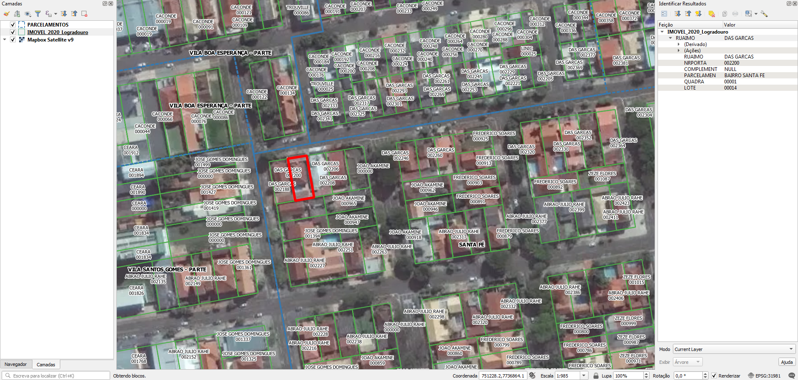

# Tarefas

## 1. Completar nome de logradouro nos lotes
Os lotes possuem numeração predial e o nome do logradouro sem o tipo de via. Por exemplo, "Treze de Maio" ao invés de "Rua Treze de Maio".

Adicionar o tipo de via dos eixos do OpenStreetMap nos lotes. Se isso não for viável, entraremos em contato com a prefeitura para solicitar outros materiais.

## 2. Gerar ponto de endereço na testada do lote
Procedimento usando PostGIS com script desenvolvido pelo A4A.

Cada ponto terá os dados:
* Nome do logradouro
* Número predial

# Extração
Abaixo os passos para extração por tipo de dado relevante.

## Lotes
SRID: 31981
1. Abrir `Open_Street.rar`.
2. Selecionar arquivos `Open Street/IMOVEL_2020_Logradouro.*`.
3. Copiar arquivos selecionados para diretório alvo.

### Dados relevantes
Colunas da camada `IMOVEL_2020_Logradouro`:
* `RUAIMO` (string): nome do logradouro em caixa alta. Há abreviações como "DR" para "DOUTOR", e casos que há ponto como "PROF.".
* `NRPORTA` (string): número predial.
* `COMPLEMENT` (string): complemento do número predial.
* `QUADRA` (string): número da quadra.
* `LOTE` (string): número de lote.

## Loteamentos
SRID: 31981
1. Abrir `Open_Street.rar`.
2. Selecionar arquivos `Open Street/PARCELAMENTOS.*`.
3. Copiar arquivos selecionados para diretório alvo.

Loteamentos são contornos das áreas loteadas e que compõem os bairros.

### Dados relevantes
Colunas da camada `PARCELAMENTOS`:
* `NOME` (string): nome do loteamento em caixa alta.
* `BAIRRO` (string): nome do bairro a qual pertence em caixa alta..

## Equipamentos
Para outros projetos, há também dados sobre:
* SAUDE
* ESCOLAS_MUNICIPAIS_ESTADUAIS
* ASSISTENCIA_SOCIAL

(!!! Havendo outros projetos, esta seção será detalhada !!!)

# Evidências de teste
Teste no QGIS:

