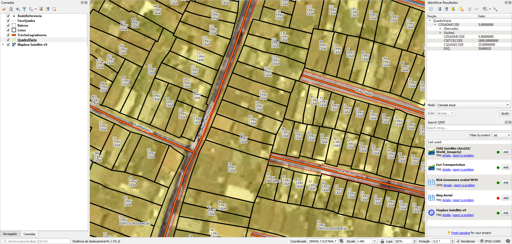

# Tarefas

## 1. Atribuir nome de logradouro nos lotes
Os lotes possuem somente numeração predial.

Atribuir nome de logradouro dos eixos próximos.

## 2. Gerar ponto de endereço na testada do lote
Procedimento usando PostGIS com script desenvolvido pelo A4A.

Cada ponto terá os dados:
* Nome do logradouro
* Número predial

# Extração
Abaixo os passos para extração por tipo de dado relevante.

## Lotes
SRID: 31985
Codificação: ISO-8859-1
1. Abrir `ProjetoRecife_SHP.zip`.
2. Selecionar todos os arquivos `Lotes.*`.
3. Copiar arquivos selecionados para diretório alvo.

### Dados relevantes
Colunas da camada `Lotes`:
* `ENDNUMERO` (int): número predial. Lotes sem número são representados por "0".
* `QTDPAVIMEN` (int): quantidade de pavimentos.
* `NMEDIFICAC` (string): nome da edificação em caixa alta (ex.: "EDF CAMACARI").

## Eixos
SRID: 31985
Codificação: ISO-8859-1
1. Abrir `ProjetoRecife_SHP.zip`.
2. Selecionar todos os arquivos `TrechoLogradouros.*`.
3. Copiar arquivos selecionados para diretório alvo.

### Dados relevantes
Colunas da camada `TrechoLogradouros`:
* `NLGPAVOFIC` (string): tipo e nome de logradouro em caixa alta e baixa e por extenso. Alguns casos têm os títulos abrevidados (ex.: "Dr", "Prof" etc).

## Bairros
SRID: 31985
Codificação: ISO-8859-1
1. Abrir `ProjetoRecife_SHP.zip`.
2. Selecionar todos os arquivos `Bairros.*`.
3. Copiar arquivos selecionados para diretório alvo.

### Dados relevantes
Colunas da camada `Bairros`:
* `EBAIRRNO_1` (string): nome do bairro em caixa alta e baixa e por extenso.

## Outros
Em `ProjetoRecife_SHP.zip`:
* Meio-fio, em shapefile;
* Rede Referência, em shapefile;
* Quadra viária, em shapefile. Não são quadras formadas pela junção dos lotes, mas o contorno formado pelos meios-fios ao redor das quadras, incluindo as calçadas.

Em `Projeto_Recife_CAD.zip`:
* Mapa da cidade, em arquivo CAD/DWG;
* Topografia, em em arquivo CAD/DXF.

(!!! Havendo outros projetos, esta seção será detalhada !!!)

# Evidências de teste
Teste no QGIS:

