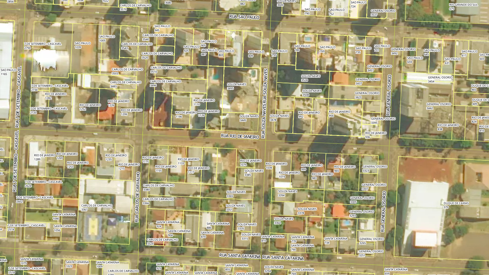

# Tarefas

## 1. Completar nome de logradouro nos lotes
Os lotes possuem numeração predial e o nome do logradouro sem o tipo de via (R, AV, ROD etc). Por exemplo, "Pernambuco" ao invés de "Rua Pernambuco".

Adicionar o tipo de via do shapefile de eixos (ver Eixos, coluna `tipolograd`) nos lotes.

## 2. Gerar ponto de endereço na testada do lote
Procedimento usando PostGIS com script desenvolvido pelo A4A.

Cada ponto terá os dados:
* Nome do logradouro
* Número predial

# Extração
Abaixo os passos para extração por tipo de dado relevante.

## Bairros
SRID: 31982
Codificação: ISO-8859-1
1. Abrir `Bairros.zip`.
2. Selecionar arquivos `Bairros.*`.
3. Copiar arquivos selecionados para diretório alvo.

### Dados relevantes
Colunas da camada `Bairros`:
* `nmbairro` (string): nome do loteamento em caixa alta.

## Eixos
SRID: 31982
Codificação: UTF-8
1. Abrir `Logradouros.zip`.
2. Selecionar arquivos `Logradouros.*`.
3. Copiar arquivos selecionados para diretório alvo.

### Dados relevantes
Colunas da camada `Logradouros`:
* `nmlogradou` (string): nome do logradouro em caixa alta sem tipo de via.
* `tipolograd` (string): tipo de via do logradouro em caixa alta.

Algumas vias possuem nomes fora do padrão, exemplos:
* BR-163: rodovia BR-163.
* 277: rodovia BR-277.
* 486: rodovia PR-486.
* 467 BR: rodovia BR-467.
* EMP-{número}: são estradas municipal rurais que usam o código de via como nome.

### Expressões
Para contruir o nome do logradouro, usar:

`tipolograd  +  ' '  + nmlogradou`

## Lotes
SRID: 31982
Codificação: ISO-8859-1
1. Abrir `Lotes.zip`.
2. Selecionar arquivos `Lotes.*`.
3. Copiar arquivos selecionados para diretório alvo.

### Dados relevantes
Colunas da camada `Lotes`:
* `logradouro` (string): nome do logradouro sem tipo de via em caixa alta.
* `numerologr` (string): número predial.

# Evidências de teste
Teste no QGIS:

