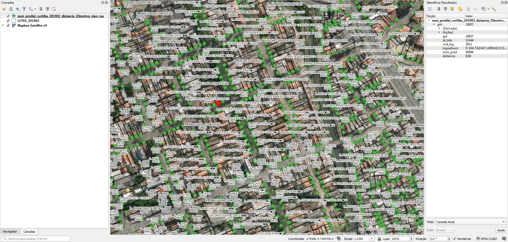

# Tarefas

## 1. Completar nome de logradouro nos pontos de endereço
Os pontos de endereço possuem o nome do logradouro com o tipo de via abreviado (R, AV, ROD etc).

# Extração
Abaixo os passos para extração por tipo de dado relevante.

## Pontos de endereço
SRID: 31982
1. Abrir `curitiba.zip`.
2. Abrir `num_predial_curitiba_201902_distancia_20metros_eixo_rua.rar`.
3. Selecionar arquivo `num_predial_curitiba_201902_distancia_20metros_eixo_rua.geojson`.
4. Copiar arquivo selecionados para diretório alvo.

### Dados relevantes
Colunas da camada `num_predial_curitiba_201902_distancia_20metros_eixo_rua`:
* `logradouro` (string): nome do loteamento em caixa alta.
* `num_pred` (string): número predial.

N.B.: O arquivo geojson veio com charset UTF-8, mas o QGIS apresenta alguns caracteres não reconhecidos. Houve tentativas para converter para ANSII/Win-1280, mas sem sucesso.

## Lotes
SRID: 31982
1. Abrir `LOTES_SIRGAS.zip`.
2. Selecionar arquivos `LOTES_201902.*`.
3. Copiar arquivos selecionados para diretório alvo.

### Dados relevantes
Colunas da camada `LOTES_201902`:
* `NME_LOGRAD` (string): nome do logradouro em caixa alta.
* `NUM_PREDIA` (string): número predial.

# Evidências de teste
Teste no QGIS:

