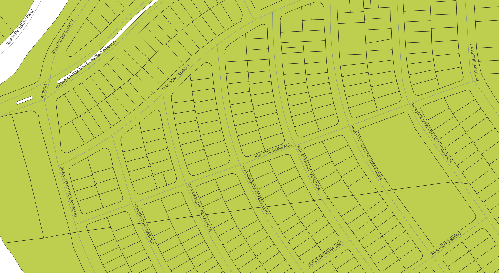

<aside>
<table align="right" style="padding: 1em">
<tr><td>Pacote <a target="_git" title="link canônico para o git deste pacote" href="http://git.digital-guard.org/preserv-BR/blob/main/data/PR/Londrina/_pk0106.01"><big><b>pk0106.01</b></big></a> de <small><a target="_osmcodes" title="Jurisdição" href="https://osm.codes/BR-PR-Londrina">BR-PR-Londrina</a></small>
</td></tr>
<tr><td>
Doador: <a rel="external" target="_doador" href="https://www.londrina.pr.gov.br/">Prefeitura do Município de Londrina</a>
 &nbsp; <small>CNPJ 75.771.477/0001-70</small> • Wikidata <a rel="external" target="_doador" title="link descritor Wikidata do doador" href="https://www.wikidata.org/wiki/Q192387">Q192387</a></small> 
Licença <a rel="external" target="_doador" href="https://creativecommons.org/publicdomain/zero/1.0/"><b>CC0-1.0</b></a> (cc0 <a title="SHA256 7adf2a2ec5348c05db9a52eedccdfb065352d363ff617d6167cf6202e30ee4af.eml" href="http://dl.digital-guard.org/7adf2a2ec5348c05db9a52eedccdfb065352d363ff617d6167cf6202e30ee4af.eml"><code>7adf2a2...eml</code></a>) 
Obtido via <i>site</i> em <b>2022-11-10</b> por:
 &nbsp; Avaliação técnica: <a rel="external" target="_gitPerson" title="usuário Git" href="https://github.com/luisfelipebr">luisfelipebr</a>
 &nbsp; Representação institucional: <a rel="external" target="_gitPerson" title="usuário Git" href="https://github.com/ThierryAJean">ThierryAJean</a> 
</td></tr>
<tr><td>Camadas:    </td></tr>
<tr><td>Dados publicados em <a href="http://git.digital-guard.org/preservCutGeo-BR2021/tree/main/data/PR/Londrina/_pk0106.01">preservCutGeo-BR2021</a> <a href="#reprodutibilidade">Reprodutíveis</a></td></tr>
<tr><td>Visualização:    </td></tr>
</table>
</aside>

<section>

Este repositório de metadados descreve um pacote de arquivos doado para o domínio público. Ele está sendo preservado pela Digital Guard: para maiores detalhes consulte a [documentação sobre o processo de registro e preservação](https://wiki.addressforall.org/doc/Documentação_Digital-guard).

Nota. O presente documento README foi gerado por software a partir das informações contidas no arquivo [`make_conf.yaml`](http://git.digital-guard.org/preserv-BR/blob/main/data/PR/Londrina/_pk0106.01/make_conf.yaml) deste pacote, e informações adicionais dos catálogos de [doadores](https://git.digital-guard.org/preserv-BR/blob/main/data/donor.csv) e de [pacotes](https://git.digital-guard.org/preserv-BR/blob/main/data/donatedPack.csv).

# Camadas de dados

Os arquivos contêm "camadas de dados" temáticas. Os metadados também descrevem como cada camada foi avaliada e seus dados filtrados de forma padronizada.

##  nsvia

Nome do arquivo: `LIM_Bairros_V1` *Download* e integridade: [e5b42971d89614a91b1f503345be4248b73cee7528a93a3b0bbd519ed972ce91.rar](http://dl.digital-guard.org/e5b42971d89614a91b1f503345be4248b73cee7528a93a3b0bbd519ed972ce91.rar) Descrição: bairros.rar Tamanho do arquivo: 61248 bytes (0.06 <abbr title="mebibyte">MiB</abbr>) Formato: shp SRID: 31982

#### Dados relevantes
* `BAIRROS` (nsvia)

#### Visualização
[https://viz.addressforall.org/BR-PR-Londrina/_pk0106.01/nsvia](https://viz.addressforall.org/BR-PR-Londrina/_pk0106.01/nsvia)
##  parcel

Nome do arquivo: `shp/bclotes` *Download* e integridade: [8826fc166ad990ec171f0671ee193f79d2a5f35dbc93c227cd7097e7fe19b525.rar](http://dl.digital-guard.org/8826fc166ad990ec171f0671ee193f79d2a5f35dbc93c227cd7097e7fe19b525.rar) Descrição: bcarshp.rar Tamanho do arquivo: 13751947 bytes (13.11 <abbr title="mebibyte">MiB</abbr>) Formato: shp SRID: 31982

#### Visualização
[https://viz.addressforall.org/BR-PR-Londrina/_pk0106.01/parcel](https://viz.addressforall.org/BR-PR-Londrina/_pk0106.01/parcel)
##  via

Nome do arquivo: `Export_Output` *Download* e integridade: [b1cc16e9070aa2c624d1eeebde8a00e4b9bea471fb76a79c4f8ec5902c250c3e.rar](http://dl.digital-guard.org/b1cc16e9070aa2c624d1eeebde8a00e4b9bea471fb76a79c4f8ec5902c250c3e.rar) Descrição: arruamento-05-22-shapefile.rar Tamanho do arquivo: 1004732 bytes (0.96 <abbr title="mebibyte">MiB</abbr>) Formato: shp SRID: 31982

#### Dados relevantes
* `NOME` (via)

#### Visualização
[https://viz.addressforall.org/BR-PR-Londrina/_pk0106.01/via](https://viz.addressforall.org/BR-PR-Londrina/_pk0106.01/via)

# Evidências de teste

</section>
<section>

# Reprodutibilidade

O processo de transformação dos *dados orginais* (arquivos doados) em *dados filtrados* pode ser reproduzido por qualquer pessoa fazendo uso das mesmas ferramentas de software utilizadas pelo projeto. A seguir a sequência de comandos *bash* que garantem a [reprodutibilidade](https://en.wikipedia.org/wiki/Reproducibility) do processo a cada *layer*. Qualquer pessoa, munida dos [ferramentas de software utilizadas pelo projeto](https://git.AddressForAll.org/suporte/blob/master/docs/pt/infra.md#ambientes-e-ferramentas-de-uso-geral), vai gerar os mesmos resultados.

Pode-se reproduzir de dois modos:
* artesanal: com os comandos em [reproducibility.sh](http://git.digital-guard.org/preserv-BR/blob/main/data/PR/Londrina/_pk0106.01/reproducibility.sh), depois de seguir a sequência de preparo da base de dados no esquema *ingest*.
* automático: usando o comando `make` conforme descrito na documentação do projeto.

</section>

