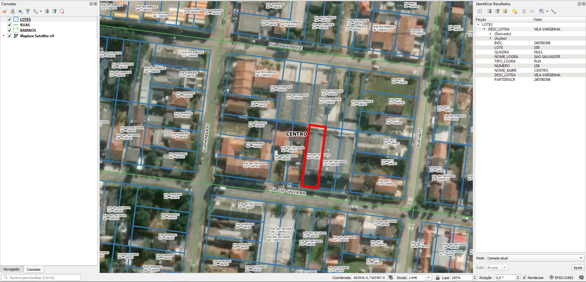

<aside>
<table align="right" style="padding: 1em">
<tr><td>Pacote <big><b>pk0014.01</b></big> de <small><a target="_afacodes" title="Jurisdição" href="https://afa.codes/BR-PR-Pinhais">BR-PR-Pinhais</a></small>
</td></tr>
<tr><td>
Doador: <a rel="external" target="_doador" href="https://pinhais.atende.net/">Prefeitura Municipal de Pinhais</a>
 &nbsp; <small>CNPJ 95.423.000/0001-00</small> • Wikidata <a rel="external" target="_doador" title="link descritor Wikidata do doador" href="https://www.wikidata.org/wiki/Q97631607">Q97631607</a></small> 
Licença <a rel="external" target="_doador" href="https://git.digital-guard.org/licenses/blob/master/reports/implied-govWorks_geo-BR_municipal-v1.md"><b>Implied govWorks_geo-BR_municipal-1.0</b></a> (cc0) 
Obtido via <i>site</i> em <b>26/06/2020</b> por:
 &nbsp; Avaliação técnica: <a rel="external" target="_gitPerson" title="usuário Git" href="https://github.com/IgorEliezer">IgorEliezer</a>
 &nbsp; Representação institucional: <a rel="external" target="_gitPerson" title="usuário Git" href="https://github.com/ThierryAJean">ThierryAJean</a> 
</td></tr>
<tr><td>Camadas:    </td></tr>
<tr><td>Dados publicados em <a href="https://git.digital-guard.org/preservCutGeo-BR2021/tree/main/data/PR/Pinhais/_pk0014.01">preservCutGeo-BR2021</a> <a href="#reprodutibilidade">Reprodutíveis</a></td></tr>
<tr><td>Visualização:    </td></tr>
</table>
</aside>

<section>

Este repositório de metadados descreve um pacote de arquivos doado para o domínio público. Ele está sendo preservado pela Digital Guard: para maiores detalhes consulte a [documentação sobre o processo de registro e preservação](https://wiki.addressforall.org/doc/Documentação_Digital-guard).

Nota. O presente documento README foi gerado por software a partir das informações contidas no arquivo [`make_conf.yaml`](https://git.digital-guard.org/preserv-BR/blob/main/data/PR/Pinhais/_pk0014.01/make_conf.yaml) deste pacote, e informações adicionais dos catálogos de [doadores](https://git.digital-guard.org/preserv-BR/blob/main/data/donor.csv) e de [pacotes](https://git.digital-guard.org/preserv-BR/blob/main/data/donatedPack.csv).

# Camadas de dados

Os arquivos contêm "camadas de dados" temáticas. Os metadados também descrevem como cada camada foi avaliada e seus dados filtrados de forma padronizada.

##  nsvia

Nome do arquivo: `BAIRROS` *Download* e integridade: [7d96c19771ca271623058eeb9fdc4ceb67ff68c3937a7b66e7ccdb1a4e6580fb.rar](http://dl.digital-guard.org/7d96c19771ca271623058eeb9fdc4ceb67ff68c3937a7b66e7ccdb1a4e6580fb.rar) Descrição: Bairros Tamanho do arquivo: 35685 bytes (0.03 <abbr title="mebibyte">MiB</abbr>) Formato: shp SRID: 31982

#### Dados relevantes
* `BAIRRO` (nsvia)

#### Resultados da filtragem e sua publicação
65687 bytes (0.06 <abbr title="mebibyte">MiB</abbr>) 15 polígonos com 60.9 <abbr title="quilômetros quadrados">km²</abbr> densidade média: 0.94 polígonos/km² GeoJSONs publicados em [https://git.digital-guard.org/preservCutGeo-BR2021/tree/main/data/PR/Pinhais/_pk0014.01/nsvia](https://git.digital-guard.org/preservCutGeo-BR2021/tree/main/data/PR/Pinhais/_pk0014.01/nsvia)

#### Visualização
[https://viz.addressforall.org/BR-PR-Pinhais/_pk0014.01/nsvia](https://viz.addressforall.org/BR-PR-Pinhais/_pk0014.01/nsvia)
##  parcel

Nome do arquivo: `LOTES` *Download* e integridade: [56d32368409f4ba2c99afadc7ad307bd8cc660b93d38e57936da313fafde1f13.rar](http://dl.digital-guard.org/56d32368409f4ba2c99afadc7ad307bd8cc660b93d38e57936da313fafde1f13.rar) Descrição: Lotes Tamanho do arquivo: 2061575 bytes (1.97 <abbr title="mebibyte">MiB</abbr>) Formato: shp SRID: 31982

#### Dados relevantes
* `NOME_LOGRA || ' ' || TIPO_LOGRA` (via)

* `NUMERO` (hnum)

* `NOME_BAIRR` (nsvia)

#### Resultados da filtragem e sua publicação
5677620 bytes (5.41 <abbr title="mebibyte">MiB</abbr>) 31540 polígonos com 50.99 <abbr title="quilômetros quadrados">km²</abbr> densidade média: 0.78 polígonos/km² GeoJSONs publicados em [https://git.digital-guard.org/preservCutGeo-BR2021/tree/main/data/PR/Pinhais/_pk0014.01/parcel](https://git.digital-guard.org/preservCutGeo-BR2021/tree/main/data/PR/Pinhais/_pk0014.01/parcel)

#### Visualização
[https://viz.addressforall.org/BR-PR-Pinhais/_pk0014.01/parcel](https://viz.addressforall.org/BR-PR-Pinhais/_pk0014.01/parcel)
##  via

Nome do arquivo: `RUAS` *Download* e integridade: [27c0c467222a668837f62e9f40ac85f94685ea50f3d655207384f2343d13f573.rar](http://dl.digital-guard.org/27c0c467222a668837f62e9f40ac85f94685ea50f3d655207384f2343d13f573.rar) Descrição: Eixos Tamanho do arquivo: 97648 bytes (0.09 <abbr title="mebibyte">MiB</abbr>) Formato: shp SRID: 31982

#### Dados relevantes
* `NOME_RUA` (via)

#### Resultados da filtragem e sua publicação
154764 bytes (0.15 <abbr title="mebibyte">MiB</abbr>) 684 segmentos com 414.54 <abbr title="quilômetros">km</abbr> densidade média: 6.41 segmentos/km² GeoJSONs publicados em [https://git.digital-guard.org/preservCutGeo-BR2021/tree/main/data/PR/Pinhais/_pk0014.01/via](https://git.digital-guard.org/preservCutGeo-BR2021/tree/main/data/PR/Pinhais/_pk0014.01/via)

#### Visualização
[https://viz.addressforall.org/BR-PR-Pinhais/_pk0014.01/via](https://viz.addressforall.org/BR-PR-Pinhais/_pk0014.01/via)

# Evidências de teste

</section>
<section>

# Reprodutibilidade

O processo de transformação dos *dados orginais* (arquivos doados) em *dados filtrados* pode ser reproduzido por qualquer pessoa fazendo uso das mesmas ferramentas de software utilizadas pelo projeto. A seguir a sequência de comandos *bash* que garantem a [reprodutibilidade](https://en.wikipedia.org/wiki/Reproducibility) do processo a cada *layer*. Qualquer pessoa, munida dos [ferramentas de software utilizadas pelo projeto](https://git.AddressForAll.org/suporte/blob/master/docs/pt/infra.md#ambientes-e-ferramentas-de-uso-geral), vai gerar os mesmos resultados.

Pode-se reproduzir de dois modos:
* artesanal: com os comandos em [reproducibility.sh](https://git.digital-guard.org/preserv-BR/blob/main/data/PR/Pinhais/_pk0014.01/reproducibility.sh), depois de seguir a sequência de preparo da base de dados no esquema *ingest*.
* automático: usando o comando `make` conforme descrito na documentação do projeto.

</section>

