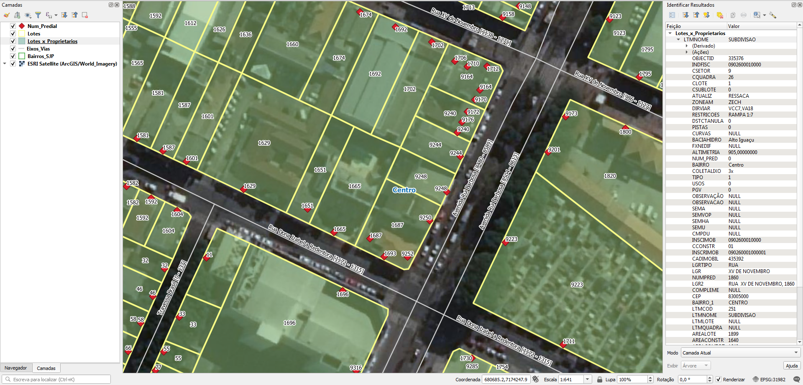

# Geral
## Arquivos renomeados
Nomes originais da entrega renomeados para facilitar:
* 2020.04.16_Dados OSM.rar -> 2020-04-16_Dados.rar
* 2020.04.16_EXTERNO - Dados OSM.rar -> 2020-04-16_EXTERNO-Dados.rar

# Tarefas
## 1. Atribuir nome de logradouro nos pontos de endereço
Os pontos de endereço possuem somente o número predial.

Para atribuir o nome de logradouro, poderá usar um dos métodos:
1. Atribuir o nome de logradouro dos eixos de vias próximos ou dos lotes. Nos casos de esquina, deverá usar dedução pelo entorno: lado par ou lado ímpar, número mais próximo etc. Os eixos de vias possuem número de início e fim, mas nem sempre os número prediais não se enquadram com o intervalo indicado no trecho.
2. Atribuir através de planilha relacionando o número de inscrição aos respectivos endereços. **Note que a prefeitura não forneceu a planilha**.

Ver [Extração](#Extração) para dados.

# Extração
Abaixo os passos para extração por tipo de dado relevante.

## Pontos de endereço
Codificação: ISO-8859-1
SRID: 31982
1. Abrir `2020-04-16_Dados.rar`.
2. Selecionar arquivos `Num_Predial.*`.
3. Copiar arquivos selecionados para diretório alvo.

### Dados relevantes
Colunas da camada `Num_Predial`:
* `TEXTSTRING` (string): número predial.

**Notas:**
1. Alguns números prediais vieram com código/tags de formatação de texto, provavelmente do CAD. Ex.: `<FNT name="Arial" size="6,00">580</FNT>`.
2. Outros, talvez, por serem "sem número", vieram como nome do prédio. Ex.: "Posto de Saúde".
3. Há um caso de uma fábrica na Rua Doutor Murici, 3202, em que há um ponto de numeração predial principal (o 3202) e outros 6 secundários com letra: A, B, C, D, E e F.

## Lotes
Codificação: ISO-8859-1
SRID: 31982
1. Abrir `2020-04-16_Dados.rar`.
2. Selecionar arquivos `Lotes.*`.
3. Copiar arquivos selecionados para diretório alvo.

### Dados relevantes
Colunas da camada `Lotes`:
* `INDFISC` (string): número de inscrição composto de número de setor, quadra, lote e sublote.
* `CSETOR` (int): número de setor.
* `CQUADRA` (int): número de quadra.
* `CLOTE` (int): número de lote.
* `CSUBLOTE` (int): número de sublote.
* `BAIRRO` (string): nome do bairro em caixa alta e baixa, com acentuação.
* `SHAPE_AREA` (real): área calculada da geometria.

## Lotes - mais detalhes
Codificação: ISO-8859-1
SRID: 31982
1. Abrir `2020-04-16_EXTERNO-Dados.rar`.
2. Selecionar arquivos `Lotes_x_Proprietarios.*`.
3. Copiar arquivos selecionados para diretório alvo.

A diferença em relação ao anterior é que neste os lotes têm o endereço principal. 

### Dados relevantes
Colunas da camada `Lotes_x_Proprietarios`:
* `INDFISC` (string): número de inscrição composto de número de setor, quadra, lote e sublote.
* `CSETOR` (int): número de setor.
* `CQUADRA` (int): número de quadra.
* `CLOTE` (int): número de lote.
* `CSUBLOTE` (int): número de sublote.
* `NUM_PRED` (real): número predial. 80% está 0, **prefira usar `NUMPRED`**.
* `BAIRRO` (string): nome do bairro em caixa alta e baixa, com acentuação.
* `LGRTIPO` (string): tipo de logradouro em caixa alta, abreviado.
* `LGR` (string): nome de logradouro em caixa alta, com título abreviado no final. Ex.: "JAIME FRANCA, DR.".
* `NUMPRED` (string): número predial. Sem número é representado por "SN" e "S/N". Se estiver NULL, usar `NUM_PRED` como **complemento**.
* `LGR2` (string): endereço composto de `LGRTIPO`, `LGR` e `NUMPRED`. Ex.: "RUA  JAIME FRANCA, DR., 30". Há dois espaços entre `LGRTIPO` e `LGR`.
* `COMPLEME` (string): complemento do endereço.
* `CEP` (string): CEP do endereço.
* `BAIRRO_1` (string): nome do bairro em caixa alta, sem acentuação.

**Notas:**
1. Muitos lotes do Centro e outros bairros possuem mais de um ponto de endereço em seu interior, podendo haver até 8 pontos. Normalmente, um dos pontos contém o endereço principal do lote, e os demais podem ser outros acessos para a rua (ex.: várias lojas ocupando um lote de esquina ou com várias frentes). Não são casos de numeração com letra ou apartamento.
2. Há casos em que nenhum endereço dos pontos dentro lote confere com o endereço do lote. Isso também poder ocorrer com lotes que tenham um só ponto de endereço.
3. Também há lotes que não possuem ponto de endereço, especialmente os lotes sem número. 

## Eixos
Codificação: ISO-8859-1
SRID: 31982
1. Abrir `2020-04-16_Dados.rar`.
2. Selecionar arquivos `Eixos_Vias.*`.
3. Copiar arquivos selecionados para diretório alvo.

### Dados relevantes
Colunas da camada `Eixos_Vias`:
* `TIPOS` (string): tipo de via em caixa alta, abreviado.
* `NOME` (string): nome de logradouro em caixa alta e baixa, com acentuação e por extenso, exceto os títulos ("Pe.", "Prof.", "Dr." etc).
* `NOMECPLT` (string): nome de logradouro completo composto de `TIPOS` e `NOME`.
* `BAIRRONOME` (string): nome do bairro em caixa alta e baixa, com acentuação.
* `CEPLE` (real): CEP do lado esquerdo.
* `CEPLD` (real): CEP do lado direito.
* `NUMIE` (real): número predial inicial do lado esquerdo do trecho do eixo.
* `NUMID` (real): número predial inicial do lado direito do trecho do eixo.
* `NUMFE` (real): número predial final do lado esquerdo do trecho do eixo.
* `NUMFD` (real): número predial final do lado direito do trecho do eixo.

**Notas:**
* Há casos em que os número prediais presentes nos lotes não se enquadram com o intervalo indicado no trecho do eixo, especialmente nos casos em que a numeração diminui ao se afastar do Centro. Provavelmente há um projeto de renumeração em andamento.

## Bairros
Codificação: ISO-8859-1
SRID: 31982
1. Abrir `2020-04-16_Dados.rar`.
2. Selecionar arquivos `Bairros_SJP.*`.
3. Copiar arquivos selecionados para diretório alvo.

### Dados relevantes
Colunas da camada `Bairros_SJP`:
* `BAIRRO2015` (string): nome do bairro em caixa alta e baixa, com acentuação.

# Outros
Outros dados:
* Em "Lotes - mais detalhes", há também dados sobre frequência de coleta de lixo.
* Em "Eixos", há dados sobre tipo de pavimentos.

(!!! Havendo outros projetos, esta seção será detalhada !!!)

# Evidências de teste
Teste no QGIS:

