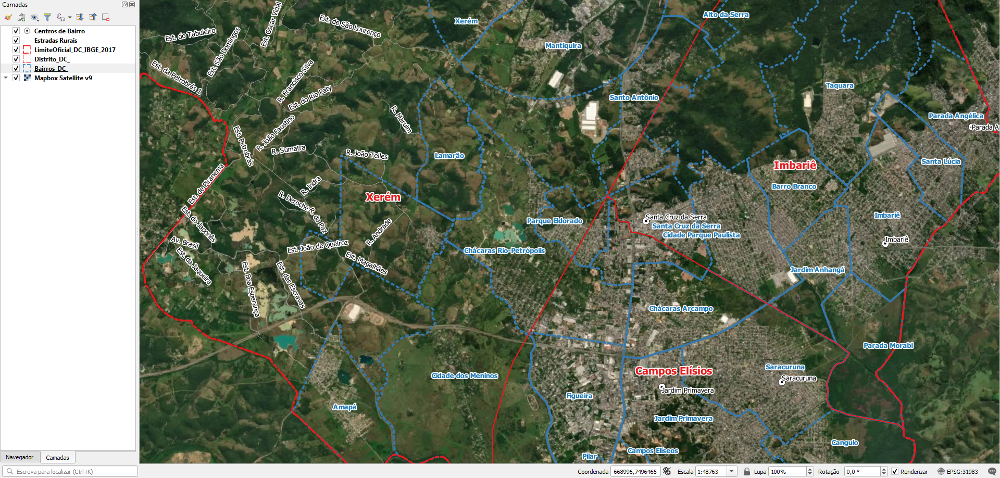

# Geral
Não há material com dados endereços.

Somente há:
* Limite de município
* Divisa de distritos e bairros
* Eixos de logradouro só de estradas rurais
* Equipamentos públicos
* Outros arquivos sobre administração pública e planejamento territorial

Material geoprocessável insuficiente. Aguardando mais material.

# Evidências de teste
Teste no QGIS:

