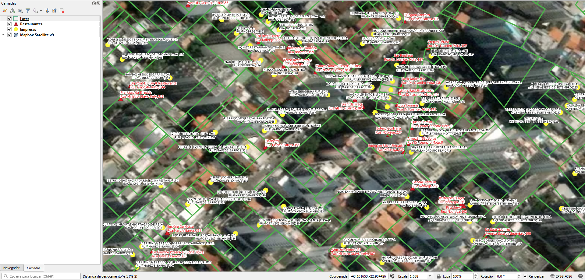

# Geral
## Arquivos renomeados
Foram renomeados os seguintes arquivos por simplicidade:
* `Topon%C3%ADmias-shp.zip` -> `Toponimias-shp.zip`

# Tarefas
## 1. Atribuir endereços nos lotes
Os lotes não possuem endereço, mas um número de inscrição `tx_insct`.

Os endereços poderão ser atribuídos via uma planilha relacionando o `tx_insct` aos endereços. A prefeitura não enviou planilha.

Ver [Extração](#Extração) para detalhes.

## 2. Gerar ponto de endereço na testada do lote
Procedimento usando PostGIS com script desenvolvido pelo A4A.

Cada ponto terá os dados:
* Nome do logradouro
* Número predial

# Extração
Abaixo os passos para extração por tipo de dado relevante.

## Lotes
SRID: 4326
1. Abrir `Lotes.zip`.
2. Selecionar todos os arquivos `Lotes.*`.
3. Copiar arquivos selecionados para diretório alvo.

### Dados relevantes
Colunas da camada `Lotes`:
* `tx_insct` (string): número de inscrição.

Os demais atributos possuem preenchimento incompleto (NULL).

## Eixos
SRID: 4326
1. Abrir `Logradouro.zip`.
2. Selecionar todos os arquivos `Logradouro.*`.
3. Copiar arquivos selecionados para diretório alvo.

### Dados relevantes
Colunas da camada `Logradouro`:
* `ST_TYPE` (string): tipo de logradouro por extenso.
* `ST_NO` (string): nome de logradouro por extenso.
* `CMTY_L` (string): nome do bairro à esquerda do eixo.
* `CMTY_R` (string): nome do bairro à direita do eixo.
* `Legislacao` (string): lei da denominação (para outros projetos).

## Bairros
SRID: 4326
1. Abrir `Limite_de_Bairros-shp.zip`.
2. Selecionar todos os arquivos `Limite_de_Bairros.*`.
3. Copiar arquivos selecionados para diretório alvo.

Não contém dados relevantes.

## Outros
Para outros projetos, há também dados/datasets sobre:
* Empresas: pontos de empresas com endereços cobrindo cerca de 25% dos lotes.
* Toponímia: pontos de equipamentos urbanos, como escolas, UBSs etc.

Nota: o arquivo `METADADOS_Camadas SIGEONiteroi.xlsx.zip\METADADOS_Camadas SIGEONiteroi.xlsx` é uma biblioteca descrevendo cada dataset.

(!!! Havendo outros projetos, esta seção será detalhada !!!)

# Evidências de teste
Teste no QGIS:

