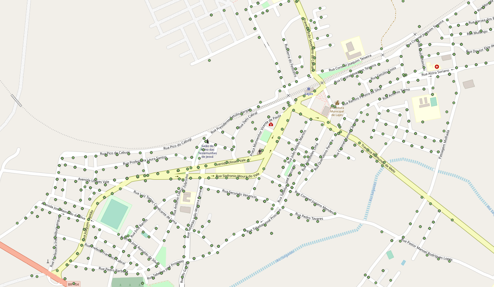

<aside>
<table align="right" style="padding: 1em">
<tr><td>Pacote <big><b>pk0149.01</b></big> de <small><a target="_afacodes" title="Jurisdição" href="https://afa.codes/BR-RN">BR-RN</a></small>
</td></tr>
<tr><td>
Doador: <a rel="external" target="_doador" href="https://servicos.neoenergiacosern.com.br/Pages/index.aspx">Companhia Energética do Rio Grande do Norte - COSERN</a>
 &nbsp; <small>CNPJ 08.324.196/0001-81</small> • Wikidata <a rel="external" target="_doador" title="link descritor Wikidata do doador" href="https://www.wikidata.org/wiki/Q18477769">Q18477769</a></small> 

Obtido via <i>email</i> em <b>08/11/2022</b> por:
 &nbsp; Avaliação técnica: <a rel="external" target="_gitPerson" title="usuário Git" href="https://github.com/luisfelipebr">luisfelipebr</a>
 &nbsp; Representação institucional: <a rel="external" target="_gitPerson" title="usuário Git" href="https://github.com/ThierryAJean">ThierryAJean</a> 
</td></tr>
<tr><td>Camadas:  </td></tr>

</table>
</aside>

<section>

Este repositório de metadados descreve um pacote de arquivos doado para o domínio público. Ele está sendo preservado pela Digital Guard: para maiores detalhes consulte a [documentação sobre o processo de registro e preservação](https://wiki.addressforall.org/doc/Documentação_Digital-guard).

Nota. O presente documento README foi gerado por software a partir das informações contidas no arquivo [`make_conf.yaml`](https://git.digital-guard.org/preserv-BR/blob/main/data/RN/_pk0149.01/make_conf.yaml) deste pacote, e informações adicionais dos catálogos de [doadores](https://git.digital-guard.org/preserv-BR/blob/main/data/donor.csv) e de [pacotes](https://git.digital-guard.org/preserv-BR/blob/main/data/donatedPack.csv).

# Camadas de dados

Os arquivos contêm "camadas de dados" temáticas. Os metadados também descrevem como cada camada foi avaliada e seus dados filtrados de forma padronizada.

##  geopoint

Nome do arquivo: `CSR_ADRESSFORALL/CSR_ENDERECO` *Download* e integridade: [4c277e529eaf56a0e8fa7ccd0c2afc141ad541e8d14874997ee429610ed31b23.zip](https://dl.digital-guard.org/4c277e529eaf56a0e8fa7ccd0c2afc141ad541e8d14874997ee429610ed31b23.zip) Formato: shp SRID: 4326

#### Dados relevantes
* `NU_PORTAL` (hnum)

* `DE_LOGRADO` (via)

* `DE_BAIRRO` (nsvia)

#### Outros dados relevantes
* `DE_DESCRIC`

# Evidências de teste

</section>
<section>

# Reprodutibilidade

O processo de transformação dos *dados orginais* (arquivos doados) em *dados filtrados* pode ser reproduzido por qualquer pessoa fazendo uso das mesmas ferramentas de software utilizadas pelo projeto. A seguir a sequência de comandos *bash* que garantem a [reprodutibilidade](https://en.wikipedia.org/wiki/Reproducibility) do processo a cada *layer*. Qualquer pessoa, munida dos [ferramentas de software utilizadas pelo projeto](https://git.AddressForAll.org/suporte/blob/master/docs/pt/infra.md#ambientes-e-ferramentas-de-uso-geral), vai gerar os mesmos resultados.

Pode-se reproduzir de dois modos:
* artesanal: com os comandos em [reproducibility.sh](https://git.digital-guard.org/preserv-BR/blob/main/data/RN/_pk0149.01/reproducibility.sh), depois de seguir a sequência de preparo da base de dados no esquema *ingest*.
* automático: usando o comando `make` conforme descrito na documentação do projeto.

</section>

