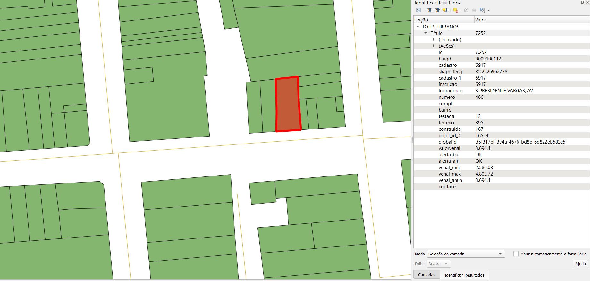

# Geral

Baixamos os dados que estão disponíveis no [GitHub](https://github.com/GGC-Bage/GeoDataBase) em 2022-04-25. Todas as camadas estão no formato `geojson`.

SRID: 31981


## **VIA** (logradouros)

1. Abrir `LOGRADOUROS.geojson`

2. Copiar para o diretório alvo

- `id` = gid (id)

- `logradouro` = name


## **PARCEL** (lotes)

1. Abrir `LOTES_URBANOS.geojson`

2. Copiar para o diretório alvo

- `id` = gid

- `numero` = house_number (numero de porta)

- `logradouro` = via_name (nome do logradouro)

**Atenção:** o nome do logradouro no arquivo de lotes não é igual ao nome do logradouro no arquivo de vias. Seguindo os passos abaixo é possível encontrar correspondência de 89%. Enquanto isso, questionei se eles têm a intenção de atualizar os nomes no arquivo de lotes.

1. Remover os primeiros três caracteres
2. Separar a string em duas, utilizando a vírgula como separador
3. Na segunda string (que possui termos como AV ou TV), remover os espaços em branco a direita e esquerda (trim)
4. Criar uma nova string com: (i) segunda string, (ii) espaço " ", (iii) primeira string

```
# Código em R (caso ajude a escrever o código em POSTGIS):

data %>%
  dplyr::mutate(log2 = stringr::str_sub(logradouro, 3)) %>% # 1.
  tidyr::separate(log2, into=c("log3", "log4"), sep=",") %>% #2.
  dplyr::mutate(log3 = dplyr::if_else(is.na(log3), "", log3),
         log4 = dplyr::if_else(is.na(log4), "", log4),
         log3 = stringr::str_trim(log3), #3.
         log4 = stringr::str_trim(log4), #3.
         log5 = base::paste0(log4, " ", log3)) %>% #4.
  dplyr::select(id, log3, log4, log5) %>%
  dplyr::rename(logradouro = log5)
```


## **BLOCK** (quarteirões)

1. Abrir `QUARTEIRAO.geojson`

2. Copiar para o diretório alvo

- `id` = gid


# Evidências de teste
Teste no QGIS:

