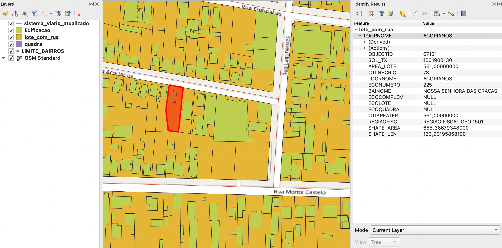

<aside>
<table align="right" style="padding: 1em">
<tr><td>Pacote <a target="_git" title="link canônico para o git deste pacote" href="http://git.digital-guard.org/preserv-BR/blob/main/data/RS/Canoas/_pk0076.01"><big><b>pk0076.01</b></big></a> de <small><a target="_osmcodes" title="Jurisdição" href="https://osm.codes/BR-RS-Canoas">BR-RS-Canoas</a></small>
</td></tr>
<tr><td>
Doador: <a rel="external" target="_doador" href="https://www.canoas.rs.gov.br/">Prefeitura Municipal de Canoas</a>
 &nbsp; <small>CNPJ 88.577.416/0001-18</small> • Wikidata <a rel="external" target="_doador" title="link descritor Wikidata do doador" href="https://www.wikidata.org/wiki/Q56450066">Q56450066</a></small> 

Obtido via <i>email</i> em <b>2021-07-06</b> por:
 &nbsp; Avaliação técnica: <a rel="external" target="_gitPerson" title="usuário Git" href="https://github.com/IgorEliezer">IgorEliezer</a>
 &nbsp; Representação institucional: <a rel="external" target="_gitPerson" title="usuário Git" href="https://github.com/ThierryAJean">ThierryAJean</a> 
</td></tr>
<tr><td>Camadas:      </td></tr>
<tr><td>Dados publicados em <a href="http://git.digital-guard.org/preservCutGeo-BR2021/tree/main/data/RS/Canoas/_pk0076.01">preservCutGeo-BR2021</a> <a href="#reprodutibilidade">Reprodutíveis</a></td></tr>
<tr><td>Visualização:      </td></tr>
</table>
</aside>

<section>

Este repositório de metadados descreve um pacote de arquivos doado para o domínio público. Ele está sendo preservado pela Digital Guard: para maiores detalhes consulte a [documentação sobre o processo de registro e preservação](https://wiki.addressforall.org/doc/Documentação_Digital-guard).

Nota. O presente documento README foi gerado por software a partir das informações contidas no arquivo [`make_conf.yaml`](http://git.digital-guard.org/preserv-BR/blob/main/data/RS/Canoas/_pk0076.01/make_conf.yaml) deste pacote, e informações adicionais dos catálogos de [doadores](https://git.digital-guard.org/preserv-BR/blob/main/data/donor.csv) e de [pacotes](https://git.digital-guard.org/preserv-BR/blob/main/data/donatedPack.csv).

# Camadas de dados

Os arquivos contêm "camadas de dados" temáticas. Os metadados também descrevem como cada camada foi avaliada e seus dados filtrados de forma padronizada.

##  block

Nome do arquivo: `quadra`. *Download* e integridade: [23916aea28282c1c2485ff18fa561728bcfc087c2999d9a9575658e32a66f782.zip](http://dl.digital-guard.org/23916aea28282c1c2485ff18fa561728bcfc087c2999d9a9575658e32a66f782.zip) Descrição: Quadras Tamanho do arquivo: 1860161 bytes (1.77 <abbr title="mebibyte">MiB</abbr>) Formato: shp SRID: 31982

#### Dados publicados
[http://git.digital-guard.org/preservCutGeo-BR2021/tree/main/data/RS/Canoas/_pk0076.01/block](http://git.digital-guard.org/preservCutGeo-BR2021/tree/main/data/RS/Canoas/_pk0076.01/block) 3108271 bytes (2.96 <abbr title="mebibyte">MiB</abbr>) 2745 polígonos com 101.5 <abbr title="quilômetros quadrados">km²</abbr> densidade média: 0.76 polígonos/km²

#### Visualização
[https://viz.addressforall.org/BR-RS-Canoas/_pk0076.01/block](https://viz.addressforall.org/BR-RS-Canoas/_pk0076.01/block)
##  building

Nome do arquivo: `Edificacao`. *Download* e integridade: [6536687209661fd36ce85976660e736b76cb2597c9a6402df810fe623aa2e569.zip](http://dl.digital-guard.org/6536687209661fd36ce85976660e736b76cb2597c9a6402df810fe623aa2e569.zip) Descrição: Edificações Tamanho do arquivo: 22036142 bytes (21.02 <abbr title="mebibyte">MiB</abbr>) Formato: shp SRID: 31982

#### Dados publicados
[http://git.digital-guard.org/preservCutGeo-BR2021/tree/main/data/RS/Canoas/_pk0076.01/building](http://git.digital-guard.org/preservCutGeo-BR2021/tree/main/data/RS/Canoas/_pk0076.01/building) 35378109 bytes (33.74 <abbr title="mebibyte">MiB</abbr>) 175040 polígonos com 13.6 <abbr title="quilômetros quadrados">km²</abbr> densidade média: 0.24 polígonos/km²

#### Visualização
[https://viz.addressforall.org/BR-RS-Canoas/_pk0076.01/building](https://viz.addressforall.org/BR-RS-Canoas/_pk0076.01/building)
##  nsvia

Nome do arquivo: `LIMITE_BAIRROS`. *Download* e integridade: [62972bc1f5accf55c5ea97f9154f246a111cde13c4da881798668e12b0a03a41.zip](http://dl.digital-guard.org/62972bc1f5accf55c5ea97f9154f246a111cde13c4da881798668e12b0a03a41.zip) Descrição: Bairros Tamanho do arquivo: 349550 bytes (0.33 <abbr title="mebibyte">MiB</abbr>) Formato: shp SRID: 31982

#### Dados relevantes
* `Bairro` (nsvia)

#### Dados publicados
[http://git.digital-guard.org/preservCutGeo-BR2021/tree/main/data/RS/Canoas/_pk0076.01/nsvia](http://git.digital-guard.org/preservCutGeo-BR2021/tree/main/data/RS/Canoas/_pk0076.01/nsvia) 370857 bytes (0.35 <abbr title="mebibyte">MiB</abbr>) 14 polígonos com 95.42 <abbr title="quilômetros quadrados">km²</abbr> densidade média: 0.7 polígonos/km²

#### Visualização
[https://viz.addressforall.org/BR-RS-Canoas/_pk0076.01/nsvia](https://viz.addressforall.org/BR-RS-Canoas/_pk0076.01/nsvia)
##  parcel

Nome do arquivo: `lote_com_rua`. *Download* e integridade: [4f5971ab149c0d936a315fff94fdd8ee5fb2410f2a472b3eaf0d33666ee1043d.zip](http://dl.digital-guard.org/4f5971ab149c0d936a315fff94fdd8ee5fb2410f2a472b3eaf0d33666ee1043d.zip) Descrição: Lotes Tamanho do arquivo: 11632446 bytes (11.09 <abbr title="mebibyte">MiB</abbr>) Formato: shp SRID: 31982

#### Dados relevantes
* `LOGRNOME` (via)

* `ECONUMERO` (hnum)

#### Dados publicados
[http://git.digital-guard.org/preservCutGeo-BR2021/tree/main/data/RS/Canoas/_pk0076.01/parcel](http://git.digital-guard.org/preservCutGeo-BR2021/tree/main/data/RS/Canoas/_pk0076.01/parcel) 16712286 bytes (15.94 <abbr title="mebibyte">MiB</abbr>) 84032 polígonos com 101.53 <abbr title="quilômetros quadrados">km²</abbr> densidade média: 0.73 polígonos/km²

#### Visualização
[https://viz.addressforall.org/BR-RS-Canoas/_pk0076.01/parcel](https://viz.addressforall.org/BR-RS-Canoas/_pk0076.01/parcel)
##  via

Nome do arquivo: `sistema_viario_atualizado`. *Download* e integridade: [8dd9b6e7e03435fd0adb687313f754cfd76488f13a4b3cfdcc17a4b8c317be87.zip](http://dl.digital-guard.org/8dd9b6e7e03435fd0adb687313f754cfd76488f13a4b3cfdcc17a4b8c317be87.zip) Descrição: Vias Tamanho do arquivo: 727978 bytes (0.69 <abbr title="mebibyte">MiB</abbr>) Formato: shp SRID: 31982

#### Dados relevantes
* `ds_logrado` (via)

#### Dados publicados
[http://git.digital-guard.org/preservCutGeo-BR2021/tree/main/data/RS/Canoas/_pk0076.01/via](http://git.digital-guard.org/preservCutGeo-BR2021/tree/main/data/RS/Canoas/_pk0076.01/via) 777478 bytes (0.74 <abbr title="mebibyte">MiB</abbr>) 6472 segmentos com 939.52 <abbr title="quilômetros">km</abbr> densidade média: 6.89 segmentos/km²

#### Visualização
[https://viz.addressforall.org/BR-RS-Canoas/_pk0076.01/via](https://viz.addressforall.org/BR-RS-Canoas/_pk0076.01/via)

# Evidências de teste

# Comentários gerais
Existem vários outros arquivos com pontos de interesse (escolas, bibliotecas, UPAs etc.).

</section>
<section>

# Reprodutibilidade

Ver detalhes em [reproducibility.sh](reproducibility.sh).

</section>

