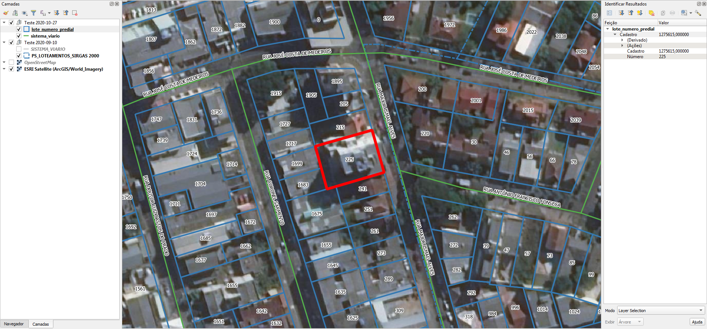

<aside>
<table align="right" style="padding: 1em">
<tr><td>Pacote <a target="_git" title="link canônico para o git deste pacote" href="http://git.digital-guard.org/preserv-BR/blob/main/data/RS/Gravatai/_pk0017.01"><big><b>pk0017.01</b></big></a> de <small><a target="_osmcodes" title="Jurisdição" href="https://osm.codes/BR-RS-Gravatai">BR-RS-Gravatai</a></small>
</td></tr>
<tr><td>
Doador: <a rel="external" target="_doador" href="https://www.gravatai.rs.gov.br/">Prefeitura Municipal de Gravataí</a>
 &nbsp; <small>CNPJ 87.890.992/0001-58</small> • Wikidata <a rel="external" target="_doador" title="link descritor Wikidata do doador" href="https://www.wikidata.org/wiki/Q56450094">Q56450094</a></small> 

Obtido via <i>email</i> em <b>2021-06-23</b> por:
 &nbsp; Avaliação técnica: <a rel="external" target="_gitPerson" title="usuário Git" href="https://github.com/IgorEliezer">IgorEliezer</a>
 &nbsp; Representação institucional: <a rel="external" target="_gitPerson" title="usuário Git" href="https://github.com/ThierryAJean">ThierryAJean</a> 
</td></tr>
<tr><td>Camadas:   </td></tr>
<tr><td>Dados publicados em <a href="http://git.digital-guard.org/preservCutGeo-BR2021/tree/main/data/RS/Gravatai/_pk0017.01">preservCutGeo-BR2021</a> <a href="#reprodutibilidade">Reprodutíveis</a></td></tr>
<tr><td>Visualização: </td></tr>
</table>
</aside>

<section>

Este repositório de metadados descreve um pacote de arquivos doado para o domínio público. Ele está sendo preservado pela Digital Guard: para maiores detalhes consulte a [documentação sobre o processo de registro e preservação](https://wiki.addressforall.org/doc/Documentação_Digital-guard).

Nota. O presente documento README foi gerado por software a partir das informações contidas no arquivo [`make_conf.yaml`](make_conf.yaml) deste pacote, e informações adicionais dos catálogos de [doadores](https://git.digital-guard.org/preserv-BR/blob/main/data/donor.csv) e de [pacotes](https://git.digital-guard.org/preserv-BR/blob/main/data/donatedPack.csv).

# Camadas de dados

Os arquivos contêm "camadas de dados" temáticas. Os metadados também descrevem como cada camada foi avaliada e seus dados filtrados de forma padronizada.

##  parcel

Nome do arquivo: `lote_numero_predial`. *Download* e integridade: [d101e729d51ddfc33e4a866684074487c5a2601c7c84d4eca01ff9bbca186cda.rar](http://dl.digital-guard.org/d101e729d51ddfc33e4a866684074487c5a2601c7c84d4eca01ff9bbca186cda.rar) Descrição: Lotes e Eixos Tamanho do arquivo: 7445892 bytes (7.1 <abbr title="mebibyte">MiB</abbr>) Formato: shp SRID: 31982

#### Dados relevantes
* `Número` (hnum)

#### Dados publicados
[http://git.digital-guard.org/preservCutGeo-BR2021/tree/main/data/RS/Gravatai/_pk0017.01/parcel](http://git.digital-guard.org/preservCutGeo-BR2021/tree/main/data/RS/Gravatai/_pk0017.01/parcel) 15048410 bytes (14.35 <abbr title="mebibyte">MiB</abbr>) 85144 polígonos com 103.93 <abbr title="quilômetros quadrados">km²</abbr> densidade média: 0.45 polígonos/km²

#### Visualização
[https://viz.addressforall.org/BR-RS-Gravatai/_pk0017.01/parcel](https://viz.addressforall.org/BR-RS-Gravatai/_pk0017.01/parcel)
##  via

Nome do arquivo: `sistema_viario`. *Download* e integridade: [d101e729d51ddfc33e4a866684074487c5a2601c7c84d4eca01ff9bbca186cda.rar](http://dl.digital-guard.org/d101e729d51ddfc33e4a866684074487c5a2601c7c84d4eca01ff9bbca186cda.rar) Descrição: Lotes e Eixos Tamanho do arquivo: 7445892 bytes (7.1 <abbr title="mebibyte">MiB</abbr>) Formato: shp SRID: 31982

#### Dados relevantes
* `TIPO || ' ' || NOME` (via)

#### Dados publicados
[http://git.digital-guard.org/preservCutGeo-BR2021/tree/main/data/RS/Gravatai/_pk0017.01/via](http://git.digital-guard.org/preservCutGeo-BR2021/tree/main/data/RS/Gravatai/_pk0017.01/via) 1747356 bytes (1.67 <abbr title="mebibyte">MiB</abbr>) 9512 segmentos com 1470.44 <abbr title="quilômetros">km</abbr> densidade média: 3.1 segmentos/km²

#### Visualização
[https://viz.addressforall.org/BR-RS-Gravatai/_pk0017.01/via](https://viz.addressforall.org/BR-RS-Gravatai/_pk0017.01/via)

# Evidências de teste

</section>
<section>

# Reprodutibilidade

Ver detalhes em [reproducibility.sh](reproducibility.sh).

</section>

