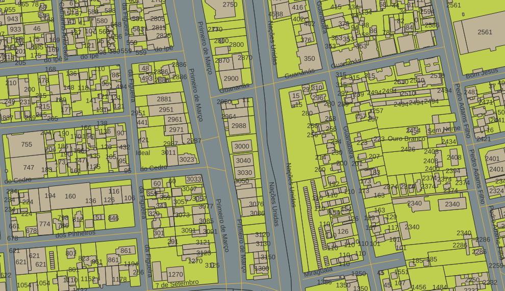

<aside>
<table align="right" style="padding: 1em">
<tr><td>Pacote <a target="_git" title="link canônico para o git deste pacote" href="https://git.digital-guard.org/preserv-BR/blob/main/data/RS/NovoHamburgo/_pk0063.01"><big><b>pk0063.01</b></big></a> de <small><a target="_osmcodes" title="Jurisdição" href="https://afa.codes/BR-RS-NovoHamburgo">BR-RS-NovoHamburgo</a></small>
</td></tr>
<tr><td>
Doador: <a rel="external" target="_doador" href="https://www.novohamburgo.rs.gov.br/">Prefeitura Municipal de Novo Hamburgo</a>
 &nbsp; <small>CNPJ 07.044.304/0001-08</small> • Wikidata <a rel="external" target="_doador" title="link descritor Wikidata do doador" href="https://www.wikidata.org/wiki/Q105008951">Q105008951</a></small> 

Obtido via <i>site</i> em <b>10/11/2022</b> por:
 &nbsp; Avaliação técnica: <a rel="external" target="_gitPerson" title="usuário Git" href="https://github.com/IgorEliezer">IgorEliezer</a>
 &nbsp; Representação institucional: <a rel="external" target="_gitPerson" title="usuário Git" href="https://github.com/ThierryAJean">ThierryAJean</a> 
</td></tr>
<tr><td>Camadas:     </td></tr>
<tr><td>Dados publicados em <a href="https://git.digital-guard.org/preservCutGeo-BR2021/tree/main/data/RS/NovoHamburgo/_pk0063.01">preservCutGeo-BR2021</a> <a href="#reprodutibilidade">Reprodutíveis</a></td></tr>
<tr><td>Visualização:    </td></tr>
</table>
</aside>

<section>

Este repositório de metadados descreve um pacote de arquivos doado para o domínio público. Ele está sendo preservado pela Digital Guard: para maiores detalhes consulte a [documentação sobre o processo de registro e preservação](https://wiki.addressforall.org/doc/Documentação_Digital-guard).

Nota. O presente documento README foi gerado por software a partir das informações contidas no arquivo [`make_conf.yaml`](https://git.digital-guard.org/preserv-BR/blob/main/data/RS/NovoHamburgo/_pk0063.01/make_conf.yaml) deste pacote, e informações adicionais dos catálogos de [doadores](https://git.digital-guard.org/preserv-BR/blob/main/data/donor.csv) e de [pacotes](https://git.digital-guard.org/preserv-BR/blob/main/data/donatedPack.csv).

# Camadas de dados

Os arquivos contêm "camadas de dados" temáticas. Os metadados também descrevem como cada camada foi avaliada e seus dados filtrados de forma padronizada.

##  building

Nome do arquivo: `edificacoes` *Download* e integridade: [830b546ac5cdc4290fdcdb04654f731704b494f474e5dded78acfd651139f3a5.zip](http://dl.digital-guard.org/830b546ac5cdc4290fdcdb04654f731704b494f474e5dded78acfd651139f3a5.zip) Descrição: shp_edificacoes.zip Formato: shp SRID: 31982

#### Dados relevantes
* `tx_numero` (house_number)

#### Resultados da filtragem e sua publicação
23275379 bytes (22.2 <abbr title="mebibyte">MiB</abbr>) 111053 polígonos com 10.63 <abbr title="quilômetros quadrados">km²</abbr> densidade média: 0.23 polígonos/km² GeoJSONs publicados em [https://git.digital-guard.org/preservCutGeo-BR2021/tree/main/data/RS/NovoHamburgo/_pk0063.01/building](https://git.digital-guard.org/preservCutGeo-BR2021/tree/main/data/RS/NovoHamburgo/_pk0063.01/building)

#### Visualização
[https://viz.addressforall.org/BR-RS-NovoHamburgo/_pk0063.01/building](https://viz.addressforall.org/BR-RS-NovoHamburgo/_pk0063.01/building)
##  nsvia

Nome do arquivo: `bairros` *Download* e integridade: [375a3906c90abe84e3dc3a6e7dbc81d985dc3779b00e4c3cebf35bcc6ff2067f.zip](http://dl.digital-guard.org/375a3906c90abe84e3dc3a6e7dbc81d985dc3779b00e4c3cebf35bcc6ff2067f.zip) Descrição: shp_bairros.zip Formato: shp SRID: 31982

#### Dados relevantes
* `chave` (nsvia_name)

#### Resultados da filtragem e sua publicação
271452 bytes (0.26 <abbr title="mebibyte">MiB</abbr>) 27 polígonos com 222.66 <abbr title="quilômetros quadrados">km²</abbr> densidade média: 0.95 polígonos/km² GeoJSONs publicados em [https://git.digital-guard.org/preservCutGeo-BR2021/tree/main/data/RS/NovoHamburgo/_pk0063.01/nsvia](https://git.digital-guard.org/preservCutGeo-BR2021/tree/main/data/RS/NovoHamburgo/_pk0063.01/nsvia)

#### Visualização
[https://viz.addressforall.org/BR-RS-NovoHamburgo/_pk0063.01/nsvia](https://viz.addressforall.org/BR-RS-NovoHamburgo/_pk0063.01/nsvia)
##  via

Nome do arquivo: `logradouros` *Download* e integridade: [920d3a2f5e1c031a965f94ea48b243018780712c21a02903e7d0cec4d7cea06f.zip](http://dl.digital-guard.org/920d3a2f5e1c031a965f94ea48b243018780712c21a02903e7d0cec4d7cea06f.zip) Descrição: shp_logradouros.zip Formato: shp SRID: 31982

#### Dados relevantes
* `nome` (via)

#### Resultados da filtragem e sua publicação
1214848 bytes (1.16 <abbr title="mebibyte">MiB</abbr>) 8442 segmentos com 1072.13 <abbr title="quilômetros">km</abbr> densidade média: 4.59 segmentos/km² GeoJSONs publicados em [https://git.digital-guard.org/preservCutGeo-BR2021/tree/main/data/RS/NovoHamburgo/_pk0063.01/via](https://git.digital-guard.org/preservCutGeo-BR2021/tree/main/data/RS/NovoHamburgo/_pk0063.01/via)

#### Visualização
[https://viz.addressforall.org/BR-RS-NovoHamburgo/_pk0063.01/via](https://viz.addressforall.org/BR-RS-NovoHamburgo/_pk0063.01/via)
##  parcel

Nome do arquivo: `lotes` *Download* e integridade: [eb69ff81ddacf4fc1c1eb0a099102f365646d8bd4d227f27d930ad78c22ff9b5.zip](http://dl.digital-guard.org/eb69ff81ddacf4fc1c1eb0a099102f365646d8bd4d227f27d930ad78c22ff9b5.zip) Descrição: shp_lotes.zip Formato: shp SRID: 31982

# Evidências de teste

</section>
<section>

# Reprodutibilidade

O processo de transformação dos *dados orginais* (arquivos doados) em *dados filtrados* pode ser reproduzido por qualquer pessoa fazendo uso das mesmas ferramentas de software utilizadas pelo projeto. A seguir a sequência de comandos *bash* que garantem a [reprodutibilidade](https://en.wikipedia.org/wiki/Reproducibility) do processo a cada *layer*. Qualquer pessoa, munida dos [ferramentas de software utilizadas pelo projeto](https://git.AddressForAll.org/suporte/blob/master/docs/pt/infra.md#ambientes-e-ferramentas-de-uso-geral), vai gerar os mesmos resultados.

Pode-se reproduzir de dois modos:
* artesanal: com os comandos em [reproducibility.sh](https://git.digital-guard.org/preserv-BR/blob/main/data/RS/NovoHamburgo/_pk0063.01/reproducibility.sh), depois de seguir a sequência de preparo da base de dados no esquema *ingest*.
* automático: usando o comando `make` conforme descrito na documentação do projeto.

</section>

