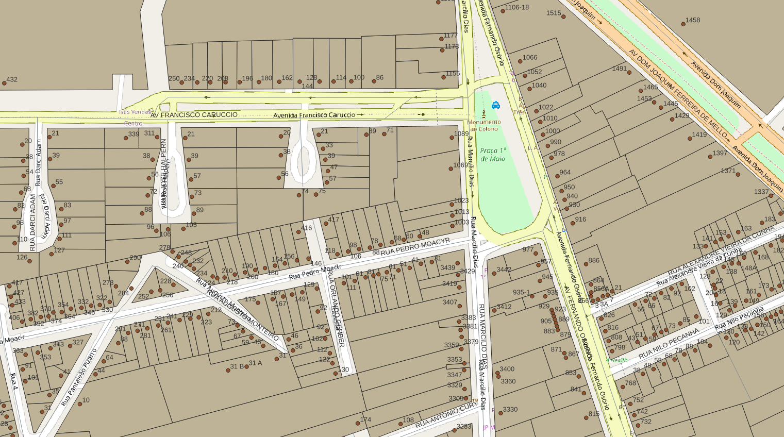

# Tarefas

# Extração
Abaixo os passos para extração por tipo de dado relevante.

## Pontos de Endereço
SRID: 31982
1. Abrir `DADOS PELOTAS.zip`.
2. Selecionar arquivos `DADOS PELOTAS/pelotas_lotes_cadastro`.
3. Copiar arquivos selecionados para diretório alvo.

### Dados relevantes
Colunas da camada `DADOS PELOTAS/pelotas_lotes_cadastro`:
* `text` (string): pontos de endereço

## Eixos
SRID: 
1. Abrir `DADOS PELOTAS.zip`.
2. Selecionar arquivos `DADOS PELOTAS/pelotas_eixos_viarios`.
3. Copiar arquivos selecionados para diretório alvo.

### Dados relevantes
Colunas da camada `DADOS PELOTAS/pelotas_eixos_viarios`:
* `nome_map` (): nome de via;

## Outros
Para outros projetos, há também dados sobre:
* `pelotas_tab_logradouros.xlsx`: Informação de CEP

(!!! Havendo outros projetos, esta seção será detalhada !!!)

# Evidências de teste
Teste no QGIS:

