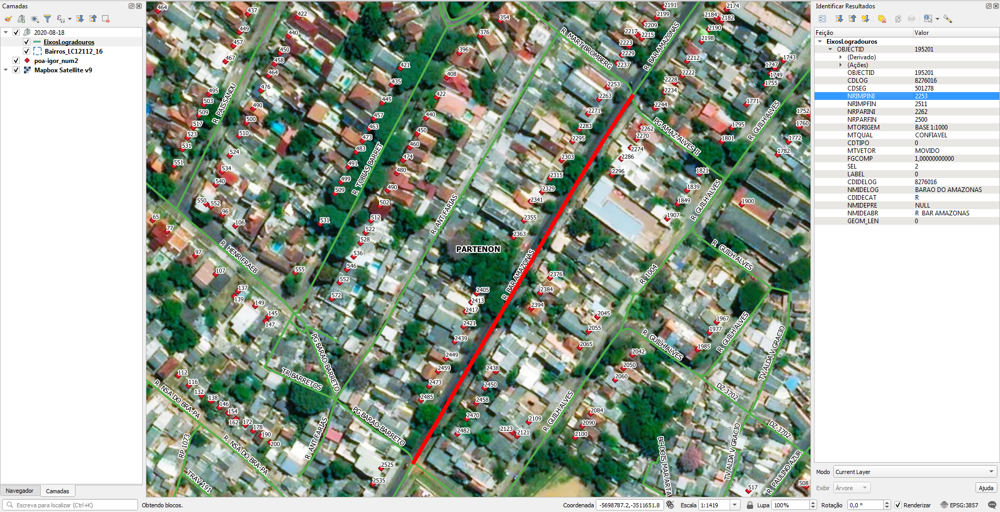

# Tarefas

## 1. Converter boxes com numeração predial em pontos

**NB:** Confirmar se é necessária, conforme este comentário e ilustração: https://github.com/AddressForAll/digital-preservation-BR/issues/3#issuecomment-726850941

Cada ponto de numeração predial é representado por um pequeno box com vários atributos, dos quais o atributo `TEXTSRING` é a numeração predial.

Precisa converter cada box em um ponto de numeração predial sem perder os dados dos atributos, especialmente `TEXTSRING`.

Para pontos de numeração predial, ver [Numeração predial](#Numeração predial).

## 2. Atribuir nome de logradouro dos eixos nos pontos de numeração predial

Os eixos de logradouros são formados por trechos (de esquina a esquina) os quais possuem atributos indicando o início e o fim de numeração no lado par e ímpar do trecho de via.

Precisa atribuir o nome do logradouro nos pontos de numeração predial que se enquadram no intervalo dos números de início e fim dos trechos.

Para eixos de vias, ver [Eixos](#Eixos).

# Extração
Abaixo os passos para extração por tipo de dado relevante.

## Numeração predial
SRID: Custom (TM-POA)
1. Abrir `NRO_IMOVEL.zip`.
2. Selecionar arquivos `NRO_IMOVEL.*`.
3. Copiar arquivos selecionados para diretório alvo.

### Dados relevantes
Colunas:
* `TEXTSRING` (string): numeração predial.

**NB1:** Há 3380 numerações que possuem uma "/" indicando numeração de unidade (ex.: 360/2 = nº 360 casa 2).
**NB2:** O arquivo `SMF-XLSX-ORIGINAIS.zip` possui pontos de numeração predial mais antigo.

## Eixos
SRID: Custom (TM-POA)
1. Abrir `eixoslogradouros.zip`.
2. Selecionar arquivos `EixosLogradouros.*`.
3. Copiar arquivos selecionados para diretório alvo.

### Dados relevantes
Colunas:
* `CDIDECAT` (string): tipo de logradouro (R, AV, TR etc) em caixa alta.
* `NMIDEPRE` (string): preposição de nome de logradouro (DE, DA, DO) em caixa alta.
* `NMIDELOG` (string): nome de logradouro em caixa alta.
* `NMIDEABR` (string): nome do logradouro abreviado em caixa alta, caso precise.
* `NRIMPINI` (int): numeração inicial - lado ímpar.
* `NRIMPFIN` (int): numeração final - lado ímpar.
* `NRPARINI` (int): numeração inicial - lado par.
* `NRPARFIN` (int): numeração final - lado par.

### Significado de abreviações em CDIDECAT

Significados obtidos no código html do menu em http://cdlweb.procempa.com.br/cdlmapafotos/CDLPesquisaLogradouroAvancada.asp

- AC: ACESSO
- AL: ALAMEDA
- **AR: ARROIO**
- AS: ACESSO SECUNDARIO
- AV: AVENIDA
- BC: BECO
- BV: BELVEDERE
- CA: CAIS
- CICL: CICLOVIA
- **CN: CANAL**
- DIR: DIRETRIZ
- ESC: ESCADARIA
- ESP: ESQUINA
- EST: ESTACAO
- ESTR: ESTRADA
- GAL: GALERIA
- **I: ILHA**
- JAR: JARDIM
- LAGO: LAGO
- LE: LOGRADOURO ESPECIAL
- LG: LARGO
- MER: MERCADO
- PCA: PRACA
- PRQ: PARQUE
- PSG: PASSAGEM
- PSL: PASSARELA
- R: RUA
- RIO: RIO
- RP: RUA DE PEDESTRES
- RTL: ROTULA
- TERM: TERMINAL
- TRAV: TRAVESSA
- TRVS: TRAVESSIA
- TUN: TUNEL
- VA: VIA ACESSO
- VDT: VIADUTO
- VE: VIELA
- VIA: VIA
- VP: VIA DE PEDESTRES
- VTC: VIA TRAFEGO COMPARTILHADO

### Filtragem de hidrografia e limites

CDIDECAT mistura hidrografia, limites municipal e vias. Os valores AR, CN, I, LAGO, RIO e, ainda, `CDIDECAT='LE' AND NMIDELOG ='LIMITE DE PROPRIEDADE'` (que captura alguns limites dos município ao leste) podem ser filtrados.


### Expressões
Expressão para construir a string do nome do logradouro:

`"CDIDECAT" + if("NMIDEPRE",' ' + "NMIDEPRE",'') + ' ' + "NMIDELOG"`

## Bairros
SRID: Custom (TM-POA)
1. Abrir `bairros_lc12112_16.zip`.
2. Selecionar arquivos `Bairros_LC12112_16.*`.
3. Copiar arquivos selecionados para diretório alvo.

### Dados relevantes
Colunas:
* `NOME` (string): nome do bairro.

## Outros
O arquivo `decreto_18.315.pdf` Institui o Sistema Cartográfico de Referência de Porto Alegre.

# Evidências de teste
Teste no QGIS:


------------------

## TM-POA
O arquivo `NRO_IMOVEL.prj`, por um [bug de interface do software `shp2pgsql`](https://nelsonslog.wordpress.com/2012/08/10/shp2pgsql-and-prj-files/),
eh ignorado sem aviso.

A partir da publicação do [Decreto municipal n° 18.315 de 2013](https://web.archive.org/web/20200324034734/http://lproweb.procempa.com.br/pmpa/prefpoa/spm/usu_doc/decreto_18.315.pdf)
foi instituído o Sistema Cartográfico de Referência de Porto Alegre,
definido pelo sistema geodésico de referência SIRGAS2000 (equiparado ao WGS84) e projeção cartográfica TM-POA.
O artigo 1º do decreto pode ser traduzido para a seguinte [definicao Proj](https://proj.org/):
```
+proj=tmerc +lat_0=0 +lon_0=-51 +k=0.999995 +x_0=300000 +y_0=5000000 +ellps=GRS80 +towgs84=0,0,0,0,0,0,0 +units=m +no_defs
```

Neste Decreto está definido que os trabalhos de delimitação e demarcação de terras,
de topografia e cartografia devem estar referenciados na Projeção
Transversa de Mercator para Porto Alegre (TM-POA).

Na AddressForAll o TM-POA recebeu o SRID 952013.

# Issues:
* https://github.com/AddressForAll/digital-preservation-BR/issues/3

-------------------

## Make

Para gerar todos os layers aqui descritos,  `make all_layers`. Os dados "originais filtrados" serão todos gravados nas tabelas `ingest.layer_file` e `ingest.feature_asis`.

Para a geração de um só layer ou baixando dados em outra origem, ou usando uma base diferente da `ingest1`, usar demais parâmetros. Exemplo: `make pg_db=ingest2 orig=/tmp/sandOrig nsvia_full`.
