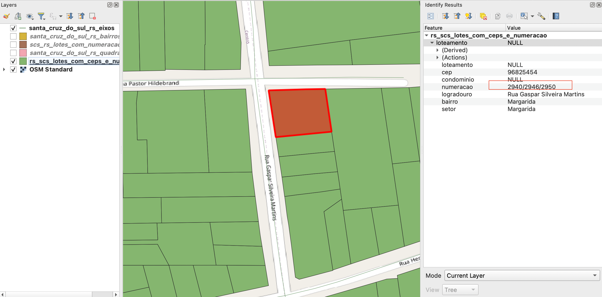

<aside>
<table align="right" style="padding: 1em">
<tr><td>Pacote <a target="_git" title="link canônico para o git deste pacote" href="http://git.digital-guard.org/preserv-BR/blob/main/data/RS/SantaCruzSul/_pk0064.01"><big><b>pk0064.01</b></big></a> de <small><a target="_osmcodes" title="Jurisdição" href="https://osm.codes/BR-RS-SantaCruzSul">BR-RS-SantaCruzSul</a></small>
</td></tr>
<tr><td>
Doador: <a rel="external" target="_doador" href="https://www.santacruz.rs.gov.br">Prefeitura Municipal de Santa Cruz do Sul</a>
 &nbsp; <small>CNPJ 95.440.517/0001-08</small> • Wikidata <a rel="external" target="_doador" title="link descritor Wikidata do doador" href="https://www.wikidata.org/wiki/Q105328349">Q105328349</a></small> 
 
Obtido via <i>email</i> em <b>2022-03-08</b> por:
 &nbsp; Avaliação técnica: <a rel="external" target="_gitPerson" title="usuário Git" href="https://github.com/IgorEliezer">IgorEliezer</a>
 &nbsp; Representação institucional: <a rel="external" target="_gitPerson" title="usuário Git" href="https://github.com/ThierryAJean">ThierryAJean</a> 
</td></tr>
<tr><td>Camadas:     </td></tr>
<tr><td>Dados publicados em <a href="http://git.digital-guard.org/preservCutGeo-BR2021/tree/main/data/RS/SantaCruzSul/_pk0064.01">preservCutGeo-BR2021</a> <a href="#reprodutibilidade">Reprodutíveis</a></td></tr>
<tr><td>Visualização: </td></tr>
</table>
</aside>

<section>

Este repositório de metadados descreve um pacote de arquivos doado para o domínio público. Ele está sendo preservado pela Digital Guard: para maiores detalhes consulte a [documentação sobre o processo de registro e preservação](https://wiki.addressforall.org/doc/Documentação_Digital-guard).

Nota. O presente documento README foi gerado por software a partir das informações contidas no arquivo [`make_conf.yaml`](make_conf.yaml) deste pacote, e informações adicionais dos catálogos de [doadores](https://git.digital-guard.org/preserv-BR/blob/main/data/donor.csv) e de [pacotes](https://git.digital-guard.org/preserv-BR/blob/main/data/donatedPack.csv).

# Camadas de dados

Os arquivos contêm "camadas de dados" temáticas. Os metadados também descrevem como cada camada foi avaliada e seus dados filtrados de forma padronizada.

##  block

Nome do arquivo: `santa_cruz_do_sul_rs_quadras`. *Download* e integridade: [a3eab1ae42ce304d9bbd119ebb769b6c93c40f04b1f09c6e0e9ec322320da7ff.zip](http://dl.digital-guard.org/a3eab1ae42ce304d9bbd119ebb769b6c93c40f04b1f09c6e0e9ec322320da7ff.zip) Descrição: Quadras Tamanho do arquivo: 2534948 bytes (2.42 <abbr title="mebibyte">MiB</abbr>) Formato: shp SRID: 31982

#### Dados publicados
[http://git.digital-guard.org/preservCutGeo-BR2021/tree/main/data/RS/SantaCruzSul/_pk0064.01/block](http://git.digital-guard.org/preservCutGeo-BR2021/tree/main/data/RS/SantaCruzSul/_pk0064.01/block) 3632381 bytes (3.46 <abbr title="mebibyte">MiB</abbr>) 1646 polígonos com 111.57 <abbr title="quilômetros quadrados">km²</abbr> densidade média: 0.18 polígonos/km²

#### Visualização
[https://viz.addressforall.org/BR-RS-SantaCruzSul/_pk0064.01/block](https://viz.addressforall.org/BR-RS-SantaCruzSul/_pk0064.01/block)
##  nsvia

Nome do arquivo: `santa_cruz_do_sul_rs_bairros`. *Download* e integridade: [8cfffc8d4ab052dd653748fd22c52ad708609e8c3c30283f57a7b2627fbf8aca.zip](http://dl.digital-guard.org/8cfffc8d4ab052dd653748fd22c52ad708609e8c3c30283f57a7b2627fbf8aca.zip) Descrição: Bairros Tamanho do arquivo: 512506 bytes (0.49 <abbr title="mebibyte">MiB</abbr>) Formato: shp SRID: 31982

#### Dados relevantes
* `NAME1_` (nsvia)

#### Dados publicados
[http://git.digital-guard.org/preservCutGeo-BR2021/tree/main/data/RS/SantaCruzSul/_pk0064.01/nsvia](http://git.digital-guard.org/preservCutGeo-BR2021/tree/main/data/RS/SantaCruzSul/_pk0064.01/nsvia) 917377 bytes (0.87 <abbr title="mebibyte">MiB</abbr>) 34 polígonos com 88 <abbr title="quilômetros quadrados">km²</abbr> densidade média: 0.15 polígonos/km²

#### Visualização
[https://viz.addressforall.org/BR-RS-SantaCruzSul/_pk0064.01/nsvia](https://viz.addressforall.org/BR-RS-SantaCruzSul/_pk0064.01/nsvia)
##  parcel

Nome do arquivo: `rs_scs_lotes_com_ceps_e_numeracao`. *Download* e integridade: [3b4634f38fafd4d3a779b1f7a1075ab2fd6b951509290849f26813319920b2fa.zip](http://dl.digital-guard.org/3b4634f38fafd4d3a779b1f7a1075ab2fd6b951509290849f26813319920b2fa.zip) Descrição: Lotes Tamanho do arquivo: 7563664 bytes (7.21 <abbr title="mebibyte">MiB</abbr>) Formato: shp SRID: 31982

#### Dados relevantes
* `logradouro` (via)

* `numeracao` (hnum)

#### Dados publicados
[http://git.digital-guard.org/preservCutGeo-BR2021/tree/main/data/RS/SantaCruzSul/_pk0064.01/parcel](http://git.digital-guard.org/preservCutGeo-BR2021/tree/main/data/RS/SantaCruzSul/_pk0064.01/parcel) 12272728 bytes (11.7 <abbr title="mebibyte">MiB</abbr>) 45351 polígonos com 116.24 <abbr title="quilômetros quadrados">km²</abbr> densidade média: 0.56 polígonos/km²

#### Visualização
[https://viz.addressforall.org/BR-RS-SantaCruzSul/_pk0064.01/parcel](https://viz.addressforall.org/BR-RS-SantaCruzSul/_pk0064.01/parcel)
##  via

Nome do arquivo: `santa_cruz_do_sul_rs_eixos`. *Download* e integridade: [5c7bc9d5d753681db743235e647cb653efe34404aad61b040af89cc2ec68bbe2.zip](http://dl.digital-guard.org/5c7bc9d5d753681db743235e647cb653efe34404aad61b040af89cc2ec68bbe2.zip) Descrição: Vias Tamanho do arquivo: 544243 bytes (0.52 <abbr title="mebibyte">MiB</abbr>) Formato: shp SRID: 31982

#### Dados relevantes
* `logradouro` (via)

#### Dados publicados
[http://git.digital-guard.org/preservCutGeo-BR2021/tree/main/data/RS/SantaCruzSul/_pk0064.01/via](http://git.digital-guard.org/preservCutGeo-BR2021/tree/main/data/RS/SantaCruzSul/_pk0064.01/via) 974531 bytes (0.93 <abbr title="mebibyte">MiB</abbr>) 1322 segmentos com 715.27 <abbr title="quilômetros">km</abbr> densidade média: 1.19 segmentos/km²

#### Visualização
[https://viz.addressforall.org/BR-RS-SantaCruzSul/_pk0064.01/via](https://viz.addressforall.org/BR-RS-SantaCruzSul/_pk0064.01/via)

# Evidências de teste

</section>
<section>

# Reprodutibilidade

Ver detalhes em [reproducibility.sh](reproducibility.sh).

</section>

