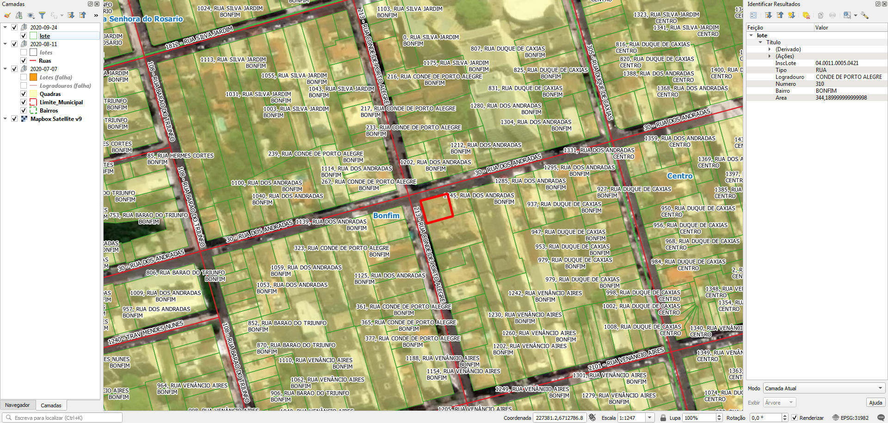

# Geral
Foram realizadas 3 entregas, havendo mais de um dataset de mesmo tipo. Abaixo, em Extração, está a seleção do material.

## Arquivos
Renomeados para facilitar:
* `Lotes (2).rar` -> `Lotes.rar`

Removidos por estarem corrompidos:
* Entrega de 2020-07-07: arquivos de lotes e eixos, por não carregarem. Os demais estão em `recebido_2020-07-07.zip`.

# Tarefas

## 1. Gerar ponto de endereço na testada do lote
Procedimento usando PostGIS com script desenvolvido pelo A4A.

Cada ponto terá os dados:
* Nome do logradouro
* Número predial

# Extração
Abaixo os passos para extração por tipo de dado relevante.

## Lotes
SRID: 31982
1. Abrir `Lotes.rar`.
2. Abrir diretório `Lotes`.
3. Selecionar arquivos `lote.*`.
4. Copiar arquivos selecionados para diretório alvo.

### Dados relevantes
Colunas da camada `lotes`:
* `Tipo` (string): tipo do logradouro em caixa alta, abreviado.
* `Logradouro` (string): nome do logradouro em caixa alta, com acentuação. 
* `Numero` (string): número predial. Sem número é representado como "0".
* `Bairro` (string): nome do bairro em caixa alta, com acentuação.

### Expressões
Para construir o nome do logradouro, usar:
`Tipo + ' ' + Logradouro`

## Eixos
SRID: 31982
1. Abrir `Dados_Santa_Maria_(complemento).zip`.
2. Selecionar arquivos `Ruas.*`.
3. Copiar arquivos selecionados para diretório alvo.

### Dados relevantes
Colunas da camada `Ruas`:
* `LOGRADOURO` (string): texto composto de código de logradouro e nome do logradouro em caixa alta (ex.: "218 - RUA CORONEL NIEDERAUER", "30 - RUA DOS ANDRADAS")
* `NOME` (string): nome de logradouro em caixa alta, seguido de preposições e títulos entre parênteses (ex.: "NIEDERAUER (Coronel)", "ANDRADAS (dos)")

**Notas:**
1. Há casos que `NOME` está mais completo ou melhor que `LOGRADOURO`: "3137 - EST BR-287" vs. "TARSO DUTRA (Senador) (Rodovia) - RSC287"
2. Em `Logradouro`, há casos de nomes provisórios (ex.: "3 - CONT. DAVID RIBEIRO(REAL PARK)") e condominiais (ex.: "01 - COND.NOVO HORIZONTE").

## Bairros
SRID: 31982
1. Abrir `recebido_2020-07-07.zip`.
2. Selecionar arquivos shapefile `Bairros.*`.
3. Copiar arquivos selecionados para diretório alvo.

### Dados relevantes
Colunas da camada `bairros`:
* `NOME` (string): nome do bairro em caixa alta e baixa, sem acentuação.

## Quadras
SRID: 31982
1. Abrir `recebido_2020-07-07.zip`.
2. Selecionar arquivos shapefile `Quadras.*`.
3. Copiar arquivos selecionados para diretório alvo.

### Dados relevantes
Colunas da camada `Quadras`:
* `NumQuadra` (string): número de setor e quadra.

# Outros
Outros dados:
* Limite_Municipal.

(!!! Havendo outros projetos, esta seção será detalhada !!!)

# Evidências de teste
Teste no QGIS:

