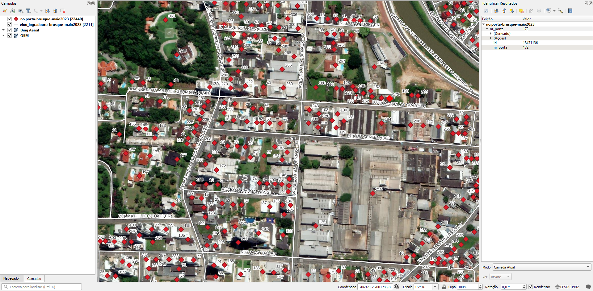

<aside>
<table align="right" style="padding: 1em">
<tr><td>Pacote <a target="_git" title="link canônico para o git deste pacote" href="https://git.digital-guard.org/preserv-BR/blob/main/data/SC/Brusque/_pk0075.02"><big><b>pk0075.02</b></big></a> de <small><a target="_afacodes" title="Jurisdição" href="https://afa.codes/BR-SC-Brusque">BR-SC-Brusque</a></small>
</td></tr>
<tr><td>
Doador: <a rel="external" target="_doador" href="https://portal.brusque.sc.gov.br/">Prefeitura Municipal de Brusque</a>
 &nbsp; <small>CNPJ 83.102.343/0001-94</small> • Wikidata <a rel="external" target="_doador" title="link descritor Wikidata do doador" href="https://www.wikidata.org/wiki/Q107398109">Q107398109</a></small> 
Licença <a rel="external" target="_doador" href="https://git.digital-guard.org/licenses/blob/master/reports/implied-br-generic-v1.md"><b>Implied BR-generic-1.0</b></a> (cc0) 
Obtido via <i>email</i> em <b>12/06/2023</b> por:
 &nbsp; Avaliação técnica: <a rel="external" target="_gitPerson" title="usuário Git" href="https://github.com/IgorEliezer">IgorEliezer</a>
 &nbsp; Representação institucional: <a rel="external" target="_gitPerson" title="usuário Git" href="https://github.com/ThierryAJean">ThierryAJean</a> 
</td></tr>
<tr><td>Camadas:   </td></tr>
<tr><td>Dados publicados em <a href="https://git.digital-guard.org/preservCutGeo-BR2021/tree/main/data/SC/Brusque/_pk0075.02">preservCutGeo-BR2021</a> <a href="#reprodutibilidade">Reprodutíveis</a></td></tr>
<tr><td>Visualização:   </td></tr>
</table>
</aside>

<section>

Este repositório de metadados descreve um pacote de arquivos doado para o domínio público. Ele está sendo preservado pela Digital Guard: para maiores detalhes consulte a [documentação sobre o processo de registro e preservação](https://wiki.addressforall.org/doc/Documentação_Digital-guard).

Nota. O presente documento README foi gerado por software a partir das informações contidas no arquivo [`make_conf.yaml`](https://git.digital-guard.org/preserv-BR/blob/main/data/SC/Brusque/_pk0075.02/make_conf.yaml) deste pacote, e informações adicionais dos catálogos de [doadores](https://git.digital-guard.org/preserv-BR/blob/main/data/donor.csv) e de [pacotes](https://git.digital-guard.org/preserv-BR/blob/main/data/donatedPack.csv).

# Camadas de dados

Os arquivos contêm "camadas de dados" temáticas. Os metadados também descrevem como cada camada foi avaliada e seus dados filtrados de forma padronizada.

##  geoaddress

Nome do arquivo: `no.porta-brusque-maio2023` *Download* e integridade: [c252e8028e7f3abc353c7aebdfd5929913959b7931b05a4b18187c3a954b1296.zip](http://dl.digital-guard.org/c252e8028e7f3abc353c7aebdfd5929913959b7931b05a4b18187c3a954b1296.zip) Descrição: email.zip Tamanho do arquivo: 1524507 bytes (1.45 <abbr title="mebibyte">MiB</abbr>) Formato: geojson SRID: 31982

#### Dados relevantes
* `properties->'nr_porta'` (hnum)

#### Resultados da filtragem e sua publicação
1207058 bytes (1.15 <abbr title="mebibyte">MiB</abbr>) 22449 pontos densidade média: 68.45 pontos/km² GeoJSONs publicados em [https://git.digital-guard.org/preservCutGeo-BR2021/tree/main/data/SC/Brusque/_pk0075.02/geoaddress](https://git.digital-guard.org/preservCutGeo-BR2021/tree/main/data/SC/Brusque/_pk0075.02/geoaddress)

##  via

Nome do arquivo: `eixo_logradouro-brusque-maio2023` *Download* e integridade: [c252e8028e7f3abc353c7aebdfd5929913959b7931b05a4b18187c3a954b1296.zip](http://dl.digital-guard.org/c252e8028e7f3abc353c7aebdfd5929913959b7931b05a4b18187c3a954b1296.zip) Descrição: email.zip Tamanho do arquivo: 1524507 bytes (1.45 <abbr title="mebibyte">MiB</abbr>) Formato: geojson SRID: 31982

#### Dados relevantes
* `properties->'COMPLETO'` (via)

#### Outros dados relevantes
* `categ_via`

#### Resultados da filtragem e sua publicação
1021137 bytes (0.97 <abbr title="mebibyte">MiB</abbr>) 2204 segmentos com 682.12 <abbr title="quilômetros">km</abbr> densidade média: 2.32 segmentos/km² GeoJSONs publicados em [https://git.digital-guard.org/preservCutGeo-BR2021/tree/main/data/SC/Brusque/_pk0075.02/via](https://git.digital-guard.org/preservCutGeo-BR2021/tree/main/data/SC/Brusque/_pk0075.02/via)

# Evidências de teste

# Tarefas
* {'Tratamento/PostGIS': 'atribuir o nome de logradouro nos pontos de número predial. Confirmar viabilidade/interesse da equipe técnica em assumir este custo.'}
</section>
<section>

# Reprodutibilidade

O processo de transformação dos *dados orginais* (arquivos doados) em *dados filtrados* pode ser reproduzido por qualquer pessoa fazendo uso das mesmas ferramentas de software utilizadas pelo projeto. A seguir a sequência de comandos *bash* que garantem a [reprodutibilidade](https://en.wikipedia.org/wiki/Reproducibility) do processo a cada *layer*. Qualquer pessoa, munida dos [ferramentas de software utilizadas pelo projeto](https://git.AddressForAll.org/suporte/blob/master/docs/pt/infra.md#ambientes-e-ferramentas-de-uso-geral), vai gerar os mesmos resultados.

Pode-se reproduzir de dois modos:
* artesanal: com os comandos em [reproducibility.sh](https://git.digital-guard.org/preserv-BR/blob/main/data/SC/Brusque/_pk0075.02/reproducibility.sh), depois de seguir a sequência de preparo da base de dados no esquema *ingest*.
* automático: usando o comando `make` conforme descrito na documentação do projeto.

</section>

