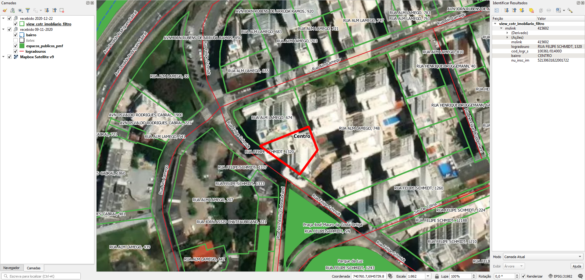

# Tarefas
## 1. Dividir a string do endereço em duas colunas
Os lotes possuem uma string única contendo o nome do logradouro e o número predial, separados por vígula, exemplo "RUA RIO BRANCO, 127".

Dividir a string em dois valores: "RUA RIO BRANCO, 127" --> "RUA RIO BRANCO" e "127"

## 2. Gerar ponto de endereço na testada do lote
Procedimento usando PostGIS com script desenvolvido pelo A4A.

Cada ponto terá os dados:
* Nome do logradouro
* Número predial

# Extração
Abaixo os passos para extração por tipo de dado relevante.

## Bairros
SRID: 31982
1. Abrir `OSM_dados_solicitacao.rar`.
2. Selecionar arquivos `bairro.*`.
3. Copiar arquivos selecionados para diretório alvo.

### Dados relevantes
Colunas da camada `bairro`:
* `nm_bairro` (string): nome do bairro em caixa alta.
* `label` (string): nome do bairro.

## Lotes
SRID: 29192
1. Abrir `view_cotr_imobliario_filtro.zip`.
2. Selecionar arquivos `view_cotr_imobliario_filtro.*`.
3. Copiar arquivos selecionados para diretório alvo.

### Dados relevantes
Colunas da camada `view_cotr_imobliario_filtro`:
* `logradouro` (string): endereço composto de tipo de logradouro abreviado, nome de logradouro em caixa alta e número predial.
* `bairro` (string): nome do bairro em caixa alta.

N.B.: alguns números prediais são representados por "SN" (sem número) e numeração com letras (ex.: "45 A").

## Eixos
SRID: 31983
1. Abrir `OSM_dados_solicitacao.rar`.
2. Selecionar arquivos `logradouros.*`.
3. Copiar arquivos selecionados para diretório alvo.

### Dados relevantes
Colunas da camada `logradouros`:
* `cd_logr` (string): nome do loteamento em caixa alta.
* `nome` (string): nome completo do logradouro.

## Lista de abreviaturas de tipos de logradouros
Charset: UTF-8 sem BOM
1. Abrir `OSM_dados_solicitacao.rar`.
2. Selecionar arquivos `atributo__tipo_logradouro.csv`.
3. Copiar arquivos selecionados para diretório alvo.

### Dados relevantes
Colunas [número da coluna]:
* `nm_tipo` [2]: abreviatura (R., Av., etc).
* `nm_descricao` [3]: texto por extenso em caixa alta.

## Lista de abreviaturas de nomes de logradouros
Charset: UTF-8 sem BOM
1. Abrir `OSM_dados_solicitacao.rar`.
2. Selecionar arquivos `atributo_logradouro.csv`.
3. Copiar arquivos selecionados para diretório alvo.

### Dados relevantes
Colunas [número da coluna]:
* `nm_atrb` [2]: abreviatura (Prof., Dr., etc).
* `nm_descricao` [3]: texto por extenso em caixa alta.

## Outros
Para outros projetos, há também dados sobre:
* `OSM_dados_solicitacao.rar`:
  * espacos_publicos_pmf: praças, parques e áreas públicas.
  * distritos_admnistrativos: subdivisão do município.
* `Categorias_REP - 2020.pdf.zip`:
  * Categorias_REP - 2020.pdf: metadados do `espacos_publicos_pmf`.

(!!! Havendo outros projetos, esta seção será detalhada !!!)

# Evidências de teste
Teste no QGIS:

