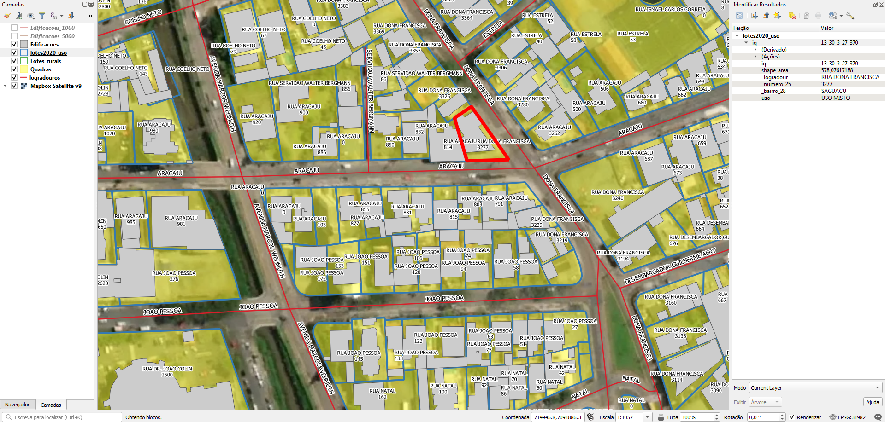

# Tarefas
## 1. (CONFIRMAR NECESSIDADE) Adicionar endereços nos lotes rurais 
Os lotes da área rural (ver Lotes rurais) estão sem endereços e possuem só um identificador de setor, quadra e lote.

Ver se o Censo Rural ou CNEFE do IBGE supre.

## 2. Gerar ponto de endereço na testada do lote
Procedimento usando PostGIS com script desenvolvido pelo A4A.

Cada ponto terá os dados:
* Nome do logradouro
* Número predial

## 3. (CONFIRMAR NECESSIDADE) Completar nome de logradouro nos eixos 
Os eixos de do logradouro possuem só o nome, mas estão sem o tipo de via (R, AV, ROD etc). Por exemplo, "RUA PERNAMBUCO" está "PERNAMBUCO".

O nome de logradouro nos lotes está completo.

# Extração
Abaixo os passos para extração por tipo de dado relevante.

## Lotes
SRID: 31982
1. Abrir `shp_malhafund.zip`.
2. Abrir diretório `Malha Fundiária`.
3. Selecionar todos os arquivos `lotes2020_uso.*`.
4. Copiar arquivos selecionados para diretório alvo.

### Dados relevantes
Colunas da camada `lotes2020_uso`:
* `_logradour` (string): tipo e nome de logradouro em caixa alta.
* `_numero_25` (string): número de lote.
* `_bairro_28` (string): nome do bairro em caixa alta.
* `uso` (string): tipo de uso (para outros projetos).

Alguns lotes possuem "0" como número predial.

## Lotes rurais
SRID: 31982
1. Abrir `shp_malhafund.zip`.
2. Abrir diretório `Malha Fundiária`.
3. Selecionar todos os arquivos `Lotes_rurais.*`.
4. Copiar arquivos selecionados para diretório alvo.

### Dados relevantes
Colunas da camada `Lotes_rurais`:
* `iq_lote` (string): identificador de setor, quadra e lote.

N.B.: Não há endereços nos lotes rurais.

## Eixos
SRID: 31982
1. Abrir `shp_malhaviaria.zip`.
2. Abrir diretório `Malha Viária`.
3. Selecionar todos os arquivos `logradouros.*`.
4. Copiar arquivos selecionados para diretório alvo.

### Dados relevantes
Colunas da camada `logradouros`:
* `nomelog` (string): nome de logradouro sem tipo (R, AV, ROD etc) em caixa alta e sem acentuação.

## Edificações
SRID: 31982
1. Abrir `shp_malhafund.zip`.
2. Abrir diretório `Malha Fundiária`.
3. Selecionar todos os arquivos `Edificacoes.*`.
4. Copiar arquivos selecionados para diretório alvo.

Possui cobertura limitada à área urbana.

No mesmo diretório, há também `Edificacoes_1000` e `Edificacoes_5000`, com as seguintes características:
* São feições vetoriais do tipo linear, não são polígonos.
* Cobrem mais a zona rural e com cobertura dispersa na área urbana. Há sobreposição das feições de `Edificacoes` com `Edificacoes_1000` e `Edificacoes_5000` na área urbana.

## Quadras
SRID: 31982
1. Abrir `shp_malhafund.zip`.
2. Abrir diretório `Malha Fundiária`.
3. Selecionar todos os arquivos `Quadras.*`.
4. Copiar arquivos selecionados para diretório alvo.

### Dados relevantes
Colunas da camada `Quadras`:
* `iq` (string): identificador de setor e quadra.

## Outros
Para outros projetos, há também dados sobre:
* Malha viária:
  * Ferrovia
  * Meios-fios/leitos carroçáveis (arquivos `vias_rodovias_*`)
* Equipamentos públicos:
  * Academias populares
  * Equipamentos de lazer/praças
  * Escolas
  * UBS
* Patrimônio:
  * Edificações tombados
  * Arqueologia

Nota: em cada diretório dentro dos arquivos zip, há um arquivo txt fornecido pela Prefeitura, contendo uma descrição detalhada de cada dataset.

(!!! Havendo outros projetos, esta seção será detalhada !!!)

# Evidências de teste
Teste no QGIS:

