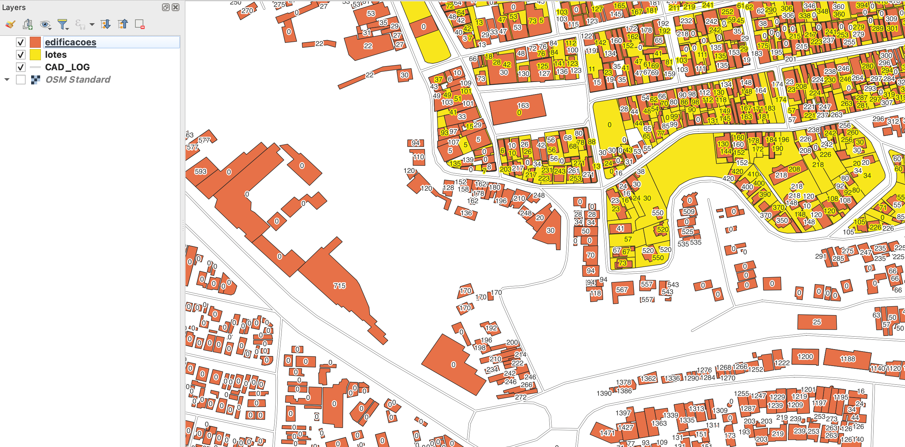

<aside>
<table align="right">
<tr><th>BR-SP-Atibaia</th></tr>
<tr><td>
Pacote: <a target="_git" href="http://git.digital-guard.org/preserv-BR/blob/main/data/SP/Atibaia/_pk0021.01"><small>_pk0021.01</small></a>
</td></tr>
<tr><td>
Doador: <a rel="external" target="_doador" href="http://www.prefeituradeatibaia.com.br/">Prefeitura da Estância de Atibaia</a> 
<small>cnpj:45.279.635/0001-08</small> • <a rel="external" target="_doador" href="https://www.wikidata.org/wiki/Q97936697">Q97936697</a></small> 
Obtido via <i>email</i> em <b>2020-09-10</b> 
Avaliação técnica: igor 
Representação institucional: Thierry 

Licença: <b>CC0</b>
</td></tr>
</table>
</aside>

<section>

# Camadas de dados
##  building

Nome do arquivo: `pg_cartografia_logradouros`. Download: <a title="SHA256" href="http://dl.digital-guard.org/6d741572b6c31ffd82cf004b92fa98056545df805bcb64afba5e7b26e32b62ab.zip">6d741572b6c31ffd82cf004b92fa98056545df805bcb64afba5e7b26e32b62ab.zip</a> Descrição: Edificações Tamanho do arquivo: 11032539 bytes Formato: shp SRID: 3857

### Dados relevantes
* `numero` (house_number)

##  parcel

Nome do arquivo: `lotes`. Download: <a title="SHA256" href="http://dl.digital-guard.org/b6221fa57754ec8c4db284591a6ceeea7acf986eb215b2e521647e32fb175488.zip">b6221fa57754ec8c4db284591a6ceeea7acf986eb215b2e521647e32fb175488.zip</a> Descrição: Lotes Tamanho do arquivo: 889309 bytes Formato: shp SRID: 29193

### Dados relevantes
* `num` (house_number)

##  via

Nome do arquivo: `CAD_LOG`. Download: <a title="SHA256" href="http://dl.digital-guard.org/0a7fedd6e8e30541f706fa7f77166a183a3cc43d2b1d3d3d0a8d3fb7f077e804.zip">0a7fedd6e8e30541f706fa7f77166a183a3cc43d2b1d3d3d0a8d3fb7f077e804.zip</a> Descrição: Logradouros Comentário: exemplo de comentário em files. Tamanho do arquivo: 1241211 bytes Formato: shp SRID: 29193

### Dados relevantes
* `log_nome_c` (name): exemplo de comentário em standardized_fields.
### Outros dados relevantes
* `exemplo de other_fields.`: exemplo de comentário em other_fields.
* `exemplo de +1 other_fields.`: exemplo +1 de comentário em other_fields.

### Evidência de teste

### Comentários
exemplo de comentário em layer.

# Evidências de teste

# Comentários gerais
Parcel e building incompletos. Sem nome de logradouro, alguns número de porta nulos (&quot;0&quot;) e cobertura parcial de lotes (veja evidências).

# Tarefas
* Tarefa 1. Exemplo de lista de tarefas;
* Tarefa 2. Exemplo de lista de tarefas;
</section>

# Anexo

Exemplo de arquivo _attachment.md_ anexado ao final do readme gerado.
