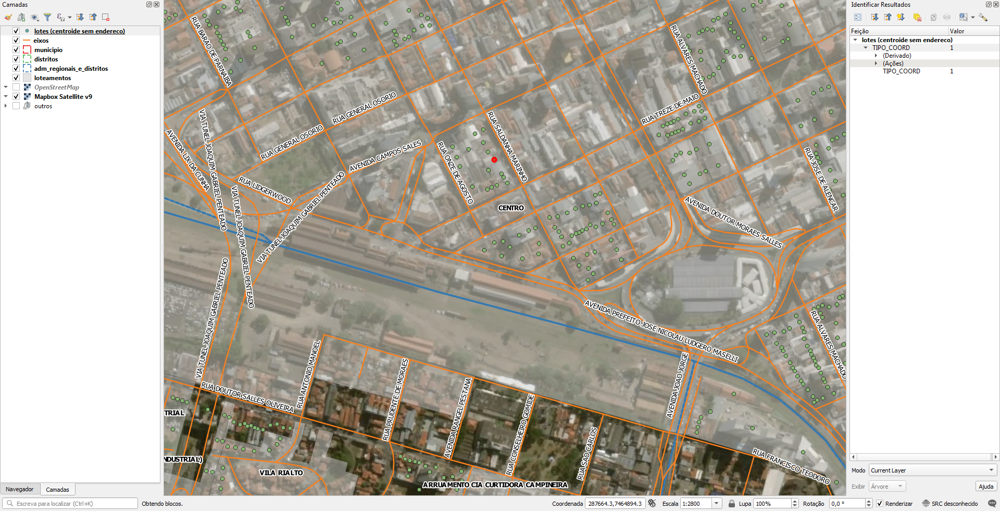

# Extração
Abaixo os passos para extração por tipo de dado relevante.

## Eixos
SRID: 31983
1. Abrir `eixos.zip`.
2. Selecionar todos arquivos shapefile.
3. Copiar arquivos selecionados para diretório alvo.

### Dados relevantes
Colunas:
* `LOGRADOURO` (string): nome do logradouro em caixa alta.

## Pontos de lotes
SRID: 31983
1. Abrir `lotes.zip`.
2. Selecionar todos arquivos shapefile.
3. Copiar arquivos selecionados para diretório alvo.

Consiste somente de pontos no centro do lote, com cobertura parcial no Centro e em alguns bairros. Não há dados.

## Outros
Para outros projetos, há também dados sobre:
* ferrovia
* adm_regionais
* distritos
* loteamentos
* mancha_urb
* municipio

(!!! Havendo outros projetos, esta seção será detalhada !!!)

# Evidências de teste
Teste no QGIS:

