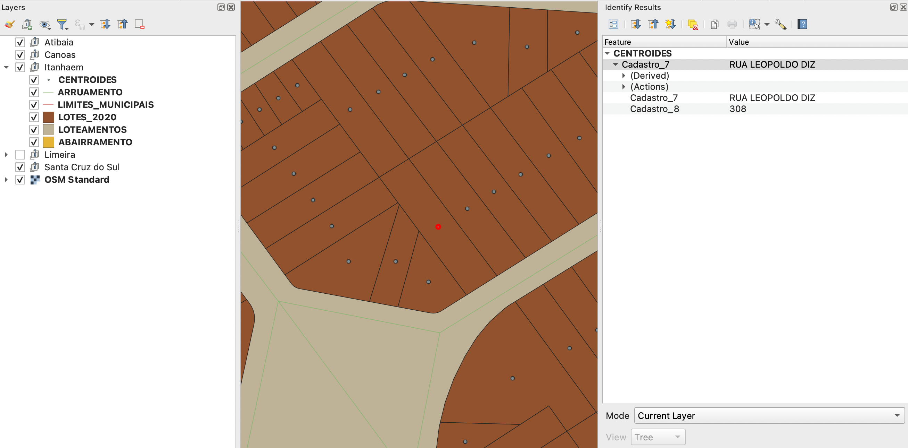

<aside>
<table align="right" style="padding: 1em">
<tr><td>Pacote <a target="_git" title="link canônico para o git deste pacote" href="https://git.digital-guard.org/preserv-BR/blob/main/data/SP/Itanhaem/_pk0058.01"><big><b>pk0058.01</b></big></a> de <small><a target="_osmcodes" title="Jurisdição" href="https://osm.codes/BR-SP-Itanhaem">BR-SP-Itanhaem</a></small>
</td></tr>
<tr><td>
Doador: <a rel="external" target="_doador" href="http://www2.itanhaem.sp.gov.br/">Prefeitura de Itanhaém</a>
 &nbsp; <small>CNPJ 46.578.498/0001-75</small> • Wikidata <a rel="external" target="_doador" title="link descritor Wikidata do doador" href="https://www.wikidata.org/wiki/Q104847769">Q104847769</a></small> 
Licença <a rel="external" target="_doador" href="https://git.digital-guard.org/licenses/blob/master/reports/implied-br-generic-v1.md"><b>Implied BR-generic-1.0</b></a> (cc0) 
Obtido via <i>email</i> em <b>07/12/2020</b> por:
 &nbsp; Avaliação técnica: <a rel="external" target="_gitPerson" title="usuário Git" href="https://github.com/IgorEliezer">IgorEliezer</a>
 &nbsp; Representação institucional: <a rel="external" target="_gitPerson" title="usuário Git" href="https://github.com/ThierryAJean">ThierryAJean</a> 
</td></tr>
<tr><td>Camadas:     </td></tr>
<tr><td>Dados publicados em <a href="https://git.digital-guard.org/preservCutGeo-BR2021/tree/main/data/SP/Itanhaem/_pk0058.01">preservCutGeo-BR2021</a> <a href="#reprodutibilidade">Reprodutíveis</a></td></tr>
<tr><td>Visualização:     </td></tr>
</table>
</aside>

<section>

Este repositório de metadados descreve um pacote de arquivos doado para o domínio público. Ele está sendo preservado pela Digital Guard: para maiores detalhes consulte a [documentação sobre o processo de registro e preservação](https://wiki.addressforall.org/doc/Documentação_Digital-guard).

Nota. O presente documento README foi gerado por software a partir das informações contidas no arquivo [`make_conf.yaml`](https://git.digital-guard.org/preserv-BR/blob/main/data/SP/Itanhaem/_pk0058.01/make_conf.yaml) deste pacote, e informações adicionais dos catálogos de [doadores](https://git.digital-guard.org/preserv-BR/blob/main/data/donor.csv) e de [pacotes](https://git.digital-guard.org/preserv-BR/blob/main/data/donatedPack.csv).

# Camadas de dados

Os arquivos contêm "camadas de dados" temáticas. Os metadados também descrevem como cada camada foi avaliada e seus dados filtrados de forma padronizada.

##  geoaddress

Nome do arquivo: `CENTROIDES` *Download* e integridade: [78f10da32c1dfab83bdbb448884731fffba15a36c88337b122bc6e896a841302.zip](http://dl.digital-guard.org/78f10da32c1dfab83bdbb448884731fffba15a36c88337b122bc6e896a841302.zip) Descrição: Geo-endereços Tamanho do arquivo: 3431030 bytes (3.27 <abbr title="mebibyte">MiB</abbr>) Formato: shp SRID: 31983

#### Dados relevantes
* `Cadastro_7` (via)

* `Cadastro_8` (hnum)

#### Visualização
[https://viz.addressforall.org/BR-SP-Itanhaem/_pk0058.01/geoaddress](https://viz.addressforall.org/BR-SP-Itanhaem/_pk0058.01/geoaddress)
##  nsvia

Nome do arquivo: `ABAIRRAMENTO` *Download* e integridade: [023071f87e4bb37e46d42cee7841f3a2119b8f65d2778604af3644f279cf89f1.zip](http://dl.digital-guard.org/023071f87e4bb37e46d42cee7841f3a2119b8f65d2778604af3644f279cf89f1.zip) Descrição: Bairros Tamanho do arquivo: 221789 bytes (0.21 <abbr title="mebibyte">MiB</abbr>) Formato: shp SRID: 31983

#### Dados relevantes
* `NOME` (nsvia)

#### Resultados da filtragem e sua publicação
379708 bytes (0.36 <abbr title="mebibyte">MiB</abbr>) 45 polígonos com 172.87 <abbr title="quilômetros quadrados">km²</abbr> densidade média: 0.28 polígonos/km² GeoJSONs publicados em [https://git.digital-guard.org/preservCutGeo-BR2021/tree/main/data/SP/Itanhaem/_pk0058.01/nsvia](https://git.digital-guard.org/preservCutGeo-BR2021/tree/main/data/SP/Itanhaem/_pk0058.01/nsvia)

#### Visualização
[https://viz.addressforall.org/BR-SP-Itanhaem/_pk0058.01/nsvia](https://viz.addressforall.org/BR-SP-Itanhaem/_pk0058.01/nsvia)
##  parcel

Nome do arquivo: `LOTES_2020` *Download* e integridade: [7e8269d4c80f9a03cc999a44f028c00dd296868ee26b61f012dc53211e760417.zip](http://dl.digital-guard.org/7e8269d4c80f9a03cc999a44f028c00dd296868ee26b61f012dc53211e760417.zip) Descrição: Lotes Tamanho do arquivo: 18397666 bytes (17.55 <abbr title="mebibyte">MiB</abbr>) Formato: shp SRID: 29193

#### Dados relevantes
* `Cadastro_7` (via)

* `Cadastro_8` (hnum)

#### Visualização
[https://viz.addressforall.org/BR-SP-Itanhaem/_pk0058.01/parcel](https://viz.addressforall.org/BR-SP-Itanhaem/_pk0058.01/parcel)
##  via

Nome do arquivo: `ARRUAMENTO` *Download* e integridade: [3137911874246d45f025f2b98066f1e7a31543332e175e83f433005d131c40fe.zip](http://dl.digital-guard.org/3137911874246d45f025f2b98066f1e7a31543332e175e83f433005d131c40fe.zip) Descrição: Vias Tamanho do arquivo: 376218 bytes (0.36 <abbr title="mebibyte">MiB</abbr>) Formato: shp SRID: 31983

#### Dados relevantes
* `tr_tipo || ' ' || tr_descric` (via)

#### Resultados da filtragem e sua publicação
573413 bytes (0.55 <abbr title="mebibyte">MiB</abbr>) 4646 segmentos com 1833.25 <abbr title="quilômetros">km</abbr> densidade média: 2.98 segmentos/km² GeoJSONs publicados em [https://git.digital-guard.org/preservCutGeo-BR2021/tree/main/data/SP/Itanhaem/_pk0058.01/via](https://git.digital-guard.org/preservCutGeo-BR2021/tree/main/data/SP/Itanhaem/_pk0058.01/via)

#### Visualização
[https://viz.addressforall.org/BR-SP-Itanhaem/_pk0058.01/via](https://viz.addressforall.org/BR-SP-Itanhaem/_pk0058.01/via)

# Evidências de teste

</section>
<section>

# Reprodutibilidade

O processo de transformação dos *dados orginais* (arquivos doados) em *dados filtrados* pode ser reproduzido por qualquer pessoa fazendo uso das mesmas ferramentas de software utilizadas pelo projeto. A seguir a sequência de comandos *bash* que garantem a [reprodutibilidade](https://en.wikipedia.org/wiki/Reproducibility) do processo a cada *layer*. Qualquer pessoa, munida dos [ferramentas de software utilizadas pelo projeto](https://git.AddressForAll.org/suporte/blob/master/docs/pt/infra.md#ambientes-e-ferramentas-de-uso-geral), vai gerar os mesmos resultados.

Pode-se reproduzir de dois modos:
* artesanal: com os comandos em [reproducibility.sh](https://git.digital-guard.org/preserv-BR/blob/main/data/SP/Itanhaem/_pk0058.01/reproducibility.sh), depois de seguir a sequência de preparo da base de dados no esquema *ingest*.
* automático: usando o comando `make` conforme descrito na documentação do projeto.

</section>

