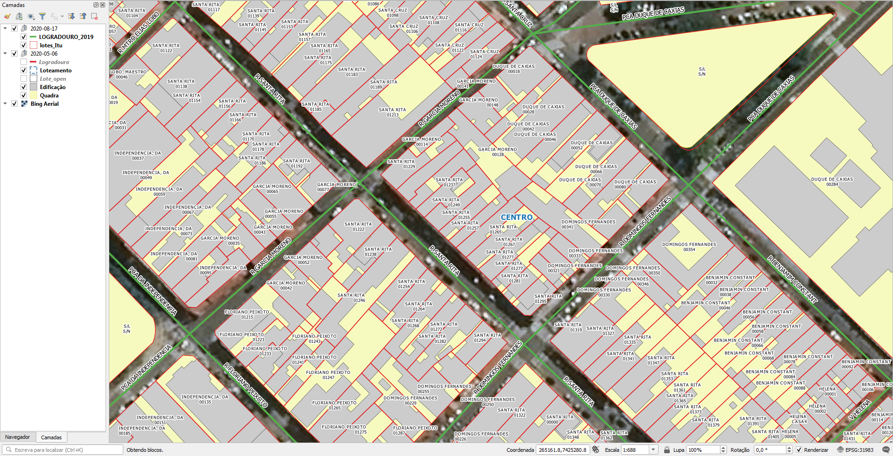

# Sobre
Foram recebidos 3 arquivos rar, dos quais foram renomeados para facilitar:
* LOGRADOURO_2019 (2).rar -> LOGRADOURO_2019.rar
* lotes_Itu (2).rar -> lotes_Itu.rar.

# Tarefas
## 1. Completar nome de logradouro nos lotes
Os lotes possuem numeração predial e o nome do logradouro sem o tipo de via (R, AV, ROD etc). Por exemplo, "Pernambuco" ao invés de "Rua Pernambuco".

Adicionar o tipo de via do shapefile de eixos nos lotes. Os nomes dos logradouros são escritos para ordenação alfabética (ver Lotes).

## 2. Gerar ponto de endereço na testada do lote
Procedimento usando PostGIS com script desenvolvido pelo A4A.

Cada ponto terá os dados:
* Nome do logradouro
* Número predial

# Extração
Abaixo os passos para extração por tipo de dado relevante.

## Lotes
SRID: 32723
1. Abrir `lotes_Itu.rar`.
2. Selecionar todos os arquivos.
3. Copiar arquivos selecionados para diretório alvo.

### Instrução para carregamento de arquivo MAP/TAB
Uma vez que os arquivos estão no diretório alvo, no QGIS:
1. Pelo Navegador ou Gerencidador de Dados, vá até o diretório alvo.
2. Localize o arquivo `lotes_Itu.TAB` e carregue.

### Dados relevantes
Colunas da camada `lotes_Itu`:
* `Bairro` (string): nome do bairro em caixa alta.
* `Logradouro` (string): nome do logradouro, sem tipo (R., AV. etc), em caixa alta, na sintaxe para ordem alfabética (ver abaixo).
* `Número` (string): número de lote.

Os nomes de ruas, quando possuir preposição ou título, são escritos de forma a privilegiar a ordem alfabética. Exemplos:
- Prof Alvez João -> Alvez João, Prof
- dos Buritis -> Buritis, dos
- Dr Carlos Pedro -> Carlos Pedro, Dr

N.B.: Cerca de **20% dos lotes estão sem endereços** e isso já foi comunicado à prefeitura.

## Eixos
SRID: 32723
1. Abrir `LOGRADOURO_2019.rar`.
2. Selecionar todos os arquivos.
3. Copiar arquivos selecionados para diretório alvo.

## Instrução para carregamento de arquivo MAP/TAB
Uma vez que os arquivos estão no diretório alvo, no QGIS:
1. Pelo Navegador ou Gerencidador de Dados, vá até o diretório alvo.
2. Localize o arquivo `LOGRADOURO_2019.tab` e carregue.

### Dados relevantes
Colunas da camada `LOGRADOURO_2019`:
* `Logradouro` (string): tipo e nome de logradouro em caixa alta. Tipos de vias e títulos vêm abreviados (R, AV, ROD e DR, PROF).
* `Totarvores` (int): número de árvores no trecho (para outros projetos).

## Loteamentos
SRID: 32723
1. Abrir `Shapefiles_-_Municipio_de Itu.rar`.
2. Abrir diretório `Loteamento`.
3. Selecionar todos os arquivos.
4. Copiar arquivos selecionados para diretório alvo.

### Dados relevantes
Colunas da camada `Loteamento`:
* `Nome_compl` (string): tipo de bairro abreviado e nome de bairro em caixa alta.

## Edificações
SRID: 31983
1. Abrir `Shapefiles_-_Municipio_de Itu.rar`.
2. Abrir diretório `Edificação`.
3. Selecionar todos os arquivos.
4. Copiar arquivos selecionados para diretório alvo.

### Dados relevantes
Colunas da camada `Edificação`:
* `pavimento` (real): número de pavimentos (para outros projetos).

## Quadras
SRID: 31983
1. Abrir `Shapefiles_-_Municipio_de Itu.rar`.
2. Abrir diretório `Quadra`.
3. Selecionar todos os arquivos.
4. Copiar arquivos selecionados para diretório alvo.

# Evidências de teste
Teste no QGIS:

