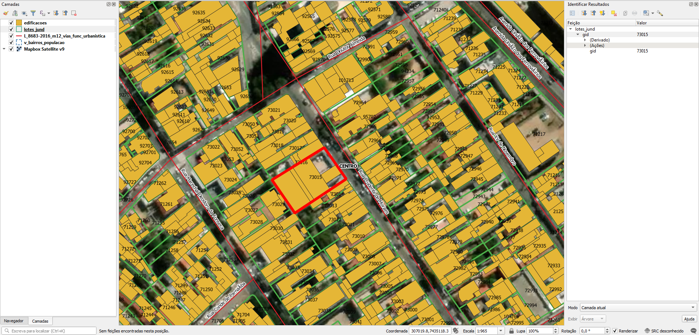

<aside>
<table align="right" style="padding: 1em">
<tr><td>Pacote <a target="_git" title="link canônico para o git deste pacote" href="http://git.digital-guard.org/preserv-BR/blob/main/data/SP/Jundiai/_pk0025.01"><big><b>pk0025.01</b></big></a> de <small><a target="_osmcodes" title="Jurisdição" href="https://osm.codes/BR-SP-Jundiai">BR-SP-Jundiai</a></small>
</td></tr>
<tr><td>
Doador: <a rel="external" target="_doador" href="https://jundiai.sp.gov.br/">Prefeitura Municipal de Jundiaí</a>
 &nbsp; <small>CNPJ 45.780.103/0001-50</small> • Wikidata <a rel="external" target="_doador" title="link descritor Wikidata do doador" href="https://www.wikidata.org/wiki/Q56450042">Q56450042</a></small> 
 
Obtido via <i>site,e-mail</i> em <b>2021-10-13</b> por:
 &nbsp; Avaliação técnica: <a rel="external" target="_gitPerson" title="usuário Git" href="https://github.com/IgorEliezer">IgorEliezer</a>
 &nbsp; Representação institucional: <a rel="external" target="_gitPerson" title="usuário Git" href="https://github.com/ThierryAJean">ThierryAJean</a> 
</td></tr>
<tr><td>Camadas:      </td></tr>
<tr><td>Dados publicados em <a href="http://git.digital-guard.org/preservCutGeo-BR2021/tree/main/data/SP/Jundiai/_pk0025.01">preservCutGeo-BR2021</a> <a href="#reprodutibilidade">Reprodutíveis</a></td></tr>
<tr><td>Visualização: </td></tr>
</table>
</aside>

<section>

Este repositório de metadados descreve um pacote de arquivos doado para o domínio público. Ele está sendo preservado pela Digital Guard: para maiores detalhes consulte a [documentação sobre o processo de registro e preservação](https://wiki.addressforall.org/doc/Documentação_Digital-guard).

Nota. O presente documento README foi gerado por software a partir das informações contidas no arquivo [`make_conf.yaml`](make_conf.yaml) deste pacote, e informações adicionais dos catálogos de [doadores](https://git.digital-guard.org/preserv-BR/blob/main/data/donor.csv) e de [pacotes](https://git.digital-guard.org/preserv-BR/blob/main/data/donatedPack.csv).

# Camadas de dados

Os arquivos contêm "camadas de dados" temáticas. Os metadados também descrevem como cada camada foi avaliada e seus dados filtrados de forma padronizada.

##  building

Nome do arquivo: `edificacoes`. *Download* e integridade: [512fe4c44525a211c68415da0ab06d565a6ba3653739809d46404d6653ce5064.zip](http://dl.digital-guard.org/512fe4c44525a211c68415da0ab06d565a6ba3653739809d46404d6653ce5064.zip) Descrição: Edificações Tamanho do arquivo: 24138706 bytes (23.02 <abbr title="mebibyte">MiB</abbr>) Formato: shp SRID: 31983

#### Dados publicados
[http://git.digital-guard.org/preservCutGeo-BR2021/tree/main/data/SP/Jundiai/_pk0025.01/building](http://git.digital-guard.org/preservCutGeo-BR2021/tree/main/data/SP/Jundiai/_pk0025.01/building) 71451722 bytes (68.14 <abbr title="mebibyte">MiB</abbr>) 306546 polígonos com 21.98 <abbr title="quilômetros quadrados">km²</abbr> densidade média: 0.23 polígonos/km²

#### Visualização
[https://viz.addressforall.org/BR-SP-Jundiai/_pk0025.01/building](https://viz.addressforall.org/BR-SP-Jundiai/_pk0025.01/building)
##  geoaddress

Nome do arquivo: `numerosprediais`. *Download* e integridade: [c26c149b65a42e9de131145b8db24aed006f37c5f44c625c835df2fc359f4763.zip](http://dl.digital-guard.org/c26c149b65a42e9de131145b8db24aed006f37c5f44c625c835df2fc359f4763.zip) Descrição: Números prediais Tamanho do arquivo: 4056242 bytes (3.87 <abbr title="mebibyte">MiB</abbr>) Formato: shp SRID: 31983

#### Dados relevantes
* `numero_int` (hnum)

* `logradouro` (via)

* `bairro` (nsvia)

* `loteamento` (nsvia2)

* `complement` (complement)

* `cep` (postcode)

#### Dados publicados
[http://git.digital-guard.org/preservCutGeo-BR2021/tree/main/data/SP/Jundiai/_pk0025.01/geoaddress](http://git.digital-guard.org/preservCutGeo-BR2021/tree/main/data/SP/Jundiai/_pk0025.01/geoaddress) 5647122 bytes (5.39 <abbr title="mebibyte">MiB</abbr>) 105006 pontos densidade média de 1117.53 pontos/km²

#### Visualização
[https://viz.addressforall.org/BR-SP-Jundiai/_pk0025.01/geoaddress](https://viz.addressforall.org/BR-SP-Jundiai/_pk0025.01/geoaddress)
##  nsvia

Nome do arquivo: `v_bairros_populacao`. *Download* e integridade: [7995d41f628e31599f80b367650d363f47e75e1515be9fefabefca91189608a5.zip](http://dl.digital-guard.org/7995d41f628e31599f80b367650d363f47e75e1515be9fefabefca91189608a5.zip) Descrição: Bairros Tamanho do arquivo: 145376 bytes (0.14 <abbr title="mebibyte">MiB</abbr>) Formato: shp SRID: 31983

#### Dados relevantes
* `nmbairro` (nsvia)

#### Dados publicados
[http://git.digital-guard.org/preservCutGeo-BR2021/tree/main/data/SP/Jundiai/_pk0025.01/nsvia](http://git.digital-guard.org/preservCutGeo-BR2021/tree/main/data/SP/Jundiai/_pk0025.01/nsvia) 252970 bytes (0.24 <abbr title="mebibyte">MiB</abbr>) 67 polígonos com 393.65 <abbr title="quilômetros quadrados">km²</abbr> densidade média: 0.88 polígonos/km²

#### Visualização
[https://viz.addressforall.org/BR-SP-Jundiai/_pk0025.01/nsvia](https://viz.addressforall.org/BR-SP-Jundiai/_pk0025.01/nsvia)
##  parcel

Nome do arquivo: `lotes_jund`. *Download* e integridade: [4c4a1565e1f7d5675ff2d546d0e6a85acd7bbaa018503601dd07e1be80dee130.zip](http://dl.digital-guard.org/4c4a1565e1f7d5675ff2d546d0e6a85acd7bbaa018503601dd07e1be80dee130.zip) Descrição: Lotes Tamanho do arquivo: 14025525 bytes (13.38 <abbr title="mebibyte">MiB</abbr>) Formato: shp SRID: 31983

#### Dados publicados
[http://git.digital-guard.org/preservCutGeo-BR2021/tree/main/data/SP/Jundiai/_pk0025.01/parcel](http://git.digital-guard.org/preservCutGeo-BR2021/tree/main/data/SP/Jundiai/_pk0025.01/parcel) 39977954 bytes (38.13 <abbr title="mebibyte">MiB</abbr>) 104050 polígonos com 185.88 <abbr title="quilômetros quadrados">km²</abbr> densidade média: 0.66 polígonos/km²

#### Visualização
[https://viz.addressforall.org/BR-SP-Jundiai/_pk0025.01/parcel](https://viz.addressforall.org/BR-SP-Jundiai/_pk0025.01/parcel)
##  via

Nome do arquivo: `v_logr_ortofoto-utf8`. *Download* e integridade: [062c98c3fc074c76a5ff8d1bb3ad97b120d4a60d2e75c835fd6ff096f466da58.zip](http://dl.digital-guard.org/062c98c3fc074c76a5ff8d1bb3ad97b120d4a60d2e75c835fd6ff096f466da58.zip) Descrição: Eixos Tamanho do arquivo: 9640530 bytes (9.19 <abbr title="mebibyte">MiB</abbr>) Formato: shp SRID: 31983

#### Dados relevantes
* `logrtotal` (via)

#### Dados publicados
[http://git.digital-guard.org/preservCutGeo-BR2021/tree/main/data/SP/Jundiai/_pk0025.01/via](http://git.digital-guard.org/preservCutGeo-BR2021/tree/main/data/SP/Jundiai/_pk0025.01/via) 2800426 bytes (2.67 <abbr title="mebibyte">MiB</abbr>) 14000 segmentos com 2329.09 <abbr title="quilômetros">km</abbr> densidade média: 5.23 segmentos/km²

#### Visualização
[https://viz.addressforall.org/BR-SP-Jundiai/_pk0025.01/via](https://viz.addressforall.org/BR-SP-Jundiai/_pk0025.01/via)

# Evidências de teste

</section>
<section>

# Reprodutibilidade

Ver detalhes em [reproducibility.sh](reproducibility.sh).

</section>

