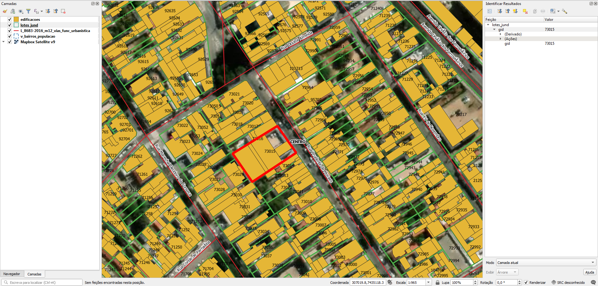

# Geral
## Sobre eixos de logradouros
Foram baixados do site da prefeitura/CIJUN três datasets, uma vez que os dados não estão num dataset só:
1. `Logradouro.zip` (ver Eixos): eixos de vias da prefeitura, contendo código de logradouro e número de início e fim de cada lado. Está **sem nomes**. Os eixos estão alinhados.
2. `v_logr_ortofoto.zip` (ver Eixos Ortofoto): eixos de vias da prefeitura, contendo código de logradouro e **nomes de logradouros** em caixa alta.
3. `L_8683-2016_m12_vias_func_urbanistica.zip` (ver Eixos OSM): eixos de vias extraídos do OpenStreetMap, **com nomes**. Os eixos estão em boa parte desalinhados.

A numeração de início e fim pode ajudar na distribuição de endereços em cada face de quadra.

O código de logradouro pode ajudar na atribuição do nome do logradouro de `v_logr_ortofoto.zip` em `Logradouro.zip``.

`L_8683-2016_m12_vias_func_urbanistica.zip` tem os nomes do logradouro em escrita normal e form obtidos do OSM.

# Tarefas
## 1. Remover espaço múltipos em nomes de logradouros
O shapefile `v_logr_ortofoto.zip` (ver Eixos Ortofoto) possui eixos com nomes de logradouros com dois ou mais espaços entre o tipo e o nome  (e.g. "R   TAUBATÉ").

## 2. Atribuir endereços nos lotes
Os lotes não possuem endereço, mas um identificador único `gid`.

Os endereços poderão ser atribuídos via uma planilha relacionando o `gid` aos endereços. O pedido solicitando a planilha já foi enviado.

Para facilitar, os eixos de vias do shapefile `Logradouro.zip` possuem numeração de início e fim de cada lado, em cada quadra. Também há o `v_logr_ortofoto.zip` com nome de logradouros.

Ver [Extração](#Extração) para detalhes.

## 3. Gerar ponto de endereço na testada do lote
Procedimento usando PostGIS com script desenvolvido pelo A4A.

Cada ponto terá os dados:
* Nome do logradouro
* Número predial

# Extração
Abaixo os passos para extração por tipo de dado relevante.

## Lotes
SRID: 31983
1. Abrir `lotes_jund.zip`.
2. Selecionar todos os arquivos `lotes_jund.*`.
3. Copiar arquivos selecionados para diretório alvo.

### Dados relevantes
Colunas da camada `lotes_jund`:
* `gid` (int): identificador único.

## Eixos
SRID: 31983
Codificação: ISO-8859-1
1. Abrir `logradouro.zip`.
2. Selecionar todos os arquivos `logradouro.*`.
3. Copiar arquivos selecionados para diretório alvo.

### Dados relevantes
Colunas da camada `logradouros`:
* `fromleft` (real): número predial inicial à esquerda.
* `toleft` (real): número predial final à esquerda.
* `fromright` (real): número predial inicial à direita.
* `toright` (real): número predial final à direita.
* `codlogr` (real): código de logradouro.

## Eixos Ortofoto
SRID: 31983
Codificação: ISO-8859-1
1. Abrir `v_logr_ortofoto.zip`.
2. Selecionar todos os arquivos `v_logr_ortofoto.*`.
3. Copiar arquivos selecionados para diretório alvo.

### Dados relevantes
Colunas da camada `v_logr_ortofoto`:
* `Codigo_do_`[SIC] (real): código do logradouro. Equivalente de `codlogr` de [Eixos](#Eixos).
* `logrtotal` (string): tipo e nome do logradouro em caixa alta. O tipo vem abreviado (R, AV, etc). Há casos em que há vários espaços entre o tipo e o nome.

## Eixos OSM
SRID: 31983
Codificação: ISO-8859-1 e UTF-8
1. Abrir `L_8683-2016_m12_vias_func_urbanistica.zip`.
2. Selecionar todos os arquivos `L_8683-2016_m12_vias_func_urbanistica.*`.
3. Copiar arquivos selecionados para diretório alvo.

Apesar de os eixos serem do OpenStreetMap, este material foi baixado do mesmo site de geoprocessamento de Jundiaí. Foi usado no Plano Diretor, Lei Municipal nº 8683/2016.

### Dados relevantes
Colunas da camada `L_8683-2016_m12_vias_func_urbanistica`:
* `name` (string, UTF-8): tipo e nome do logradouro por extenso.

O resto são etiquetas do OpenStreetMap.

NB sobre a codificação: o shapefile foi gerado com ISO-8859-1, mas a coluna `name` possui caracteres que são válidos só no UTF-8.

## Edificações
SRID: 31983
1. Abrir `edificacoes.zip`.
2. Selecionar todos os arquivos `edificacoes.*`.
3. Copiar arquivos selecionados para diretório alvo.

## Bairros
SRID: 31983
1. Abrir `v_bairros_populacao.zip`.
2. Selecionar todos os arquivos `v_bairros_populacao.*`.
3. Copiar arquivos selecionados para diretório alvo.

### Dados relevantes
Colunas da camada `v_bairros_populacao`:
* `nmbairro` (string): nome do bairro em caixa alta.
* `populacao` (int): população (para outros projetos).

## Outros
Para outros projetos, há também dados/datasets sobre:
* Limite de município
* Divisão de regiões de planejamento

Nota: o arquivo `wfsrequest.txt` que há nos arquivos zip contém o link para download do zip do site da prefeitura.

(!!! Havendo outros projetos, esta seção será detalhada !!!)

# Evidências de teste
Teste no QGIS:

