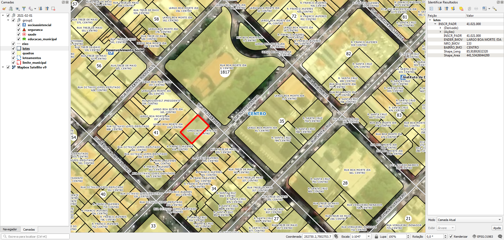

<aside>
<table align="right" style="padding: 1em">
<tr><td>Pacote <a target="_git" title="link canônico para o git deste pacote" href="http://git.digital-guard.org/preserv-BR/blob/main/data/SP/Limeira/_pk0026.01"><big><b>pk0026.01</b></big></a> de <small><a target="_osmcodes" title="Jurisdição" href="https://osm.codes/BR-SP-Limeira">BR-SP-Limeira</a></small>
</td></tr>
<tr><td>
Doador: <a rel="external" target="_doador" href="https://www.limeira.sp.gov.br/">Prefeitura Municipal de Limeira</a>
 &nbsp; <small>CNPJ 45.132.495/0001-40</small> • Wikidata <a rel="external" target="_doador" title="link descritor Wikidata do doador" href="https://www.wikidata.org/wiki/Q56450084">Q56450084</a></small> 

Obtido via <i>site;email</i> em <b>2021-02-01</b> por:
 &nbsp; Avaliação técnica: <a rel="external" target="_gitPerson" title="usuário Git" href="https://github.com/IgorEliezer">IgorEliezer</a>
 &nbsp; Representação institucional: <a rel="external" target="_gitPerson" title="usuário Git" href="https://github.com/ThierryAJean">ThierryAJean</a> 
</td></tr>
<tr><td>Camadas:     </td></tr>
<tr><td>Dados publicados em <a href="http://git.digital-guard.org/preservCutGeo-BR2021/tree/main/data/SP/Limeira/_pk0026.01">preservCutGeo-BR2021</a> <a href="#reprodutibilidade">Reprodutíveis</a></td></tr>
<tr><td>Visualização:     </td></tr>
</table>
</aside>

<section>

Este repositório de metadados descreve um pacote de arquivos doado para o domínio público. Ele está sendo preservado pela Digital Guard: para maiores detalhes consulte a [documentação sobre o processo de registro e preservação](https://wiki.addressforall.org/doc/Documentação_Digital-guard).

Nota. O presente documento README foi gerado por software a partir das informações contidas no arquivo [`make_conf.yaml`](make_conf.yaml) deste pacote, e informações adicionais dos catálogos de [doadores](https://git.digital-guard.org/preserv-BR/blob/main/data/donor.csv) e de [pacotes](https://git.digital-guard.org/preserv-BR/blob/main/data/donatedPack.csv).

# Camadas de dados

Os arquivos contêm "camadas de dados" temáticas. Os metadados também descrevem como cada camada foi avaliada e seus dados filtrados de forma padronizada.

##  block

Nome do arquivo: `quadras`. *Download* e integridade: [529f86b71a936bfdbca3d633b80912f496b9c94a2505ef816e406e2362b631c4.zip](http://dl.digital-guard.org/529f86b71a936bfdbca3d633b80912f496b9c94a2505ef816e406e2362b631c4.zip) Descrição: Quadras, bairros, lotes e vias Tamanho do arquivo: 112972140 bytes (107.74 <abbr title="mebibyte">MiB</abbr>) Formato: shp SRID: 31983

#### Dados publicados
[http://git.digital-guard.org/preservCutGeo-BR2021/tree/main/data/SP/Limeira/_pk0026.01/block](http://git.digital-guard.org/preservCutGeo-BR2021/tree/main/data/SP/Limeira/_pk0026.01/block) 7634050 bytes (7.28 <abbr title="mebibyte">MiB</abbr>) 4797 polígonos com 100.61 <abbr title="quilômetros quadrados">km²</abbr> densidade média: 0.33 polígonos/km²

#### Visualização
[https://viz.addressforall.org/BR-SP-Limeira/_pk0026.01/block](https://viz.addressforall.org/BR-SP-Limeira/_pk0026.01/block)
##  nsvia

Nome do arquivo: `loteamentos`. *Download* e integridade: [529f86b71a936bfdbca3d633b80912f496b9c94a2505ef816e406e2362b631c4.zip](http://dl.digital-guard.org/529f86b71a936bfdbca3d633b80912f496b9c94a2505ef816e406e2362b631c4.zip) Descrição: Quadras, bairros, lotes e vias Tamanho do arquivo: 112972140 bytes (107.74 <abbr title="mebibyte">MiB</abbr>) Formato: shp SRID: 31983

#### Dados relevantes
* `Tipo || ' ' || Nome` (nsvia)

#### Comentários
Necessario compor nome com regular expression.

#### Dados publicados
[http://git.digital-guard.org/preservCutGeo-BR2021/tree/main/data/SP/Limeira/_pk0026.01/nsvia](http://git.digital-guard.org/preservCutGeo-BR2021/tree/main/data/SP/Limeira/_pk0026.01/nsvia) 1131120 bytes (1.08 <abbr title="mebibyte">MiB</abbr>) 335 polígonos com 61.74 <abbr title="quilômetros quadrados">km²</abbr> densidade média: 0.11 polígonos/km²

#### Visualização
[https://viz.addressforall.org/BR-SP-Limeira/_pk0026.01/nsvia](https://viz.addressforall.org/BR-SP-Limeira/_pk0026.01/nsvia)
##  parcel

Nome do arquivo: `lotes`. *Download* e integridade: [529f86b71a936bfdbca3d633b80912f496b9c94a2505ef816e406e2362b631c4.zip](http://dl.digital-guard.org/529f86b71a936bfdbca3d633b80912f496b9c94a2505ef816e406e2362b631c4.zip) Descrição: Quadras, bairros, lotes e vias Tamanho do arquivo: 112972140 bytes (107.74 <abbr title="mebibyte">MiB</abbr>) Formato: shp SRID: 31983

#### Dados relevantes
* `ENDER_IMOV` (via)

* `NRO_IMOV` (hnum)

#### Dados publicados
[http://git.digital-guard.org/preservCutGeo-BR2021/tree/main/data/SP/Limeira/_pk0026.01/parcel](http://git.digital-guard.org/preservCutGeo-BR2021/tree/main/data/SP/Limeira/_pk0026.01/parcel) 21561791 bytes (20.56 <abbr title="mebibyte">MiB</abbr>) 100984 polígonos com 101.7 <abbr title="quilômetros quadrados">km²</abbr> densidade média: 0.6 polígonos/km²

#### Visualização
[https://viz.addressforall.org/BR-SP-Limeira/_pk0026.01/parcel](https://viz.addressforall.org/BR-SP-Limeira/_pk0026.01/parcel)
##  via

Nome do arquivo: `eixo`. *Download* e integridade: [529f86b71a936bfdbca3d633b80912f496b9c94a2505ef816e406e2362b631c4.zip](http://dl.digital-guard.org/529f86b71a936bfdbca3d633b80912f496b9c94a2505ef816e406e2362b631c4.zip) Descrição: Quadras, bairros, lotes e vias Tamanho do arquivo: 112972140 bytes (107.74 <abbr title="mebibyte">MiB</abbr>) Formato: shp SRID: 31983

#### Dados relevantes
* `tipo || ' ' || compl_1 || ' ' || compl_2 || ' ' || nome_1` (via)

#### Dados publicados
[http://git.digital-guard.org/preservCutGeo-BR2021/tree/main/data/SP/Limeira/_pk0026.01/via](http://git.digital-guard.org/preservCutGeo-BR2021/tree/main/data/SP/Limeira/_pk0026.01/via) 762920 bytes (0.73 <abbr title="mebibyte">MiB</abbr>) 3137 segmentos com 1152.54 <abbr title="quilômetros">km</abbr> densidade média: 2.06 segmentos/km²

#### Visualização
[https://viz.addressforall.org/BR-SP-Limeira/_pk0026.01/via](https://viz.addressforall.org/BR-SP-Limeira/_pk0026.01/via)

# Evidências de teste

</section>
<section>

# Reprodutibilidade

Ver detalhes em [reproducibility.sh](reproducibility.sh).

</section>

