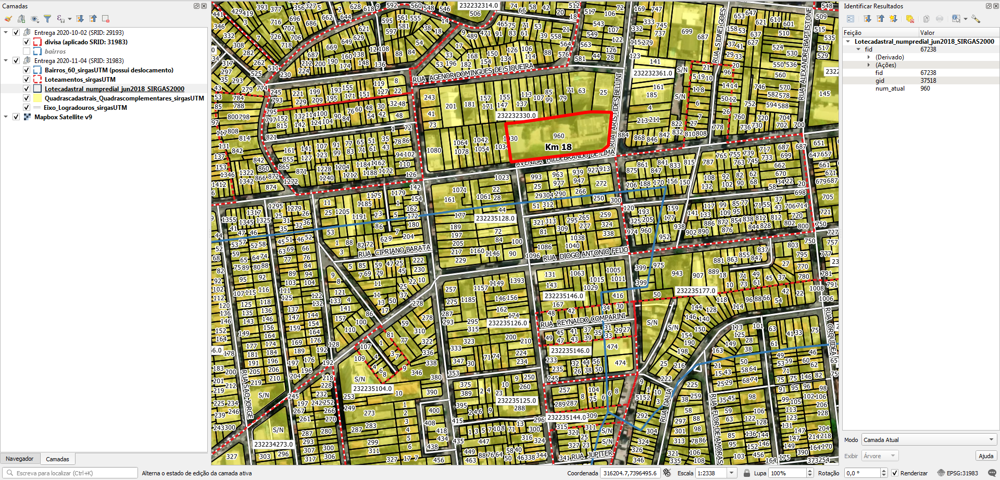

# Geral
## Recorde das entregas
Houve três entregas de material: 2020-06-22, 2020-10-02 e 2020-11-04.

Em virtude de duplicidade e falhas nos arquivos, problemas de projeção, presença de dados pessoais e qualidade dos dados, decidiu-se desmembrar as entregas (feitas em arquivos zip e rar, e alvulsos) e remover material, mantendo o restante que seja funcional, mais atual e isento de dados pessoais, como se segue:

* Entrega 2020-06-22:
  - Foram removidos: `div_bairro_2015 - UBS` por falha ou estar vazio.
  - Foram removidos: `div_bairro_2015`, `Eixo de Logradouro`, `lote_cadastral` e variantes por duplicidade e por haver versões mais recentes abaixo.
  - Foram mantidos: os PDFs do mapa urbano básico.
  - Salvo em `entrega_2020-06-22_recorte.zip`.

* Entrega 2020-10-02:
  - Foram removidos: `logradouros` por haver versões mais recentes e com mais dados abaixo.
  - Foram removidos: `lotes` por conter informações pessoais e haver versões com dados melhores. Não possui endereços, mas um número identificador.
  - Foram mantidos: `bairros` e `divisa` (do município).
  - A divisa de município foi fornecida na projeção SRID 29193, mas fica melhor na projeção 31983 (testado no QGIS com o projeto na projeção 31983).
  - Salvo em `entrega_2020-10-02_recorte.zip`.

* Entrega 2020-11-04:
  - Foram mantidos todos os arquivos: os shapefiles de Bairros, Eixos, Loteamentos, Lotes e Quadras.
  - Bairros, apesar de aparentar ser mais atual, possui um deslocamento em relação aos demais elementos, mesmo seguindo a projeção indicada (ver imagem em *Evidências de teste*, polígono azul). Como alternativa, usar bairros da entrega 2020-10-02.
  - Eixos possuem dados melhores, CEP etc.
  - Lotes possui numeração predial.
  - Quadras: algumas estão deslocadas em relação as demais.
  - Salvo em `entrega_2020-11-04.zip`.

Material antigo foi removido e substituído.

# Tarefas
## 1. Atribuir nomes de logradouro nos lotes
Os lotes possuem somente numeração predial e identificadores `gid` e `fid` que deve ser de uso interno; não há planilha DE-PARA.

Atribuir o nome do eixo de logradouro mais próximo aos lotes. Nos casos de esquina, deverá usar dedução pelo entorno: lado par ou lado ímpar, número mais próximo etc. Ver [Extração](#Extração) para dados.

## 2. Gerar ponto de endereço na testada do lote
Procedimento usando PostGIS com script desenvolvido pelo A4A.

Cada ponto terá os dados:
* Nome do logradouro
* Número predial

# Extração
Abaixo os passos para extração por tipo de dado relevante.

## Lotes
Arquivo GPKG (geopackage)
SRID: 31983
1. Abrir `entrega_2020-11-04.zip`.
2. Selecionar todos os arquivos `Loteamentos_sirgasUTM.gpkg`.
3. Copiar arquivos selecionados para diretório alvo. O diretório alvo precisa ser "writable" para o QGIS gerar os arquivos gpkg-shm e gpkg-wal enquanto a sessão estiver aberta.

### Dados relevantes
Colunas da camada `Lotecadastral_numpredial_jun2018_SIRGAS2000`:
* `num_atual` (string): número predial.

Alguns lotes possuem "S/N" e "s/n" como sem número.

## Eixos
Arquivo GPKG (geopackage)
SRID: 31983
1. Abrir `entrega_2020-11-04.zip`.
2. Selecionar todos os arquivos `Eixo_Logradouros_sirgasUTM.gpkg`.
3. Copiar arquivos selecionados para diretório alvo. O diretório alvo precisa ser "writable" para o QGIS gerar os arquivos gpkg-shm e gpkg-wal enquanto a sessão estiver aberta.

### Dados relevantes
Colunas da camada `logradouros`:
* `nome` (string): tipo e nome de logradouro em caixa alta e por extenso.
* `cep_correi` (string): CEP.
* `tp_dec_lei` (string): tipo da lei da denominação.
* `num_dec_le` (string): número da lei da denominação.
* `ano_dec_le` (string): ano da lei da denominação.

## Bairros
SRID: 29193
1. Abrir `entrega_2020-10-02_recorte.zip`.
2. Selecionar todos os arquivos `bairros.*`.
3. Copiar arquivos selecionados para diretório alvo.

### Dados relevantes
Colunas da camada `bairros`:
* `nom_bairro` (string): nome do bairro.

Este shapefile é um substituto às divisas de bairro em `entrega_2020-11-04.zip` (mais recente e atualizado), visto que este último está com deslocamento de 63 m SSW. Será necessário reenvio da prefeitura com a correção.

## Quadras
Arquivo GPKG (geopackage)
SRID: 31983
1. Abrir `entrega_2020-11-04.zip`.
2. Selecionar todos os arquivos `Quadrascadastrais_Quadrascomplementares_sirgasUTM.gpkg`.
3. Copiar arquivos selecionados para diretório alvo. O diretório alvo precisa ser "writable" para o QGIS gerar os arquivos gpkg-shm e gpkg-wal enquanto a sessão estiver aberta.

Algumas quadras estão deslocadas em relação as demais. Será necessário reenvio da prefeitura com a correção.

### Dados relevantes
Colunas da camada `Quadrascadastrais_Quadrascomplementares_sirgasUTM`:
* `codquadra` (string): código de quadra.

## Outros
Para outros projetos, há também dados/datasets sobre:
* Limite de município
* Loteamentos
* Mapas urbanos básicos em PDF

(!!! Havendo outros projetos, esta seção será detalhada !!!)

# Evidências de teste
Teste no QGIS:

