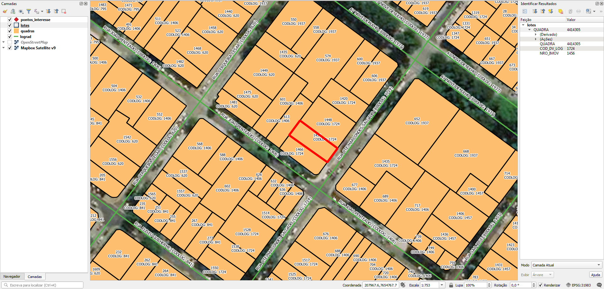

* [Tarefas](#tarefas)
* [Extração](#extração)
* [Evidências de teste](#evidências-de-teste)
* [Makefile e resumo dos resultados](#makefile-e-resumo-dos-resultados)

-----

# Tarefas
## 1. Atribuir nome de logradouro nos lotes
Os lotes possuem somente numeração predial e o código de logradouro ao qual o lote pertence.

Atribuir o nome do logradouro nos lotes usando o código de logradouro como um DE-PARA. O código de logradouro está presente nos lotes e nos eixos de vias, na coluna `COD_DV_LOG` de ambos. Ver [Extração](#Extração).

## 2. Gerar ponto de endereço na testada do lote
Procedimento usando PostGIS com script desenvolvido pelo A4A.

Cada ponto terá os dados:
* Nome do logradouro
* Número predial

# Extração
Abaixo os passos para extração por tipo de dado relevante.

## Eixos
SRID: 31983
1. Abrir `recebidos_2020-11-11.zip`.
2. Selecionar arquivos `lograd.*`.
3. Copiar arquivos selecionados para diretório alvo.

### Dados relevantes
Colunas da camada `lograd`:
* `NOME_LOGR` (string): tipo e nome do logradouro em caixa alta. O tipo de logradouro está abreviado.
* `COD_DV_LOG` (real): código do logradouro.

## Lotes
SRID: 31983
1. Abrir `recebidos_2020-11-11.zip`.
2. Selecionar arquivos `lotes.*`.
3. Copiar arquivos selecionados para diretório alvo.

### Dados relevantes
Colunas da camada `lotes`:
* `NRO_IMOV` (int): número predial. Lotes sem número são representados por 0 ou 99999.
* `COD_DV_LOG` (int): código do logradouro.

## Quadras
SRID: 31983
1. Abrir `recebidos_2020-11-11.zip`.
2. Selecionar arquivos `quadras.*`.
3. Copiar arquivos selecionados para diretório alvo.

### Dados relevantes
Colunas da camada `quadras`:
* `QUADRA` (string): número de quadra.

## Outros
Outros dados:
* Pontos de interesse: pontos turísticos e equipamentos de cultura e lazer.

(!!! Havendo outros projetos, esta seção será detalhada !!!)

# Evidências de teste
Teste no QGIS:


A coordenada 207967.6,7654767.7 da projeção original, indicada na ilustração, 
corresponde em coordenadas LatLong WGS84 ao ponto [`geo:-21.1851648,-47.812571`](https://www.openstreetmap.org/?mlat=-21.185164798007406&mlon=-47.81257110977818&zoom=18) ([Bing](https://www.bing.com/maps/?v=2&cp=-21.1851648~-47.812571&style=h&lvl=18), [Google](https://maps.google.com/maps?ll=-21.1851648,-47.812571&hl=en&t=h&z=18)). No PostGIS a transformação pode ser obtida por:
```sql
SELECT ST_Transform(ST_SetSRID( ST_Point(207967.6,7654767.7), 31983), 4326);
```

------

## Makefile e resumo dos resultados

O resumo de todos os dados deste README  encontra-se no arquivo [`make_conf.yaml`](make_conf.yaml). Ele deu origem ao *makefile* que pode ser utilizado para reproduzir no PostgreSQL os layers descritos. Para utilizar basta rodar o comando `make all_layers`. Sumarização dos *layers* resultantes desse processo:

<table><caption>Package 058 version 1, BR-SP-RibeiraoPreto</caption><tr>
<td><b>block_full</b><br/>(quadras)</td>
<td><b>Quantity</b>: 10921 polygons &#160;&#160;&#160; bbox_km2: 527 &#160;&#160;&#160; Size: 205 km2
  <br/><b>Distribution</b>:  <a href="http://git.AddressForAll.org/out-BR2021-A4A/blob/main/data/SP/RibeiraoPreto/_pk058/block_6uj.geojson"><code>6uj</code></a>: 27%, <a 
href="http://git.AddressForAll.org/out-BR2021-A4A/blob/main/data/SP/RibeiraoPreto/_pk058/block_6ujzx.geojson"><code>6ujzx</code></a>: 14%, <a href="http://git.AddressFo
rAll.org/out-BR2021-A4A/blob/main/data/SP/RibeiraoPreto/_pk058/block_6un.geojson"><code>6un</code></a>: 21%, <a href="http://git.AddressForAll.org/out-BR2021-A4A/blob/m
ain/data/SP/RibeiraoPreto/_pk058/block_6unp.geojson"><code>6unp</code></a>: 12%, <a href="http://git.AddressForAll.org/out-BR2021-A4A/blob/main/data/SP/RibeiraoPreto/_p
k058/block_6unp2.geojson"><code>6unp2</code></a>: 12%, <a href="http://git.AddressForAll.org/out-BR2021-A4A/blob/main/data/SP/RibeiraoPreto/_pk058/block_6unp8.geojson">
<code>6unp8</code></a>: 13%, <a href="http://git.AddressForAll.org/out-BR2021-A4A/blob/main/data/SP/RibeiraoPreto/_pk058/block_6uq.geojson"><code>6uq</code></a>: 0%.
<!-- <a href="http://geohash.org/6uj?format=osm"><code>6uj</code></a>: 27%, <a href="http://geohash.org/6ujzx?format=osm"><code>6ujzx</code></a>: 14%, <a href="http://geohash.org/6un?format=osm"><code>6un</code></a>: 21%, <a href="http://geohash.org/6unp?format=osm"><code>6unp</code></a>: 12%, <a href="http://geohash.org/6unp2?format=osm"><code>6unp2</code></a>: 12%, <a href="http://geohash.org/6unp8?format=osm"><code>6unp8</code></a>: 13%, <a href="http://geohash.org/6uq?format=osm"><code>6uq</code></a>: 0%. -->
<br/>Package <b>file-1</b>, sub-file: <b>shp</b> with MD5 <code>265d55a2b44626d5ea4fbe98ee03ea88</code> (14911076 bytes modifyed in 2020-09-10)
</td>
</tr><tr>
<td><b>parcel_ext</b><br/>(lotes)</td>
<td><b>Quantity</b>: 227146 polygons &#160;&#160;&#160; bbox_km2: 520 &#160;&#160;&#160; Size: 194 km2
<br/><b>Distribution</b>: <code>6uj</code>: 7%, <code>6ujzr</code>: 12%, <code>6ujzx</code>: 18%, <code>6ujzz</code>: 10%, <code>6un</code>: 40%, <code>6unp8</code>: 13%, <code>6uq</code>: 0%.
<br/>Package <b>file-1</b>, sub-file: <b>shp</b> with MD5 <code>b8b91da44d8b60eaf61e412c5bd19c56</code> (43519580 bytes modifyed in 2020-09-10)
</td>
</tr><tr>
<td><b>via_full</b><br/>(eixos)</td>
<td><b>Quantity</b>: 32119 segments &#160;&#160;&#160; bbox_km2: 765 &#160;&#160;&#160; Size: 3256 km

  <br/><b>Distribution</b>: 
  <a href="http://git.AddressForAll.org/out-BR2021-A4A/blob/main/data/SP/RibeiraoPreto/_pk058/via_6u.geojson"><code>6u</code></a>: 23%, <a href="http://git.AddressForAll.org/out-BR2021-A4A/blob/main/data/SP/RibeiraoPreto/_pk058/via_6uj.geojson"><code>6uj</code></a>: 11%, <a href="http://git.AddressForAll.org/out-BR2021-A4A/blob/main/data/SP/RibeiraoPreto/_pk058/via_6ujz.geojson"><code>6ujz</code></a>: 19%, <a href="http://git.AddressForAll.org/out-BR2021-A4A/blob/main/data/SP/RibeiraoPreto/_pk058/via_6ujzp.geojson"><code>6ujzp</code></a>: 3%, <a href="http://git.AddressForAll.org/out-BR2021-A4A/blob/main/data/SP/RibeiraoPreto/_pk058/via_6un.geojson"><code>6un</code></a>: 12%, <a href="http://git.AddressForAll.org/out-BR2021-A4A/blob/main/data/SP/RibeiraoPreto/_pk058/via_6unp.geojson"><code>6unp</code></a>: 25%, <a href="http://git.AddressForAll.org/out-BR2021-A4A/blob/main/data/SP/RibeiraoPreto/_pk058/via_6unp3.geojson"><code>6unp3</code></a>: 3%, <a href="http://git.AddressForAll.org/out-BR2021-A4A/blob/main/data/SP/RibeiraoPreto/_pk058/via_6unp9.geojson"><code>6unp9</code></a>: 3%.

  
  <br/>Package <b>file-1</b>, sub-file: <b>shp</b> with MD5 <code>d841935620ec6575d89203e727c520c0</code> (6956252 bytes modifyed in 2020-09-10)
</td>
</tr>
<tr><td colspan="2">
  Package files:
  <br/>&#160;&#160;<b>file-1</b>: <a href="http://preserv.addressforall.org/download/6cd0d4b475e61b8cbd078787ea8b38ebdd051a1def026ca476d4a83d40354738.zip"><code>6cd0d4b475e61b8cbd078787ea8b38ebdd051a1def026ca476d4a83d40354738.zip</code></a>
 </td></tr>
</table>
