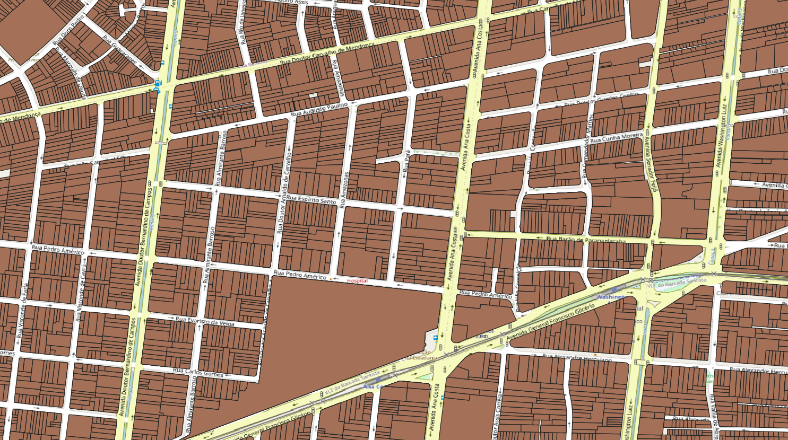

<aside>
<table align="right" style="padding: 1em">
<tr><td>Pacote <big><b>pk0029.02</b></big> de <small><a target="_afacodes" title="Jurisdição" href="https://afa.codes/BR-SP-Santos">BR-SP-Santos</a></small>
</td></tr>
<tr><td>
Doador: <a rel="external" target="_doador" href="https://www.santos.sp.gov.br/">Prefeitura Municipal de Santos</a>
 &nbsp; <small>CNPJ 58.200.015/0001-83</small> • Wikidata <a rel="external" target="_doador" title="link descritor Wikidata do doador" href="https://www.wikidata.org/wiki/Q56450035">Q56450035</a></small> 
Licença <a rel="external" target="_doador" href="https://git.digital-guard.org/licenses/blob/master/reports/implied-govWorks_geo-BR_municipal-v1.md"><b>Implied govWorks_geo-BR_municipal-1.0</b></a> (cc0) 
Obtido via <i>web</i> em <b>25/04/2024</b> por:
 &nbsp; Avaliação técnica: <a rel="external" target="_gitPerson" title="usuário Git" href="https://github.com/crebollobr">crebollobr</a>
 &nbsp; Representação institucional: <a rel="external" target="_gitPerson" title="usuário Git" href="https://github.com/ThierryAJean">ThierryAJean</a> 
</td></tr>
<tr><td>Camadas:  </td></tr>

</table>
</aside>

<section>

Este repositório de metadados descreve um pacote de arquivos doado para o domínio público. Ele está sendo preservado pela Digital Guard: para maiores detalhes consulte a [documentação sobre o processo de registro e preservação](https://wiki.addressforall.org/doc/Documentação_Digital-guard).

Nota. O presente documento README foi gerado por software a partir das informações contidas no arquivo [`make_conf.yaml`](https://git.digital-guard.org/preserv-BR/blob/main/data/SP/Santos/_pk0029.02/make_conf.yaml) deste pacote, e informações adicionais dos catálogos de [doadores](https://git.digital-guard.org/preserv-BR/blob/main/data/donor.csv) e de [pacotes](https://git.digital-guard.org/preserv-BR/blob/main/data/donatedPack.csv).

# Camadas de dados

Os arquivos contêm "camadas de dados" temáticas. Os metadados também descrevem como cada camada foi avaliada e seus dados filtrados de forma padronizada.

##  parcel

Nome do arquivo: `df031fa60edcf6f7de4e6f83a2c880d94f401a2922df174afc4322a0704ebe1a` *Download* e integridade: [df031fa60edcf6f7de4e6f83a2c880d94f401a2922df174afc4322a0704ebe1a.geojson](https://dl.digital-guard.org/df031fa60edcf6f7de4e6f83a2c880d94f401a2922df174afc4322a0704ebe1a.geojson) Descrição: lotes Formato: geojson SRID: 4326

#### Dados relevantes
* `logradouro` (via)

* `numero` (hnum)

* `bairro` (nsvia)

# Evidências de teste

</section>
<section>

# Reprodutibilidade

O processo de transformação dos *dados orginais* (arquivos doados) em *dados filtrados* pode ser reproduzido por qualquer pessoa fazendo uso das mesmas ferramentas de software utilizadas pelo projeto. A seguir a sequência de comandos *bash* que garantem a [reprodutibilidade](https://en.wikipedia.org/wiki/Reproducibility) do processo a cada *layer*. Qualquer pessoa, munida dos [ferramentas de software utilizadas pelo projeto](https://git.AddressForAll.org/suporte/blob/master/docs/pt/infra.md#ambientes-e-ferramentas-de-uso-geral), vai gerar os mesmos resultados.

Pode-se reproduzir de dois modos:
* artesanal: com os comandos em [reproducibility.sh](https://git.digital-guard.org/preserv-BR/blob/main/data/SP/Santos/_pk0029.02/reproducibility.sh), depois de seguir a sequência de preparo da base de dados no esquema *ingest*.
* automático: usando o comando `make` conforme descrito na documentação do projeto.

</section>

