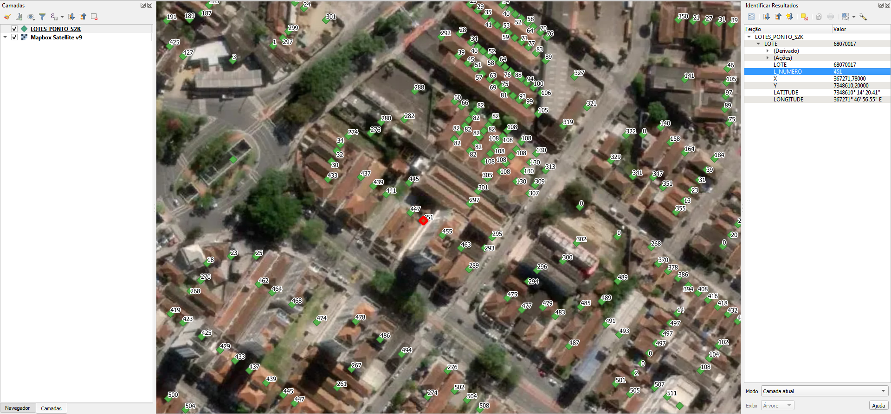

# Geral
A prefeitura forneceu somente os pontos de endereço.

# Tarefas

## 1. Obter eixos de vias
Obter eixos de vias dos OpenStreetMap, ou de outro fornecedor, com respectivos nomes de logradouro.

## 2. Atribuir nome de logradouro nos pontos de endereço
Os pontos de endereço contém somente número predial e número de lote.

Como alternativa aos eixos, pode-se solicitar uma planilha relacionando os números de lote aos respectivos endereços. 

# Extração
Abaixo os passos para extração por tipo de dado relevante.

## Pontos de endereço
SRID: 31983 ; Texto iso-8859-1

1. Abrir `SHAPEFILE.zip`.
2. Selecionar todos os arquivos `LOTES_PONTO_S2K.*`.
3. Copiar arquivos selecionados para diretório alvo.

### Dados relevantes
Colunas da camada `LOTES_PONTO_S2K`:
* `LOTE` (string): número de lote, não confundir com número predial, que é do endereço.
* `L_NUMERO` (int): número predial.
* `X` (real): valor da coordenada UTM Leste.
* `Y` (real): valor da coordenada UTM Norte.

**Notas:**
 1. Em `L_NUMERO`: sem número é representado como 0.
 2. O valor das coordenadas X e Y não é necessário para inserção no QGIS, uma vez que as coordenadas dos pontos já estão presentes nas geometrias do shapefile.

# Evidências de teste
Teste no QGIS:

# Problemas
* Centroid de terreno não vale como ponto de endereço, é somente aproximação

