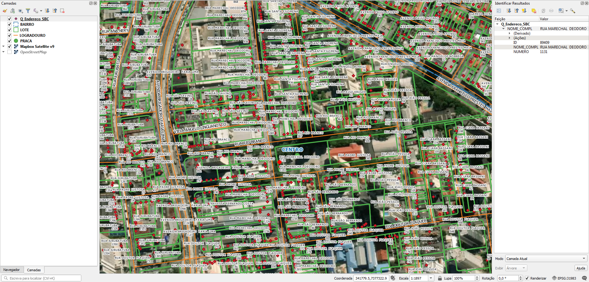

<aside>
<table align="right" style="padding: 1em">
<tr><td>Pacote <a target="_git" title="link canônico para o git deste pacote" href="http://git.digital-guard.org/preserv-BR/blob/main/data/SP/SaoBernardoCampo/_pk0030.01"><big><b>pk0030.01</b></big></a> de <small><a target="_osmcodes" title="Jurisdição" href="https://osm.codes/BR-SP-SaoBernardoCampo">BR-SP-SaoBernardoCampo</a></small>
</td></tr>
<tr><td>
Doador: <a rel="external" target="_doador" href="https://www.saobernardo.sp.gov.br/">Prefeitura Municipal de São Bernardo do Campo</a> 
<small>cnpj:46.523.239/0001-47</small> • Wikidata <a rel="external" target="_doador" title="link descritor Wikidata do doador" href="https://www.wikidata.org/wiki/Q56449994">Q56449994</a></small> 

Obtido via <i>site;email</i> em <b>2020-06-18</b> por: 
 Avaliação técnica: <a rel="external" target="_gitPerson" title="usuário Git" href="https://github.com/IgorEliezer">IgorEliezer</a> 
 Representação institucional: <a rel="external" target="_gitPerson" title="usuário Git" href="https://github.com/ThierryAJean">ThierryAJean</a> 
</td></tr>
<tr><td>Camadas:     </td></tr>
<tr><td><a href="http://git.digital-guard.org/preservCutGeo-BR2021/tree/main/data/SP/SaoBernardoCampo/_pk0030.01">Dados publicados</a></td></tr>
</table>
</aside>

<section>

Este repositório de metadados descreve um pacote de arquivos doado para o domínio público. Ele está sendo preservado pela Digital Guard: para maiores detalhes consulte a [documentação sobre o processo de registro e preservação](https://git.digital-guard.org/preserv/tree/main/docs).

Nota. O presente documento README foi gerado por software a partir das informações contidas no arquivo [`make_conf.yaml`](make_conf.yaml) deste pacote, e informações adicionais dos catálogos de [doadores](https://git.digital-guard.org/preserv-BR/blob/main/data/donor.csv) e de [pacotes](https://git.digital-guard.org/preserv-BR/blob/main/data/donatedPack.csv).

# Camadas de dados

Os arquivos contêm "camadas de dados" temáticas. Os metadados também descrevem como cada camada foi avaliada e seus dados filtrados de forma padronizada.

##  geoaddress

Nome do arquivo: `Q_Endereco_SBC`. *Download* e integridade: [22ecd5ef4ca76adef213fa422d9b5e4198f0667df598c511c30e512bb10aaedd.zip](http://dl.digital-guard.org/22ecd5ef4ca76adef213fa422d9b5e4198f0667df598c511c30e512bb10aaedd.zip) Descrição: Pontos de endereço Tamanho do arquivo: 3502991 bytes (3.34 <abbr title="mebibyte">MiB</abbr>) Formato: shp SRID: 31983

#### Dados relevantes
* `NOME_COMPL` (via)

* `Numero` (hnum)

##  parcel

Nome do arquivo: `LOTE`. *Download* e integridade: [d4985405060cc1887962a4278b4d68ada6ffd3ed72f296bd72d65abc4897cd2d.zip](http://dl.digital-guard.org/d4985405060cc1887962a4278b4d68ada6ffd3ed72f296bd72d65abc4897cd2d.zip) Descrição: Lotes Tamanho do arquivo: 23974094 bytes (22.86 <abbr title="mebibyte">MiB</abbr>) Formato: shp SRID: 31983

##  nsvia

Nome do arquivo: `BAIRRO`. *Download* e integridade: [350b605174967b94ef49ce1bbac0352dd76e2175e5eae1b8e5b730cd9950d133.zip](http://dl.digital-guard.org/350b605174967b94ef49ce1bbac0352dd76e2175e5eae1b8e5b730cd9950d133.zip) Descrição: Bairros Tamanho do arquivo: 2211019 bytes (2.11 <abbr title="mebibyte">MiB</abbr>) Formato: shp SRID: 31983

#### Dados relevantes
* `NOME` (nsvia)

##  via

Nome do arquivo: `LOGRADOURO`. *Download* e integridade: [3269bacc09d450b4d7496a2bc749ece94b1f48462ba0aae70d902404256bc433.zip](http://dl.digital-guard.org/3269bacc09d450b4d7496a2bc749ece94b1f48462ba0aae70d902404256bc433.zip) Descrição: Eixos Tamanho do arquivo: 11858312 bytes (11.31 <abbr title="mebibyte">MiB</abbr>) Formato: shp SRID: 31983

#### Dados relevantes
* `NOME` (via)

# Evidências de teste

</section>
<section>

# Reprodutibilidade

Ver detalhes em [reproducibility.sh](reproducibility.sh).

</section>

