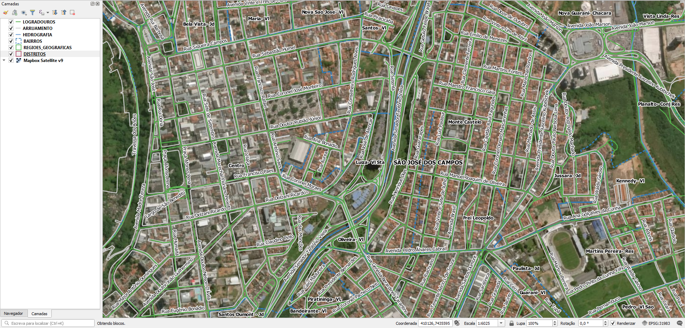

<aside>
<table align="right" style="padding: 1em">
<tr><td>Pacote <big><b>pk0043.01</b></big> de <small><a target="_afacodes" title="Jurisdição" href="https://afa.codes/BR-SP-SaoJoseCampos">BR-SP-SaoJoseCampos</a></small>
</td></tr>
<tr><td>
Doador: <a rel="external" target="_doador" href="https://www.sjc.sp.gov.br/">Prefeitura Municipal de São José dos Campos</a>
 &nbsp; <small>CNPJ 46.643.466/0001-06</small> • Wikidata <a rel="external" target="_doador" title="link descritor Wikidata do doador" href="https://www.wikidata.org/wiki/Q56450003">Q56450003</a></small> 
Licença <a rel="external" target="_doador" href="https://git.digital-guard.org/licenses/blob/master/reports/implied-govWorks_geo-BR_municipal-v1.md"><b>Implied govWorks_geo-BR_municipal-1.0</b></a> (cc0) 
Obtido via <i>site</i> em <b>15/09/2020</b> por:
 &nbsp; Avaliação técnica: <a rel="external" target="_gitPerson" title="usuário Git" href="https://github.com/IgorEliezer">IgorEliezer</a>
 &nbsp; Representação institucional: <a rel="external" target="_gitPerson" title="usuário Git" href="https://github.com/ThierryAJean">ThierryAJean</a> 
</td></tr>
<tr><td>Camadas:   </td></tr>
<tr><td>Dados publicados em <a href="https://git.digital-guard.org/preservCutGeo-BR2021/tree/main/data/SP/SaoJoseCampos/_pk0043.01">preservCutGeo-BR2021</a> <a href="#reprodutibilidade">Reprodutíveis</a></td></tr>
<tr><td>Visualização:   </td></tr>
</table>
</aside>

<section>

Este repositório de metadados descreve um pacote de arquivos doado para o domínio público. Ele está sendo preservado pela Digital Guard: para maiores detalhes consulte a [documentação sobre o processo de registro e preservação](https://wiki.addressforall.org/doc/Documentação_Digital-guard).

Nota. O presente documento README foi gerado por software a partir das informações contidas no arquivo [`make_conf.yaml`](https://git.digital-guard.org/preserv-BR/blob/main/data/SP/SaoJoseCampos/_pk0043.01/make_conf.yaml) deste pacote, e informações adicionais dos catálogos de [doadores](https://git.digital-guard.org/preserv-BR/blob/main/data/donor.csv) e de [pacotes](https://git.digital-guard.org/preserv-BR/blob/main/data/donatedPack.csv).

# Camadas de dados

Os arquivos contêm "camadas de dados" temáticas. Os metadados também descrevem como cada camada foi avaliada e seus dados filtrados de forma padronizada.

##  nsvia

Nome do arquivo: `BAIRROS` *Download* e integridade: [12fce79183bf495632c96e64708877eab12ffaf6f4f2d6f465d2cf7afff1369d.zip](https://dl.digital-guard.org/12fce79183bf495632c96e64708877eab12ffaf6f4f2d6f465d2cf7afff1369d.zip) Descrição: bairros.zip Formato: shp SRID: 31983

#### Dados relevantes
* `bairro` (nsvia)

#### Resultados da filtragem e sua publicação
318441 bytes (0.3 <abbr title="mebibyte">MiB</abbr>) 343 polígonos com 104.87 <abbr title="quilômetros quadrados">km²</abbr> densidade média: 0.09 polígonos/km² GeoJSONs publicados em [https://git.digital-guard.org/preservCutGeo-BR2021/tree/main/data/SP/SaoJoseCampos/_pk0043.01/nsvia](https://git.digital-guard.org/preservCutGeo-BR2021/tree/main/data/SP/SaoJoseCampos/_pk0043.01/nsvia)

#### Visualização
[https://viz.addressforall.org/BR-SP-SaoJoseCampos/_pk0043.01/nsvia](https://viz.addressforall.org/BR-SP-SaoJoseCampos/_pk0043.01/nsvia)
##  via

Nome do arquivo: `LOGRADOUROS` *Download* e integridade: [6effb451da343480c3acca559cf55536315c104974fb00f9c9d46b6034e1b2aa.zip](https://dl.digital-guard.org/6effb451da343480c3acca559cf55536315c104974fb00f9c9d46b6034e1b2aa.zip) Descrição: logradouros.zip Formato: shp SRID: 31983

#### Dados relevantes
* `nome` (via)

* `ref` (nome alternativo)

#### Resultados da filtragem e sua publicação
1808860 bytes (1.73 <abbr title="mebibyte">MiB</abbr>) 8844 segmentos com 2682.83 <abbr title="quilômetros">km</abbr> densidade média: 2.4 segmentos/km² GeoJSONs publicados em [https://git.digital-guard.org/preservCutGeo-BR2021/tree/main/data/SP/SaoJoseCampos/_pk0043.01/via](https://git.digital-guard.org/preservCutGeo-BR2021/tree/main/data/SP/SaoJoseCampos/_pk0043.01/via)

#### Visualização
[https://viz.addressforall.org/BR-SP-SaoJoseCampos/_pk0043.01/via](https://viz.addressforall.org/BR-SP-SaoJoseCampos/_pk0043.01/via)

# Evidências de teste

</section>
<section>

# Reprodutibilidade

O processo de transformação dos *dados orginais* (arquivos doados) em *dados filtrados* pode ser reproduzido por qualquer pessoa fazendo uso das mesmas ferramentas de software utilizadas pelo projeto. A seguir a sequência de comandos *bash* que garantem a [reprodutibilidade](https://en.wikipedia.org/wiki/Reproducibility) do processo a cada *layer*. Qualquer pessoa, munida dos [ferramentas de software utilizadas pelo projeto](https://git.AddressForAll.org/suporte/blob/master/docs/pt/infra.md#ambientes-e-ferramentas-de-uso-geral), vai gerar os mesmos resultados.

Pode-se reproduzir de dois modos:
* artesanal: com os comandos em [reproducibility.sh](https://git.digital-guard.org/preserv-BR/blob/main/data/SP/SaoJoseCampos/_pk0043.01/reproducibility.sh), depois de seguir a sequência de preparo da base de dados no esquema *ingest*.
* automático: usando o comando `make` conforme descrito na documentação do projeto.

</section>

