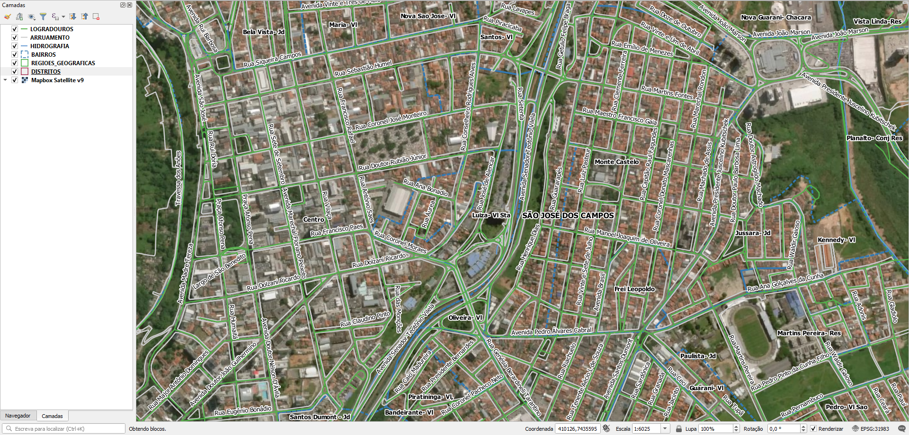

# Geral
Não há dados de endereços, a não ser nomes de logradouro e de bairros.

# Extração
Abaixo os passos para extração por tipo de dado relevante.

## Eixos
SRID: 31983
1. Abrir `logradouros.zip`.
2. Selecionar arquivos `LOGRADOUROS.*`.
3. Copiar arquivos selecionados para diretório alvo.

**Notas:**
1. Estes eixos foram extraídos do OpenStreetMap, provavelmente há 3 meses a 1 ano. As vias atuais no OpenStreetMap já divergem das do material fornecido.
2. Os eixos não estão centralizados em relação do contorno de quadras da prefeitura.

### Dados relevantes
Colunas da camada `LOGRADOUROS`:
* `oms_id` (string): ID no OpenStreetMap.
* `nome` (string): tipo de via e nome de logradouro em caixa alta e baixa, por extenso e com acentuação. Vem do OpenStreetMap.

## Quadras
SRID: 31983
1. Abrir `arruamento.zip`.
2. Selecionar arquivos shapefile `ARRUAMENTO.*`.
3. Copiar arquivos selecionados para diretório alvo.

### Dados relevantes
Colunas da camada `ARRUAMENTO`:
* `tipo` (string): indica se é existente. Maioria das entradas estão NULL.

## Bairros
SRID: 31983
1. Abrir `bairros.zip`.
2. Selecionar arquivos shapefile `BAIRROS.*`.
3. Copiar arquivos selecionados para diretório alvo.

### Dados relevantes
Colunas da camada `BAIRROS`:
* `bairro` (string): nome do bairro em caixa alta e baixa, com acentuação, seguido do tipo de bairro abreviado, ex.: "Aparecida- Jd".
* `lotes` (real): número de lotes.

# Outros
Outros dados:
* Hidrografia: em `hidrografia.zip`.
* Regiões geográficas: em `regioes_geograficas.zip`.
* Distritos: em `distritos.zip`.

(!!! Havendo outros projetos, esta seção será detalhada !!!)

# Evidências de teste
Teste no QGIS:

