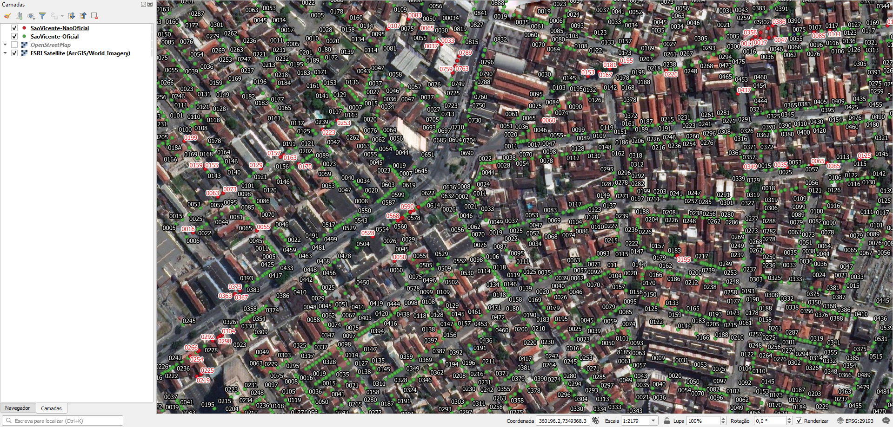

# Geral
Como descrito no README.md no diretório `_preservation`, a prefeitura não forneceu material geoprocessável, somente um desenho CAD.

Material geoprocessável que foi gerado por tratamento do material fornecido está detalhado em [Extração](Extração).

# Tarefas
## 1. Obter eixos de vias
Obter eixos de vias dos OpenStreetMap, ou de outro fornecedor, com respectivos nomes de logradouro.

## 2. Atribuir nome de logradouro nos pontos de endereço
Os pontos de endereço contém somente número predial.

Como complemento aos eixos, pode-se solicitar uma planilha relacionando os números de lote aos respectivos endereços. 

# Extração
Abaixo os passos para extração por tipo de dado relevante.

## Planilha de numeração predial oficial
Arquivo CSV
SRID: 29193
1. Selecionar arquivo `SaoVicente-Oficial.csv`.
2. Copiar arquivo selecionados para diretório alvo.

### Dados relevantes
Colunas, pela ordem:
1. `HouseNumber` (string): string do número de imóvel. Há casos de strings que fogem ao padrão por falha na elaboração do desenho CAD original. Ver **notas** abaixo.
2. `SRID_29193` (geometria formato "Well-known text" (WKT)): sequência de tipo de geometria, coordenada N, coordenada L.

**Notas:**
1. Há casos em que uma loja estava representada por dois textos, um sobre o outro: o seu número e um texto "LOJA". Por causa disso, aparecem duas entradas na planilha.
2. Há casos em que o número predial é composto de número e uma nota. Ex.: "0134 - Loja".

## Planilha de numeração predial não oficial
Arquivo CSV
SRID: 29193
1. Selecionar arquivo `SaoVicente-NaoOficial.csv`.
2. Copiar arquivo selecionados para diretório alvo.

### Dados relevantes
Colunas, pela ordem:
1. `HouseNumber` (string): string do número de imóvel. Há casos de strings que fogem ao padrão por falha na elaboração do desenho CAD original. Ver **notas** abaixo.
2. `SRID_29193` (geometria formato "Well-known text" (WKT)): sequência de tipo de geometria, coordenada N, coordenada L.

**Notas:**
1. Há casos em que uma loja estava representada por dois textos, um sobre o outro: o seu número e um texto "LOJA". Por causa disso, aparecem duas entradas na planilha.
2. Há casos em que o número predial é composto de número e uma nota. Ex.: "0134 - Loja".

# Evidências de teste
Teste no QGIS:

