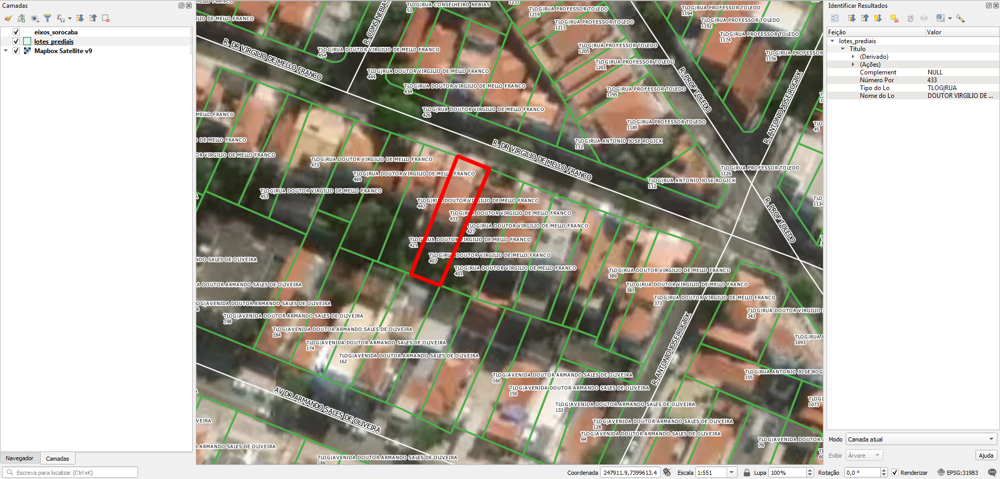

# Tarefas
## 1. Limpar nomes de logradouros dos lotes
Os tipos de logradouro dos lotes possuem a string  `TLOG|` no início. Isso precisa ser removido.

Então, `TLOG|AVENIDA` passaria a ser `AVENIDA`.

## 2. Gerar ponto de endereço na testada do lote
Procedimento usando PostGIS com script desenvolvido pelo A4A.

Cada ponto terá os dados:
* Nome do logradouro: composto de tipo de logradouro e nome de logradouro.
* Número predial

Ver [Extração](#Extração) para detalhes.

# Extração
Abaixo os passos para extração por tipo de dado relevante.

## Lotes
SRID: 31983
1. Abrir `lotes_prediais.zip`.
2. Selecionar todos os arquivos `lotes_prediais.*`.
3. Copiar arquivos selecionados para diretório alvo.

### Dados relevantes
Colunas da camada `lotes_prediais`:
* `Complement` (string): complemento de endereço.
* `Número Por` (int): número predial.
* `Tipo do Lo` (string): texto composto de `TLOG|` seguido do tipo de logradouro em caixa alta, sem acento, por extenso.
* `Nome do Lo` (string): nome de logradouro em caixa alta, sem acento, por extenso.

## Eixos
SRID: 5533
1. Abrir `shape_eixos_sorocaba.zip`.
2. Selecionar todos os arquivos `eixos_sorocaba.*`.
3. Copiar arquivos selecionados para diretório alvo.

### Dados relevantes
Colunas da camada `eixos_sorocaba`:
* `TIPO` (string): tipo de logradouro em caixa alta, sem acento, abreviado. Somente rua tem ponto (`R.`).
* `NOME` (string): nome de logradouro em caixa alta, sem acento, por extenso, exceto os títulos (DR, PROF etc).
* `CEP` (string): CEP da rua.
* `BAIRRO` (string): nome do bairro caixa alta, sem acento, com o tipo de bairro abreviado (JD, V etc).
* `IMPLANTADO` (string): se a via foi implantada.
* `CLANDESTIN` (string): se a via é clandestina.
* `SITUACAO` (string): se a via possui denominação.

## Bairros
(não há divisas de bairros)

# Evidências de teste
Teste no QGIS:

