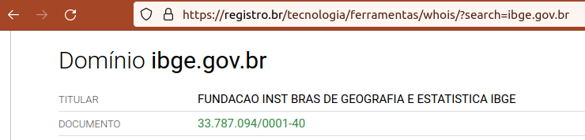
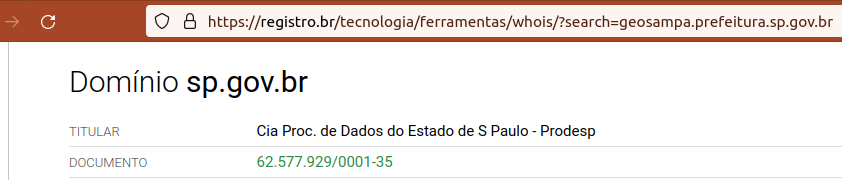
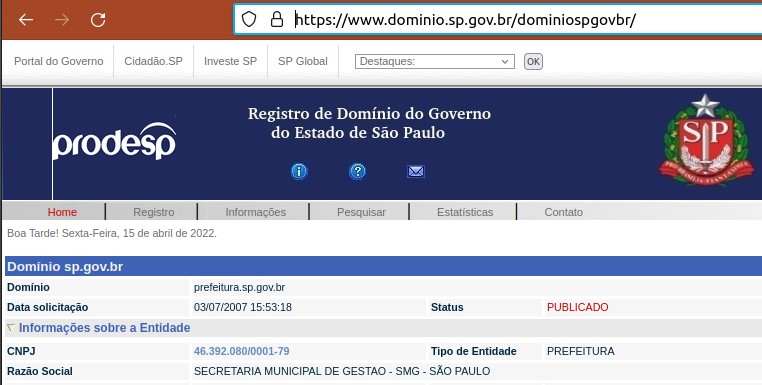
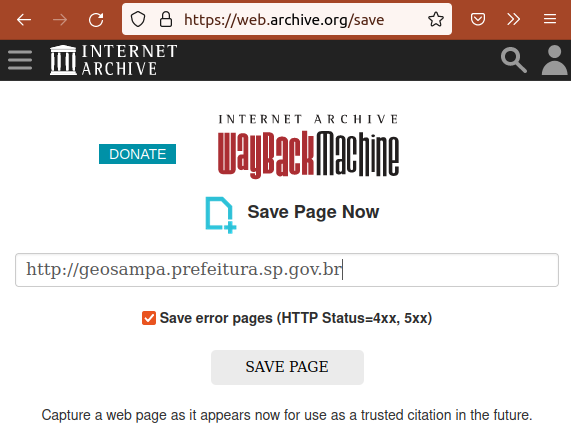

## Registro de evidência de proveniência

> ✋ Escopo: nesta seção de documentação são descritos procedimentos para registro de evidẽncias, relativas à origem do arquivo e à origem da licença.

Os arquivos preservados pela Digital-Guard podem ser provenientes de diferentes origens, tipicamente *download* de páginas oficiais do doador, e anexos de e-mail enviados por preposto oficial do doador.

Em ambos os casos **a primeira evidência** de comprovação é o [nome de domínio](https://en.wikipedia.org/wiki/Domain_name): deve-se comprovar que o domínio vinculado à origem era de propriedade do doador no instante da doação.

Em sequida deve-se forenecer a **evidência do contexto da doação**, ou seja, evidência de que a página de *download* existia e foi utilizada com sucesso para obter os arquivos, ou evidência de que o e-mail de doação do material existiu.

Por fim, **se** o **documento de licença** não é parte integrante do pacote doado, deve-se acrescentar as **evidências que comprovam a licença atribuída** ao pacote.

## Registro da evidência de domínio

Tanto e-mails como páginas web são de responsabilidade do mantenedor do domínio que figura na "transação de doação" (ato de *download* ou de envio de e-mail). Alguns exemplos de "URL da transação" e seu domínio:

Exemplo              | Hostname         | Nome de domínio
---------------------|------------------|-------------
`ibge@ibge.gov.br`   | `ibge.gov.br`    | `ibge.gov.br`
`http://geosampa.prefeitura.sp.gov.br` | `geosampa.prefeitura.sp.gov.br`    | `sp.gov.br`
`https://geoweb.vitoria.es.gov.br/#/shp` | `geoweb.vitoria.es.gov.br` | `es.gov.br`

No Brasil os proprietários de domínio podem ter seu CNPJ comprovado através da consulta ao **WHOIS do Registro-BR**,  https://registro.br/tecnologia/ferramentas/whois  Todavia nem sempre será o CNPJ do responsável final. Podem haver encadeamentos formais de responsabilidade. Tradicionalmente os governos estaduais e governos municipais não são designados na Internet diretamente por um domínio, mas por **subdomínios** (parte final do *hostname*). Nos exemplos a prefeitura de São Paulo é subdomínio de `sp.gov.br` e a prefeitura de Vitória é subdomínio de `es.gov.br`.

No Brasil os **subdomínios `gov.br`** dos estados são gerenciados por autarquias independentes, listadas em https://iprefeituras.com.br/como-ter-dominio-governamental    No exemplo `sp.gov.br` é gerenciado pela PRODESP, que oferece seu "WHOIS de subdomínio" em https://www.dominio.sp.gov.br

### Exemplo do e-mail IBGE

Suponhamos um simples arquivo CSV zipado, `listaAbreviacoesSP.csv.zip`, como pacote doado. A lista de abreviações de 3 letras dos municípios de São Paulo foi obtida por um antigo e-mail de agente do IBGE que anexava a lista em correspondência assinada por `fulano@ibge.org.br`, ou seja, domínio `ibge.gov.br`, que pode ser consultado diretamente no WHOIS do Registro-BR:  https://registro.br/tecnologia/ferramentas/whois/?search=ibge.gov.br

&nbsp;&nbsp;

A imagem da ilustrações acima, que destaca a porção da página onde o domínio é associado ao `CNPJ 33.787.094/0001-40`,  já se presta como parte das evidência, mas não basta.  

### Exemplo do *download* GeoSampa

Como vimos na tabela acima, a URL da página de *downloads* do GeoSampa é um pouco mais complexo, http://geosampa.prefeitura.sp.gov.br   Ela requer que primeiro seja estabelecido o vínculo do gestor PRODESP com o domínio `SP.GOV.BR`.

&nbsp;&nbsp;

Coletada essa evidência, que pode ser comum a diversos outros doadores, estaremos comprovando o vínculo entre o domínio `sp.gov.br` e o `CNPJ 62.577.929/0001-35` da PRODESP.

Em seguida consultamos a página (de responsabilidade da PRODESP) que faz  papel de "WHOIS de `sp.gov.br`", https://www.dominio.sp.gov.br   NOTA: se por azar não houvesse, seria necessária a consulta por e-mail ou eSIC como no caso de `es.gov.br`.

&nbsp;&nbsp;

Evidencia-se por fim a relação entre o subdomínio `prefeitura.sp.gov.br` e o `CNPJ 46.392.080/0001-79` da Prefeitura, que é a o doador e responsável pelo GeoSampa.

## Datação da evidência de página de *download*

Como os domínios podem mudar de proprietário ao longo dos anos e, com muito mais frequência, os serviços de *download* podem mudar de página ou simplesmente serem descontinuados, **é importante comprovar que outra testemunha tenha "visto" a mesma pǵanina no mesmo dia**.

https://archive.is/UBFqu

Registro do domínio do Geosampa é controlado pelo  
CNPJ 46.392.080/0001-79
conforme consulta também com evidência em
https://www.dominio.sp.gov.br/dominiospgovbr/

https://archive.ph/eRrvE
PRODESP, 	62.577.929/0001-35

## ffff

Quando o doador oferece diretamente em suas páginas
http://geosampa.prefeitura.sp.gov.br

https://web.archive.org/web/*/http://geosampa.prefeitura.sp.gov.br

A comprovação do CNPJ de origem é feita pelo WHOIS,

https://registro.br/tecnologia/ferramentas/whois/?search=geosampa.prefeitura.sp.gov.br

que infelizmente não é uma página HTML, é só um acesso tipo ReactJS aos dados da API:

http://web.archive.org/web/20220415104902/https://registro.br/tecnologia/ferramentas/whois/?search=geosampa.prefeitura.sp.gov.br

por isso precisamos fazer um save-screen

-----

